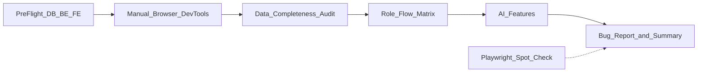
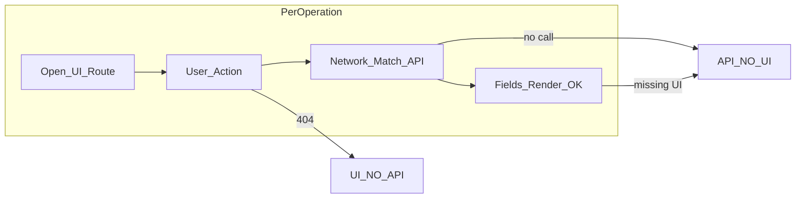

# Plan: UI/UX Editorial + Kiểm thử toàn diện AI Learning App

> File master trong repo: [`.cursor/plans/ui_ux_editorial_refactor_plan_e17edc9e.plan.md`](.cursor/plans/ui_ux_editorial_refactor_plan_e17edc9e.plan.md)

## Phần A — Editorial / Design system (khi test UX)

| Kiểm tra | Tham chiếu |
|----------|------------|
| Tokens `--ink-*`, `--gold-*`, `--cream-*` | [`FE/src/styles/tokens.css`](FE/src/styles/tokens.css) |
| Auth split editorial | [`AuthPages.css`](FE/src/pages/auth/AuthPages.css), Login/Register |
| Components | `StateView`, `Modal`, `Button`, `Input` — loading/empty/error |
| Motion | `framer-motion` + `useReducedMotion` — không jank |
| Responsive | Auth ≤860px; dashboard sidebar mobile 390px |
| Copy tiếng Việt | Toast `react-hot-toast`, validation messages |

---

## Phần B — Bối cảnh & giả định (đã xác nhận)

| Mục | Giá trị |
|-----|---------|
| DB | `ai_learning_app` trên MongoDB local — **được phép CRUD đầy đủ** |
| BE / FE | Đã chạy sẵn (không dùng `ai_learning_test` / `TESTING=true`) |
| AI | **Có `GOOGLE_API_KEY` thật** — test đầy đủ assessment, chat, from-prompt |
| OAuth | Placeholder FE only ([`SocialAuthButtons.jsx`](FE/src/components/auth/SocialAuthButtons.jsx)) — kỳ vọng toast, không login social |

**Tài khoản tham chiếu** ([`e2e/fixtures/test-users.json`](e2e/fixtures/test-users.json)):

- Student: `student1@gmail.com` / `Student@123`
- Instructor: `instructor1@ailearning.vn` / `Instructor@123`
- Admin: `admin1@ailearning.vn` / `Admin@123456`

Nếu DB trống hoặc thiếu seed: chạy `cd BE && python -m scripts.init_data` **một lần** trước Phase 2 (ghi trong báo cáo nếu đã chạy).

---

## Công cụ & quy trình ghi log



| Công cụ | Mục đích |
|---------|----------|
| Chrome/Edge DevTools | Console, Network, Application (localStorage), Performance |
| Cursor `cursor-ide-browser` MCP | Điều hướng có cấu trúc, snapshot, screenshot lỗi |
| Playwright (tùy chọn) | Regression nhanh: `E2E_SKIP_WEB_SERVER=1` khi BE:8000 + FE:3000 đang chạy |
| BE logs | [`BE/logs/app.log`](BE/logs/app.log) khi 500/timeout |
| MongoDB | Xác minh field thiếu vs UI null (Compass hoặc `mongosh`) |

**Deliverable chính:** tạo [`docs/reports/UI_UX_MANUAL_TEST_REPORT.md`](docs/reports/UI_UX_MANUAL_TEST_REPORT.md) với:

- Nhật ký từng bước (Pass/Fail/Blocked)
- Bảng bug (template Phase 5)
- Tổng kết Phase 6

**Mẫu bug (mỗi issue):** `UIUX-###` | Severity | Module | Role | Steps | Expected | Actual | Console/Network | Root cause | Files | Fix đề xuất

---

## Phase 0 — Pre-flight (trước khi test UI)

1. Xác nhận `.env` BE: `MONGODB_DATABASE=ai_learning_app`, `GOOGLE_API_KEY` set, `SECRET_KEY` ≥ 32 ký tự.
2. `GET http://localhost:8000/health` → `ok`.
3. FE: `http://localhost:3000` (hoặc port dev thực tế).
4. Ghi snapshot DB: đếm nhanh collections `users`, `courses`, `enrollments`, `classes`, `lessons`, `quizzes` (đủ để Phase 2 hay không).
5. Mở DevTools → bật **Preserve log**, **Disable cache** (tab Network).
6. Mở file làm việc: [`docs/reports/UI_UX_MANUAL_TEST_REPORT.md`](docs/reports/UI_UX_MANUAL_TEST_REPORT.md) — có sẵn **bảng ma trận API↔UI** (copy từ plan hoặc tạo khi execute).

---

## Phase 2b — Ma trận API ↔ UI (bắt buộc — tránh sót UI)

**Nguồn:** [`API_COVERAGE_LOG.md`](docs/reports/API_COVERAGE_LOG.md) (~88 operations), [`BE/tests/fixtures/openapi.json`](BE/tests/fixtures/openapi.json) (79 paths), [`FE/src/services/*.js`](FE/src/services).

**Cách test mỗi dòng:** mở đúng **UI Route** → thao tác user → DevTools Network phải thấy **API** tương ứng → UI hiển thị field từ response (không `undefined`/layout vỡ).

**Cột ghi kết quả (trong báo cáo):**

| Cột | Giá trị |
|-----|---------|
| `Wire` | OK / FAIL / N/A |
| `Gap` | — / `API_NO_UI` / `UI_NO_API` / `PARTIAL` / `DEAD_ROUTE` |
| `Note` | endpoint không gọi, page thiếu, chỉ service orphan, v.v. |

**Chú thích gap:**

- **API_NO_UI** — BE + `*Service.js` có method nhưng **không** page/hook nào gọi (thiếu nút/màn hình).
- **UI_NO_API** — UI có action nhưng Network 404/405 hoặc sai path.
- **PARTIAL** — có UI nhưng thiếu (chỉ list không detail, chỉ create không edit).
- **DEAD_ROUTE** — route trong `AppRouter` nhưng sidebar/link không tới được.



### 2b.1 Auth & Users (11 operations)

| Method | API | FE Service | UI Route / trigger | Role | Hành động test | Ghi chú rà soát |
|--------|-----|------------|-------------------|------|----------------|-----------------|
| POST | `/auth/register` | authService.register | `/auth/register` | guest | Submit form hợp lệ | → verify-email |
| POST | `/auth/login` | authService.login | `/auth/login` | all | 3 account demo | localStorage tokens |
| POST | `/auth/logout` | authService.logout | Sidebar logout | all | Logout | |
| POST | `/auth/refresh` | api.js interceptor | (auto 401) | all | Chờ token hết hạn hoặc force 401 | Không UI riêng |
| POST | `/auth/forgot-password` | authService.forgotPassword | `/auth/forgot-password` | guest | Submit email | |
| POST | `/auth/reset-password` | authService.resetPassword | `/auth/reset-password?token=` | guest | Token hợp lệ từ DB | |
| POST | `/auth/verify-email` | authService.verifyEmail | `/auth/verify-email?token=` | guest | Auto + manual | |
| POST | `/auth/resend-verification` | authService.resendVerification | VerifyEmailPage form | guest | Resend | |
| — | OAuth | — | Login/Register social buttons | guest | Click | **API_NO_UI** by design — toast only |
| GET | `/users/me` | userService / authStore | Profile, boot app | all | F5, profile load | |
| PATCH | `/users/me` | userService.updateProfile | `/dashboard/profile` | all | Sửa bio/avatar | |

### 2b.2 Courses catalog & enrollments (8)

| Method | API | FE Service | UI Route | Role | Hành động test | Ghi chú rà soát |
|--------|-----|------------|----------|------|----------------|-----------------|
| GET | `/courses/search` | courseStore.searchCourses | `/dashboard/courses` filters | all | Search + filter | |
| GET | `/courses/public` | courseService.getPublicCourses | Courses, Chat course pick, ClassCreate | all/student/inst | List load | |
| GET | `/courses/{id}` | courseService.getCourseDetail | `/dashboard/courses/:id` | all | Open detail | |
| GET | `/courses/{id}/enrollment-status` | courseService.getEnrollmentStatus | — | — | — | **API_NO_UI** — service có, page dùng `enrollment_info` từ detail; xác nhận có cần gọi riêng |
| POST | `/enrollments` | enrollmentService.enrollCourse | CourseDetail CTA | student | Đăng ký | |
| GET | `/enrollments/my-courses` | enrollmentService.getMyCourses | `/dashboard/my-courses` | student | List + filter | |
| GET | `/enrollments/{id}` | enrollmentService.getEnrollmentDetail | `/dashboard/enrollment/:id` | student | Open enrollment | |
| DELETE | `/enrollments/{id}` | enrollmentService.cancelEnrollment | MyCourses + Enrollment detail | student | Hủy ghi danh | |

### 2b.3 Learning (7)

| Method | API | FE Service | UI Route | Role | Hành động test | Ghi chú rà soát |
|--------|-----|------------|----------|------|----------------|-----------------|
| GET | `/courses/{id}/modules` | learningService.getCourseModules | `.../modules` | student | Module list | |
| GET | `/courses/{id}/modules/{mid}` | learningService.getModuleDetail | `.../modules/:mid` | student | Outcomes/resources từ **embedded** trong response | |
| GET | `.../modules/{mid}/outcomes` | learningService.getModuleOutcomes | — | — | — | **API_NO_UI** — không gọi; verify embedded đủ field |
| GET | `.../modules/{mid}/resources` | learningService.getModuleResources | — | — | — | **API_NO_UI** — tương tự |
| GET | `/courses/{id}/lessons/{lid}` | learningService.getLessonContent | LessonPage | student | Nội dung bài | |
| POST | `.../lessons/{lid}/complete` | learningService.completeLesson | LessonPage nút hoàn thành | student | Complete | |
| POST | `.../modules/{mid}/assessments/generate` | learningService.generateModuleAssessment | — | — | — | **API_NO_UI** — không có nút trên ModuleDetail |

### 2b.4 Quizzes & AI practice (10)

| Method | API | FE Service | UI Route | Role | Hành động test | Ghi chú rà soát |
|--------|-----|------------|----------|------|----------------|-----------------|
| GET | `/quizzes` | quizService.getQuizzes | `/dashboard/quiz`, instructor quizzes | all/inst | List | |
| GET | `/quizzes/{id}` | quizService.getQuizDetail | QuizDetail, Attempt | student | | |
| POST | `/quizzes/{id}/attempt` | quizService.submitAttempt | QuizAttempt | student | Nộp bài | |
| GET | `/quizzes/{id}/results` | quizService.getQuizResults | QuizResults | student | | |
| POST | `/quizzes/{id}/retake` | quizService.retakeQuiz | QuizResults CTA | student | Làm lại | |
| POST | `/lessons/{lid}/quizzes` | quizService.createQuiz | InstructorQuizForm create | instructor | Tạo quiz | |
| PUT | `/quizzes/{id}` | quizService.updateQuiz | — | — | — | **API_NO_UI** — chỉ create, không edit quiz |
| DELETE | `/quizzes/{id}` | quizService.deleteQuiz | QuizPage (instructor list) | instructor | Xóa | |
| GET | `/quizzes/{id}/class-results` | quizService.getClassResults | InstructorQuizClassResults | instructor | Chọn lớp | |
| POST | `/ai/generate-practice` | quizService.generatePractice | — | — | — | **API_NO_UI** — không có UI gọi (khác rec practice list) |

### 2b.5 Assessments & recommendations (7)

| Method | API | FE Service | UI Route | Role | Hành động test | Ghi chú rà soát |
|--------|-----|------------|----------|------|----------------|-----------------|
| POST | `/assessments/generate` | assessmentService.generate | AssessmentSetup | student | AI generate | Cần API key |
| GET | `/assessments/history` | assessmentService.listHistory | Setup + Recommendations | student | History list | |
| POST | `/assessments/{sid}/submit` | assessmentService.submit | AssessmentQuiz | student | Submit | |
| GET | `/assessments/{sid}/results` | assessmentService.getResults | AssessmentResults | student | | |
| GET | `/assessments/{sid}/review` | assessmentService.getReview | AssessmentReview | student | | |
| GET | `/recommendations/from-assessment` | recommendationService | Recommendations | student | Sau session evaluated | 404 nếu chưa evaluate |
| GET | `/recommendations` | recommendationService | Recommendations | student | Tab/list | |

### 2b.6 Progress, dashboard, analytics (9)

| Method | API | FE Service | UI Route | Role | Hành động test | Ghi chú rà soát |
|--------|-----|------------|----------|------|----------------|-----------------|
| GET | `/progress/course/{id}` | progressService | CourseDetail (enrolled) | student | Tiến độ chi tiết | |
| GET | `/dashboard/student` | dashboardService | DashboardPage | student | Cards/stats | |
| GET | `/dashboard/instructor` | dashboardService | InstructorDashboard | instructor | | |
| GET | `/dashboard/admin` | dashboardService | Admin overview tab | admin | | |
| GET | `/analytics/learning-stats` | analyticsService | ProgressPage | student | | GAP-004 by design |
| GET | `/analytics/progress-chart` | analyticsService | ProgressPage | student | Chart | |
| GET | `/analytics/instructor/classes` | analyticsService | InstructorAnalytics | instructor | | |
| GET | `/analytics/instructor/progress-chart` | analyticsService | InstructorAnalytics | instructor | | |
| GET | `/analytics/instructor/quiz-performance` | analyticsService | InstructorAnalytics | instructor | Quiz chart | |

### 2b.7 Classes (10)

| Method | API | FE Service | UI Route | Role | Hành động test | Ghi chú rà soát |
|--------|-----|------------|----------|------|----------------|-----------------|
| POST | `/classes` | classService.createClass | ClassCreate | instructor | Tạo lớp | |
| GET | `/classes/my-classes` | classService.getMyClasses | ClassList (student+inst) | student/inst | Sau join | |
| GET | `/classes/{id}` | classService.getClassDetail | ClassDetail | student/inst | | |
| PUT | `/classes/{id}` | classService.updateClass | ClassDetail edit (instructor) | instructor | Sửa | |
| DELETE | `/classes/{id}` | classService.deleteClass | ClassDetail | instructor | Xóa lớp trống | |
| POST | `/classes/join` | classService.joinClass | JoinClassModal | student | Mã mời | |
| GET | `/classes/{id}/students` | classService.getStudents | ClassDetail tab HV | instructor | List | |
| GET | `/classes/{id}/students/{sid}` | classService.getStudentDetail | — | — | — | **API_NO_UI** — không drill-down HV |
| DELETE | `/classes/{id}/students/{sid}` | classService.removeStudent | ClassDetail | instructor | Xóa HV | |
| GET | `/classes/{id}/progress` | classService.getClassProgress | ClassDetail tab tiến độ | instructor | Charts/stats | |

### 2b.8 Personal courses (6)

| Method | API | FE Service | UI Route | Role | Hành động test | Ghi chú rà soát |
|--------|-----|------------|----------|------|----------------|-----------------|
| POST | `/courses/from-prompt` | personalCourseService | PersonalCourseCreate AI | student/inst | Prompt | AI key |
| POST | `/courses/personal` | personalCourseService.createManual | Create manual | student/inst | | |
| GET | `/courses/my-personal` | personalCourseService.getMyPersonalCourses | PersonalCourses list | student/inst | | |
| GET | `/courses/personal/{id}` | personalCourseService.getPersonalCourseDetail | CourseEditor | student/inst | | |
| PUT | `/courses/personal/{id}` | personalCourseService.updateCourse | CourseEditor save | student/inst | | |
| DELETE | `/courses/personal/{id}` | personalCourseService.deleteCourse | CourseEditor delete | student/inst | Confirm | |

### 2b.9 Chat (5)

| Method | API | FE Service | UI Route | Role | Hành động test | Ghi chú rà soát |
|--------|-----|------------|----------|------|----------------|-----------------|
| POST | `/chat/course/{id}` | chatService.sendMessage | ChatPage [`useChatLogic`](FE/src/hooks/useChatLogic.js) | student | Gửi tin | AI key |
| GET | `/chat/history` | chatService.getHistory | Chat sidebar | student | | |
| GET | `/chat/conversations/{id}` | chatService.getConversation | Chat select thread | student | | |
| DELETE | `/chat/conversations` | chatService.deleteAllConversations | Chat clear all | student | | |
| DELETE | `/chat/history/{id}` | chatService.deleteConversation | Chat delete one | student | | |

### 2b.10 Search (4)

| Method | API | FE Service | UI Route | Role | Hành động test | Ghi chú rà soát |
|--------|-----|------------|----------|------|----------------|-----------------|
| GET | `/search` | searchService.search | SearchResults `?q=` | all | Search | |
| GET | `/search/suggestions` | searchService.getSuggestions | GlobalSearchBar | all | Gõ keyword | |
| GET | `/search/history` | searchService.getHistory | GlobalSearchBar dropdown | all | | |
| GET | `/search/analytics` | searchService.getAnalytics | SearchResults panel | **admin** | Login admin + search | Student không thấy panel |

### 2b.11 Admin (17)

| Method | API | FE Service | UI Route | Role | Hành động test | Ghi chú rà soát |
|--------|-----|------------|----------|------|----------------|-----------------|
| GET | `/admin/users` | adminService.getUsers | Admin users tab | admin | Filter/search | |
| POST | `/admin/users` | adminService.createUser | Modal tạo user | admin | | |
| GET | `/admin/users/{id}` | adminService.getUserDetail | — | — | — | **API_NO_UI** — không trang/modal chi tiết |
| PUT | `/admin/users/{id}` | adminService.updateUser | — | — | — | **API_NO_UI** — chỉ role/password/delete |
| DELETE | `/admin/users/{id}` | adminService.deleteUser | Users table | admin | | |
| PUT | `/admin/users/{id}/role` | adminService.changeUserRole | Role dialog | admin | | |
| POST | `/admin/users/{id}/reset-password` | adminService.resetUserPassword | Password dialog | admin | | |
| GET | `/admin/courses` | adminService.getCourses | Courses tab | admin | | |
| POST | `/admin/courses` | adminService.createCourse | Modal tạo khóa | admin | | |
| GET | `/admin/courses/{id}` | adminService.getCourseDetail | — | — | — | **API_NO_UI** |
| PUT | `/admin/courses/{id}` | adminService.updateCourse | — | — | — | **API_NO_UI** — chỉ create/delete list |
| DELETE | `/admin/courses/{id}` | adminService.deleteCourse | Courses tab | admin | | |
| GET | `/admin/classes` | adminService.getClasses | Classes tab | admin | | |
| GET | `/admin/classes/{id}` | adminService.getClassDetail | — | — | — | **API_NO_UI** |
| GET | `/admin/analytics/users-growth` | analyticsService | Admin analytics tab | admin | Chart | |
| GET | `/admin/analytics/courses` | analyticsService | Admin analytics | admin | | |
| GET | `/admin/analytics/system-health` | analyticsService | Admin analytics | admin | Metrics | |

### 2b.12 System (1)

| Method | API | FE Service | UI | Role | Test |
|--------|-----|------------|-----|------|------|
| GET | `/health` | — | — | ops | `curl localhost:8000/health` |

### 2b.13 UI routes không map 1-1 API (vẫn phải test)

| UI Route | Kiểm tra |
|----------|----------|
| `/` LandingPage | CTA login/register, links terms/privacy |
| `/terms`, `/privacy` | LegalPage static — không API |
| `/unauthorized`, `/404` | Copy + navigation |
| [`LessonPage`](FE/src/pages/learning/LessonPage.jsx) instructor quiz panel | Link tới instructor quiz routes |
| Sidebar theo role | [`Sidebar.jsx`](FE/src/components/layout/Sidebar.jsx) — student thấy assessment, instructor ẩn my-courses |

### 2b.14 Danh sách nghi ngờ thiếu UI (ưu tiên khi test)

Rà soát **bắt buộc** — nếu xác nhận đúng thì ghi bug `API_NO_UI` hoặc `PARTIAL`:

1. `GET /courses/{id}/enrollment-status` — service orphan?
2. `GET .../outcomes`, `GET .../resources` — có cần UI riêng nếu embedded thiếu field?
3. `POST .../modules/{mid}/assessments/generate` — thiếu nút trên ModuleDetail
4. `POST /ai/generate-practice` — thiếu flow luyện tập quiz
5. `PUT /quizzes/{id}` — thiếu sửa quiz
6. `GET /classes/.../students/{sid}` — thiếu chi tiết học viên
7. Admin `GET/PUT` user/course/class **detail** — chỉ bảng list
8. `quizService.updateQuiz` / `adminService.updateCourse` — service có, UI chưa

**Quy trình xác nhận:** `grep` method trong `FE/src/pages` + `FE/src/hooks` → nếu chỉ có trong `services/` → **API_NO_UI**.

---

## Phase 1 — Authentication (public + protected)

**Routes:** [`AppRouter.jsx`](FE/src/AppRouter.jsx) — `/auth/login`, `register`, `forgot-password`, `reset-password`, `verify-email`, `/terms`, `/privacy`.

| Case | Kiểm tra |
|------|----------|
| Login success | 3 role → redirect `/dashboard`; token trong `localStorage` (`access_token`, `refresh_token`) — [`authStore.js`](FE/src/stores/authStore.js) |
| Login fail | Sai email/password → toast/message tiếng Việt, không crash |
| Empty form | Validation react-hook-form trên Login/Register |
| Logout | Token xóa; vào `/dashboard/*` → redirect login |
| Session persistence | F5 sau login vẫn authenticated (`checkAuth` / persist zustand) |
| Protected route | Chưa login → `/auth/login` với `state.from` |
| Role guard | Student → `/dashboard/admin` → `/unauthorized` (đã có E2E [`route-guards.spec.js`](e2e/tests/route-guards.spec.js)) |
| Register | → `/auth/verify-email?email=...` ([`RegisterPage.jsx`](FE/src/pages/auth/RegisterPage.jsx)) |
| OAuth placeholder | Click Google/Facebook → toast only, **không** network OAuth |
| Forgot/reset | Form load; network `POST /auth/forgot-password`, `reset-password` (token test nếu có trong DB) |

**DevTools:** mọi 4xx/5xx trên `/api/v1/auth/*`; CORS; response shape vs `handleApiResponse`.

---

## Phase 2 — Data & UI validation (dữ liệu thật)

So khớp **schema thực tế** (không ép checklist “comments/reviews” nếu product chưa có UI):

### Course / learning (Student + public catalog)

| Field / feature | Nguồn | UI page |
|-----------------|-------|---------|
| thumbnail, title, description, level, category | `Course` model | [`CoursesPage`](FE/src/pages/courses/CoursesPage.jsx), [`CourseDetailPage`](FE/src/pages/courses/CourseDetailPage.jsx) |
| instructor, modules, lessons | API course detail | Module/Lesson routes |
| enrollment, progress % | `enrollment_info` | Hero progress bar + section “Tiến độ học tập” (`progressService`) |
| avg_rating | model field | Card rating (có thể 0/null — ghi nếu layout vỡ) |
| preview_video | optional URL | Nút “Xem video giới thiệu” |
| quiz | lesson/course | [`QuizAttemptPage`](FE/src/pages/quiz/QuizAttemptPage.jsx) |
| **Không có** comments/reviews CRUD | — | Ghi **N/A by design** nếu user checklist yêu cầu |

### Instructor

| Entity | UI |
|--------|-----|
| Classes CRUD | [`ClassListPage`](FE/src/pages/classes/ClassListPage.jsx), [`ClassCreatePage`](FE/src/pages/classes/ClassCreatePage.jsx), [`ClassDetailPage`](FE/src/pages/classes/ClassDetailPage.jsx) |
| Quiz CRUD + class results | [`InstructorQuizFormPage`](FE/src/pages/quiz/InstructorQuizFormPage.jsx), [`InstructorQuizClassResultsPage`](FE/src/pages/quiz/InstructorQuizClassResultsPage.jsx) |
| Analytics | [`InstructorAnalyticsPage`](FE/src/pages/enrollment/InstructorAnalyticsPage.jsx) |

### Admin

| Entity | UI |
|--------|-----|
| Users/Courses tabs | [`AdminPage.jsx`](FE/src/pages/admin/AdminPage.jsx) — modal tạo user/khóa |
| Search analytics | [`SearchResultsPage`](FE/src/pages/search/SearchResultsPage.jsx) panel admin |

**Quy trình mỗi entity:** chọn 1 bản ghi “đủ field” trong DB → mở UI → screenshot + ghi field null/undefined/layout break. Nếu thiếu: ghi collection + API endpoint + màn hình bị ảnh hưởng.

---

## Phase 3 — UI/UX flow test theo role

### Ma trận route × role

Dựa trên [`AppRouter.jsx`](FE/src/AppRouter.jsx) + [`Sidebar.jsx`](FE/src/components/layout/Sidebar.jsx):

**Student** (sidebar: courses, my-courses, classes, assessment, quiz, chat, search, recommendations, personal-courses, progress)

| Flow | Đường dẫn chính |
|------|-----------------|
| Dashboard | `/dashboard` |
| Browse → enroll → learn | courses → detail → enroll → modules → lesson |
| Assessment AI | `/dashboard/assessment` → generate → quiz → results → review |
| Quiz | `/dashboard/quiz` → attempt → results |
| Chat AI | `/dashboard/chat` |
| Classes | join code → list → detail |
| Personal courses | list → create/edit |
| Progress | `/dashboard/progress` (analytics) + course detail progress block |

**Instructor**

| Flow | Đường dẫn |
|------|-----------|
| Teaching dashboard | `/dashboard/instructor` |
| Analytics | `/dashboard/instructor/analytics` |
| Quiz management | `/dashboard/instructor/quizzes`, create, class results |
| Classes | `/dashboard/instructor/classes`, create, detail, progress tab |
| Personal courses | shared với student |

**Admin**

| Flow | Đường dẫn |
|------|-----------|
| Admin console | `/dashboard/admin/*` (users, courses, …) |
| CRUD modal | tạo user/course, filter, pagination |
| Search + analytics | `/dashboard/search?q=...` |

**UX checklist mỗi màn:** loading (`StateView` / skeleton), empty, error toast, form validation, modal focus trap, back navigation, mobile 390px ([`route-guards` mobile sidebar](e2e/tests/route-guards.spec.js)), design tokens (`tokens.css`), dead-end links.

---

## Phase 4 — API & AI features (có API key)

| Feature | Endpoint / service | Timeout | UI |
|---------|-------------------|---------|-----|
| Assessment generate | `POST /assessments/generate` | 120s [`api.js`](FE/src/services/api.js) | [`AssessmentSetupPage`](FE/src/pages/assessment/AssessmentSetupPage.jsx) |
| Chat | chat router | AI timeout | [`ChatPage`](FE/src/pages/chat/ChatPage.jsx) |
| Practice quiz | `POST /ai/generate-practice` | [`quizService.js`](FE/src/services/quizService.js) | Quiz flow |
| Personal from-prompt | personal courses API | long | [`PersonalCourseCreatePage`](FE/src/pages/personal-courses/PersonalCourseCreatePage.jsx) |
| Module assessment | `POST .../assessments/generate` | long | **API_NO_UI** — xác nhận Phase 2b |

**Kiểm tra:** payload request, streaming/loading UI, timeout message, không white-screen; BE log nếu 429/quota. Chạy lại các spec: [`assessment-flow.spec.js`](e2e/tests/assessment-flow.spec.js), [`chat.spec.js`](e2e/tests/chat.spec.js), [`student-flow.spec.js`](e2e/tests/student-flow.spec.js), personal-courses from-prompt (trước đây skip khi không key).

```powershell
cd e2e
$env:E2E_SKIP_WEB_SERVER="1"
npx playwright test assessment-flow chat student-flow personal-courses
```

---

## Phase 5 — Bug report

Gom tất cả phát hiện vào `UI_UX_MANUAL_TEST_REPORT.md`:

- Severity: **Critical** (crash/data loss/auth bypass) / **Medium** (flow broken) / **Low** (visual/copy)
- Cross-reference bug cũ [`TEST_ISSUES_AND_GAPS.md`](docs/reports/TEST_ISSUES_AND_GAPS.md) nếu tái hiện
- Đính kè screenshot + đoạn console/network (method, URL, status, `detail`)

---

## Phase 6 — Final summary (trong cùng file báo cáo)

1. Tình trạng tổng thể (Ready / Ready with issues / Not ready)
2. Tính năng ổn vs lỗi (theo role)
3. UI/UX cần cải thiện (spacing, copy, responsive)
4. API không ổn định (endpoint + pattern lỗi)
5. Schema/data gaps
6. Production risk
7. Priority fix (P0/P1/P2)
8. Testcase Playwright còn thiếu (đề xuất file spec mới)
9. Refactor đề xuất (nếu có, scope tối thiểu)

Cập nhật ngắn [`QA_STATUS.md`](docs/reports/QA_STATUS.md) với link tới báo cáo manual test (không thay thế pytest 184 passed).

---

## Thứ tự thực hiện đề xuất

1. Phase 0 + Phase 1 (auth) — nền tảng
2. **Phase 2b (ma trận API↔UI)** — đi từng nhóm 2b.1→2b.12, đánh dấu Wire/Gap trước khi test UX sâu
3. Phase 2 (data audit) — field DB vs UI trên các dòng Wire=OK
4. Phase 3 Student → Instructor → Admin (flow + UX checklist)
5. Phase 4 AI (cuối)
6. Phase 5–6 tổng hợp + bảng **Gap summary** (đếm API_NO_UI / PARTIAL)

**Ước lượng:** 1 session manual đầy đủ ~4–8h tùy dữ liệu DB; AI phase thêm 1–2h.

---

## Out of scope (ghi trong báo cáo, không test sâu)

- OAuth BE (placeholder only)
- Performance load test / security pentest
- `ai_learning_test` pytest DB (chỉ xác nhận regression: `python tests/run_tests.py -q` một lần nếu cần)
