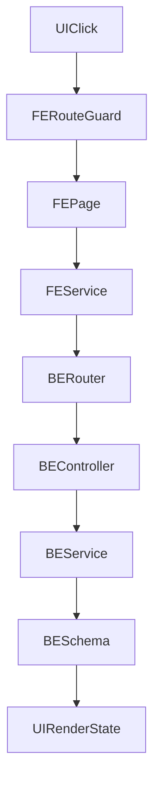

# SYSTEM FLOW AUDIT (FE/BE)

## Scope
- Audit-only (khong sua code), pham vi toan he thong.
- Doi chieu FE + BE theo 3 vai tro: `student`, `instructor`, `admin`.
- Muc tieu: check logic flow, RBAC, contract FE-BE, va tinh nhat quan UI/UX.

## 1) Domain Map Toan He Thong

### Backend domains (router registry)
Nguon gom router tai `BE/routers/routers.py`:
- Auth + Users: `auth_router`, `users_router`
- Assessment: `assessments_router`
- Course + Enrollment: `courses_router`, `enrollments_router`, `personal_courses_router`
- Learning + Quiz + Progress: `learning_router`, `quiz_router`, `progress_router`
- Chat + Recommendation: `chat_router`, `recommendation_router`
- Dashboard + Analytics + Admin: `dashboard_router`, `analytics_router`, `admin_router`
- Classes + Search: `classes_router`, `search_router`

### Frontend domains (route + page + service)
Nguon chinh: `FE/src/AppRouter.jsx`, `FE/src/services/**`, `FE/src/pages/**`
- Auth/Landing/Error
- Dashboard shell + profile/progress
- Courses/enrollment/learning/quiz
- Assessment/recommendation
- Chat/search
- Instructor classes
- Admin

## 2) Role Matrix (FE va BE)

### FE route access (thuc te theo guard)
Nguon: `FE/src/AppRouter.jsx`, `FE/src/components/layout/ProtectedRoute.jsx`

- `student`:
  - Student-only routes: `my-courses`, `enrollment/:id`, `assessment/*`, `personal-courses/*`, `recommendations`
  - Shared protected routes: `courses/*`, `learning/*`, `quiz/*`, `chat`, `search`, `profile`, `progress`
- `instructor`:
  - Instructor-only routes: `dashboard/instructor`, `dashboard/instructor/classes/*`
  - Shared protected routes nhu tren
- `admin`:
  - Admin-only routes: `dashboard/admin/*`
  - Shared protected routes nhu tren

### BE access (thuc te theo router/controller)
- Phan lon routers dung `get_current_user`; role check thuong nam o controller.
- `assessment`, `enrollment`, `learning`, `chat`, `recommendation` chu yeu theo ownership/enrollment.
- Nhieu endpoint instructor check role theo dang `role != "instructor"` (khong theo hierarchy admin > instructor).

## 3) Flow Trace End-to-End (UI -> API -> BE)

### A. Student core flow
1. Auth -> vao `/dashboard`.
2. Kham pha khoa hoc:
   - FE: `CourseDetailPage` -> `courseService.getCourseDetail`
   - BE: `GET /courses/{course_id}`
3. Dang ky khoa hoc:
   - FE: `enrollmentService.enrollCourse`
   - BE: `POST /enrollments`
4. Bat dau hoc:
   - FE: `ModuleListPage` -> `learningService.getCourseModules`
   - BE: `GET /courses/{course_id}/modules`
5. Hoc lesson:
   - FE: `LessonPage` -> `learningService.getLessonContent`
   - BE: `GET /courses/{course_id}/lessons/{lesson_id}`
6. Danh dau hoan thanh lesson:
   - FE: `learningService.completeLesson`
   - BE: `POST /courses/{course_id}/lessons/{lesson_id}/complete`
7. Theo doi tien do:
   - FE: progress/enrollment pages
   - BE: `GET /progress/course/{course_id}`, `GET /enrollments/my-courses`

### B. Student assessment flow
1. Setup:
   - FE: `AssessmentSetupPage` -> `assessmentService.generate`
   - BE: `POST /assessments/generate`
2. Quiz:
   - FE: `AssessmentQuizPage` -> `assessmentService.submit`
   - BE: `POST /assessments/{session_id}/submit`
3. Results:
   - FE: `AssessmentResultsPage` -> `assessmentService.getResults`
   - BE: `GET /assessments/{session_id}/results`
4. Recommendation:
   - FE: `RecommendationsPage` -> `recommendationService.getFromAssessment`
   - BE: `GET /recommendations/from-assessment`

### C. Instructor flow
1. Vao khu instructor:
   - FE: `/dashboard/instructor` + `/dashboard/instructor/classes/*`
2. Class lifecycle:
   - Tao lop: `POST /classes`
   - Danh sach: `GET /classes/my-classes`
   - Chi tiet/cap nhat/xoa: `GET|PUT|DELETE /classes/{class_id}`
   - Hoc vien/progress lop: `GET /classes/{class_id}/students`, `GET /classes/{class_id}/progress`
3. Analytics instructor:
   - `GET /analytics/instructor/classes`
   - `GET /analytics/instructor/progress-chart`
   - `GET /analytics/instructor/quiz-performance`

### D. Admin flow
1. FE route: `/dashboard/admin/*`
2. BE admin APIs:
   - `GET /dashboard/admin`
   - `GET /admin/*` (users, courses, classes, analytics)
   - Quan tri he thong va bao cao tong hop

## 4) Mismatch / Risk (uu tien theo impact)

### Critical
1. **Class management role-hole (BE)**
   - Router classes chi dung `get_current_user`, khong enforce instructor tai router.
   - Controller class su dung `user_id` nhu `instructor_id` ma khong check `role`.
   - Rui ro: user khong phai instructor co the goi endpoint quan ly lop neu service khong chan day du.
   - Files: `BE/routers/classes_router.py`, `BE/controllers/class_controller.py`.

### High
2. **FE shared routes mo cho non-student, BE lai chan theo enrollment/ownership**
   - Vi du `quiz/chat/learning/progress` co the vao tu FE khi da login, nhung BE co the tra 403.
   - Hieu ung UX: vao trang duoc, nhung thao tac loi ngay.
   - Files: `FE/src/AppRouter.jsx`; `BE/controllers/quiz_controller.py`, `BE/controllers/chat_controller.py`, `BE/controllers/learning_controller.py`, `BE/controllers/progress_controller.py`.

3. **Admin hierarchy khong nhat quan**
   - `middleware/rbac.py` mo ta hierarchy `admin > instructor > student`.
   - Nhieu controller check cung `role == "instructor"` nen admin bi chan o mot so endpoint instructor.
   - Files: `BE/middleware/rbac.py`, `BE/controllers/quiz_controller.py`, `BE/controllers/dashboard_controller.py`.

### Medium
4. **Recommendation field mismatch FE-BE**
   - FE render `match_score`.
   - BE schema tra `relevance_score`.
   - Hieu ung UX: badge phan tram co the trong/khong dung.
   - Files: `FE/src/pages/recommendations/RecommendationsPage.jsx`, `BE/schemas/recommendation.py`.

5. **Assessment quiz phu thuoc sessionStorage khi refresh**
   - FE luu cau hoi vao sessionStorage sau generate.
   - Neu refresh/link truc tiep quiz session ma khong co cache local -> de trang/empty state.
   - Files: `FE/src/pages/assessment/AssessmentSetupPage.jsx`, `FE/src/pages/assessment/AssessmentQuizPage.jsx`.

6. **Class join flow co BE support nhung FE route khong phoi hop cho student**
   - BE co `POST /classes/join`.
   - FE join UI gan vao khu instructor classes.
   - Files: `BE/routers/classes_router.py`, `FE/src/pages/classes/ClassListPage.jsx`.

## 5) UI/UX Audit Notes Theo Vai Tro

### Student UX
- Diem tot:
  - Flow enrollment -> modules -> lessons -> complete lesson da thanh chuoi ro rang.
  - Assessment co setup -> quiz -> results -> recommendation.
- Can theo doi:
  - Trang co the hien cho role khac nhung lai loi 403 khi action.
  - Empty/error state can thong diep ro hon theo role/business context.

### Instructor UX
- Diem tot:
  - Cum route quan ly lop ro, menu sidebar tach rieng.
- Can theo doi:
  - Cac trang shared (quiz/chat/search...) co the gay nham lan neu backend chan theo enrollment.

### Admin UX
- Diem tot:
  - Co khu admin rieng.
- Can theo doi:
  - Neu mong doi admin thao tac duoc endpoint instructor thi policy hien tai chua dong nhat.

## 6) Checklist Test Tay (Audit-only)

### Student checklist
- [ ] Dang nhap student vao `/dashboard`, sidebar hien dung item student.
- [ ] Vao `courses/:id`, click `Dang ky khoa hoc` thanh cong.
- [ ] Vao module list, module bi khoa khong click duoc.
- [ ] Vao lesson, click `Danh dau da hoc xong`, lesson tiep theo mo khoa dung.
- [ ] Vao `my-courses`, progress cap nhat.
- [ ] Chay full assessment: generate -> submit -> results -> recommendations.
- [ ] Thu refresh o quiz assessment session de check empty-state/fallback.

### Instructor checklist
- [ ] Dang nhap instructor, chi thay menu instructor + shared menu da quy dinh.
- [ ] Tao/sua/xoa lop trong `instructor/classes`.
- [ ] Kiem tra class detail, students list, class progress.
- [ ] Kiem tra analytics instructor (class/progress/quiz performance).
- [ ] Vao shared routes (quiz/chat/learning) va ghi nhan endpoint nao tra 403.

### Admin checklist
- [ ] Dang nhap admin, vao `/dashboard/admin/*` day du.
- [ ] Kiem tra users/courses/classes analytics tren admin APIs.
- [ ] Thu nghiem endpoint instructor bang admin de xac dinh policy mong muon vs thuc te.

## 7) Ket luan Audit
- He thong da co khung flow day du cho 3 vai tro, nhung co cac diem lech quan trong o:
  - enforcement role (dac biet class/instructor hierarchy),
  - contract field naming FE-BE,
  - route exposure FE vs authorization BE.
- Uu tien cao nhat cho vong sau la dong bo RBAC va policy route theo role de tranh 403 bat ngo va tranh privilege gap.
