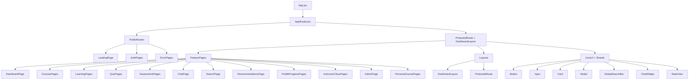

# UI/UX SYSTEM AUDIT - AI Learning Platform

## Execution Log

| Phase | Status | Date | Files Changed |
|-------|--------|------|---------------|
| Phase 1 — Design System & Tokens | ✅ COMPLETED | 2026-05-06 | `FE/src/styles/tokens.css` (new), `FE/src/styles/tokens-dark.css` (new), `FE/src/styles/motion.js` (new), `FE/src/styles/index.css` (refactored), `FE/index.html` (fonts added) |
| Phase 2 — Core UI Components | ✅ COMPLETED | 2026-05-06 | `Button.jsx/css`, `Input.jsx/css`, `Card.jsx/css`, `Modal.jsx/css`, `StateView.jsx` (new `StateView.css`) |

---

## 1) Tech Stack & Libraries

### Frontend (`FE/package.json`)
- Core: React 18.2, React DOM 18.2, Vite 7.1, React Router DOM 6.26.
- Data/API: Axios 1.4.
- State: Zustand 4.5.
- UI/Motion: Framer Motion 10.12.
- Forms/UX: React Hook Form 7.62, React Hot Toast 2.4.
- Charts: Recharts 2.12.
- i18n stack present: `i18next`, `react-i18next`, detector/backend (currently not actively wired in UI flow).
- Other: `react-dropzone` (not seen in active flow).
- Styling approach: plain CSS files (`*.css`) + global tokens/utilities in `FE/src/styles/index.css`; no Tailwind/SCSS/CSS Modules in current setup.

### Backend (`BE/requirements.txt`)
- API framework: FastAPI 0.116, Uvicorn.
- Validation/config: Pydantic 2, pydantic-settings.
- Database: MongoDB via Motor + PyMongo + Beanie ODM.
- Auth/security: `python-jose` (JWT), `passlib[bcrypt]`, `bcrypt`.
- AI: `google-generativeai`.
- Testing/utilities: pytest, pytest-asyncio, Faker, httpx, dotenv.

### AI Architecture Clarification
- System does **not** use RAG/vector retrieval.
- AI behavior is prompt-context based: backend builds structured context from MongoDB entities and sends single-shot prompts to Gemini.

---

## 2) Backend Interface Map (FastAPI + Mongo)

Base API prefix: `/api/v1` (from app router mount).

### Endpoint Domains (high level)
- Auth: register/login/logout/refresh.
- Users: `GET/PATCH /users/me`.
- Courses: search/public/detail/enrollment-status.
- Learning: modules/module detail/outcomes/resources/lesson/module-assessment-generate.
- Enrollments: create/my-courses/detail/cancel.
- Progress: course progress.
- Quiz: detail/attempt/results/retake/AI practice + instructor CRUD/class-results.
- Assessment AI: generate/submit/results.
- Recommendations: from-assessment/general.
- Chat AI: course chat/history/conversation detail/delete.
- Search: search/suggestions/history/analytics.
- Dashboard: student/instructor/admin summaries.
- Analytics: student + instructor + admin analytics endpoints.
- Admin: users/courses/classes/system analytics management.
- Classes: instructor class management + student join.
- Personal courses: create from prompt/create manual/list/update/delete.

### AI-related backend flow (prompt-context, not RAG)
- `BE/services/ai_service.py`: builds textual context (course/module/lesson metadata and related structure) then calls Gemini `generate_content`.
- `BE/services/assessment_service.py`: submit/evaluate assessment and persist analyzed outputs.
- `BE/services/recommendation_service.py`: computes recommendation payload and persists recommendation documents.
- `BE/services/search_service.py`: Mongo query/filter based search, no embedding/vector index.

### MongoDB Core Documents (from `BE/models/models.py`)
- `User`, `RefreshToken`, `PasswordResetTokenDocument`.
- `Course` (with embedded modules/lessons in some flows).
- `Module`, `Lesson`.
- `Enrollment`, `Progress`.
- `Quiz`, `QuizAttempt`.
- `AssessmentSession`.
- `Conversation`.
- `Class`.
- `Recommendation`.

---

## 3) Frontend Component Tree

### Classification

#### Core UI
- `FE/src/components/ui`: `Button`, `Input`, `Card`, `Modal`, `StateView`.

#### Layouts
- `FE/src/components/layout`: `DashboardLayout`, `ProtectedRoute`.

#### Feature Pages
- Auth: login/register/forgot/reset/verify.
- Landing.
- Dashboard.
- Courses + detail.
- Enrollment + my courses.
- Learning (module list/detail/lesson).
- Quiz (list/detail/attempt/results).
- Assessment (setup/quiz/results).
- Chat.
- Search results.
- Recommendations.
- Profile + progress.
- Instructor classes.
- Personal courses + editor.
- Admin console.

---

## 4) Data & State Flow

### Current flow summary
- UI/Page -> service (`FE/src/services/*.js`) -> Axios instance (`FE/src/services/api.js`) -> Backend `/api/v1/*`.
- Axios has auth header + 401 refresh queue logic.
- AI-heavy calls use extended timeout (`AI_TIMEOUT`).

### State management
- Global store: Zustand.
  - `authStore`: user/session/auth actions.
  - `courseStore`: course list/detail/filtering.
  - `uiStore`: global UI flags (but not consistently wired in layout yet).
- Chat state is mostly local hook state (`FE/src/hooks/useChatLogic.js`), not centralized in Zustand.
- Progress/analytics state mostly page-local via `useState` + service calls.

### AI prompt-context path
- FE chat/assessment/recommendation actions call BE services.
- BE constructs prompt context from Mongo docs and calls Gemini.
- FE renders returned text/structured result payloads.

---

## 5) Technical Debt & UI Inconsistencies (Frontend)

1. Sidebar active-state logic uses wrong pathname prefix patterns for dashboard-nested routes.
2. Instructor CTA routing mismatch in dashboard action path.
3. Sidebar information architecture misses several key feature entries (assessment/personal courses/recommendations/search visibility consistency).
4. `uiStore` exists but layout sidebar state still duplicated in local component state.
5. Instructor dashboard page currently behaves like placeholder UX in key actions.
6. Inconsistent use of shared UI primitives (`Button/Card/Input`) vs raw page-specific elements.
7. Emoji-based visual accents mixed with SVG iconography causes inconsistent tone.
8. Inline style usage bypasses design-token consistency.
9. Chat error states are generic; no differentiated UX for timeout/auth/validation cases.
10. ~~`Inter` is referenced in global CSS but font loading pipeline is not robustly standardized.~~ ✅ **Fixed Phase 1** — `FE/index.html` now loads Fraunces, Newsreader, Plus Jakarta Sans, JetBrains Mono via preconnect + `display=swap`. Inter removed from font stack.
11. Overlap between `authService` and `userService` for profile endpoints increases maintenance ambiguity.
12. ~~Global focus style strategy needs refinement (`:focus-visible`) to reduce noisy outlines for mouse interactions.~~ ✅ **Fixed Phase 1** — `FE/src/styles/index.css` now uses `*:focus-visible` (keyboard-only gold halo) instead of `*:focus` (mouse noise).
13. Auth extension pages are present but still placeholders pending full backend support.
14. Fragmented CSS patterns across pages increase visual drift risk.

---

## 6) BE Issues to Review (Note list - not auto-fix)

These are review items for controlled follow-up, not immediate mandatory backend rewrite:

1. `BE/routers/recommendation_router.py`: stray expression/no-op line should be cleaned.
2. `BE/controllers/chat_controller.py`: `sources` and `related_lessons` response fields are often empty; clarify intentional vs pending enrichment.
3. Auth extension mismatch: forgot/reset/verify/resend flows still incomplete vs frontend placeholder pages.
4. RBAC consistency: role/permission enforcement patterns are split across middleware/controllers/services; consider standardization.
5. Assessment result shape alignment: ensure persisted analysis structure matches response schema expectations.
6. Search history endpoint behavior appears minimal/stub-like; verify intended product behavior.
7. Analytics role constraints on some endpoints should be reviewed for strictness.
8. Prompt-context quality: consider enriching context payload (still non-RAG) for better AI response quality.
9. Platform dependency hygiene: windows-specific package handling should be reviewed for cross-platform CI.
10. Seed credentials in `init_data.py` are acceptable for local demo but should be controlled for non-demo environments.

---

---

## 7) System Audit Update — Phase 1–11 Gap Analysis (2026-05-07)

Được phát hiện qua system audit toàn diện sau khi hoàn thành Phase 11. Các vấn đề dưới đây cần xử lý trong Phase 11b.

### 7a) Route Bugs (Navigate đến wrong path → 404)

| File | Line | Bug | Fix |
|------|------|-----|-----|
| `ClassListPage.jsx` | 60 | `navigate('/dashboard/classes/create')` | → `/dashboard/instructor/classes/create` |
| `ClassCreatePage.jsx` | 26 | `navigate('/dashboard/classes/${class_id}')` | → `/dashboard/instructor/classes/${class_id}` |
| `ClassDetailPage.jsx` | 52 | `navigate('/dashboard/classes')` | → `/dashboard/instructor/classes` |

### 7b) Dead Placeholder Pages (không gọi service, không có data)

| Page | Route | Tình trạng |
|------|-------|-----------|
| `StudentEnrollmentPage.jsx` | `/dashboard/enrollment/:id` | Static "Đang tải..." — `enrollmentService.getEnrollmentDetail` tồn tại nhưng chưa được gọi |
| `InstructorDashboardPage.jsx` | `/dashboard/instructor` | 3 Card rỗng, không gọi `dashboardService.getInstructorDashboard()` |

### 7c) Pages Chưa Refactor (trong luồng chính, không trong Phase 1–11)

| Page | Route | Vấn đề |
|------|-------|--------|
| `MyCoursesPage.jsx` | `/dashboard/my-courses` | Emoji `📚`, raw skeleton, raw empty state |
| `AssessmentSetupPage.jsx` | `/dashboard/assessment` | Raw card form, không editorial |
| `QuizPage.jsx` | `/dashboard/quiz` | Emoji `📝`, raw skeleton + empty |
| `QuizDetailPage.jsx` | `/dashboard/quiz/:id` | Emoji `📝` trong empty state |
| `QuizResultsPage.jsx` | `/dashboard/quiz/:id/results` | Hardcoded `conic-gradient`, `✓ ✗` raw text |
| `ClassListPage.jsx` | `/dashboard/instructor/classes` | Emoji `👥 🔑`, inline `style={}` |
| `ClassCreatePage.jsx` | `/dashboard/instructor/classes/create` | Raw form, route bug |
| `ClassDetailPage.jsx` | `/dashboard/instructor/classes/:id` | Raw loading text, route bug |
| `NotFoundPage.jsx` | `/404` | Broken Vietnamese (không dấu), emoji `🔍` |
| `UnauthorizedPage.jsx` | `/unauthorized` | Chưa kiểm tra editorial |

### 7d) Pages Thuộc Phase 12–13 (đúng scope, chưa đến lượt)

| Page | Phase | Vấn đề chính |
|------|-------|-------------|
| `ProfilePage.jsx` | 12 | Raw form inputs, không editorial |
| `ProgressPage.jsx` | 12 | **6 emoji icons**, hardcoded gradient inline styles |
| `AdminPage.jsx` | 13 | 686 dòng monolith, cần tách tabs |

---

## Audit Conclusion

- Frontend has strong feature coverage but needs systemic design unification, navigation consistency fixes, and component-level standardization.
- Backend contract is sufficiently rich for an aggressive UI refactor with minimal API disruption.
- AI interaction model is prompt-context based and can be preserved while upgrading UX significantly.

---

## Phase 1 — Delivery Notes (2026-05-06)

### Files created / modified
| File | Action | Notes |
|------|--------|-------|
| `FE/src/styles/tokens.css` | **NEW** | Editorial palette (cream/ink/gold/copper/vermilion/jade/sand) + full legacy alias map. 257 lines. |
| `FE/src/styles/tokens-dark.css` | **NEW** | `[data-theme="dark"]` overrides. Surfaces → deep ink, primary → gold. 79 lines. |
| `FE/src/styles/motion.js` | **NEW** | Framer Motion presets: `EASE`, `DURATION`, `SPRING`, `fadeUp`, `staggerContainer/Editorial/Tight`, `pageTurn/pageFade`, `magneticHover/Tap`, `cardLift`, `inView()`. |
| `FE/src/styles/index.css` | **REFACTORED** | `@import tokens.css + tokens-dark.css`. Editorial body background (cream canvas + gold/copper vignette). Display font for h1–h6 (Fraunces). Scrollbar editorial styling. `:focus-visible` gold halo. `prefers-reduced-motion` global guard. All 40 legacy CSS variables preserved. |
| `FE/index.html` | **UPDATED** | Preconnect + load: Fraunces (variable opsz+wght), Newsreader (variable opsz+wght+italic), Plus Jakarta Sans (wght 300–800), JetBrains Mono (wght 400–600). `display=swap`. |

### Acceptance verification
- `npm run build` → **exit 0**, ✓ 1099 modules, built in 20.64s.
- PowerShell grep: all 40 pre-existing `var(--)` token names resolve inside `tokens.css`.
- No `.jsx` / BE files touched.
- Warnings present are **pre-existing** (chunk size, dynamic import, Edge Tools compat notices).

