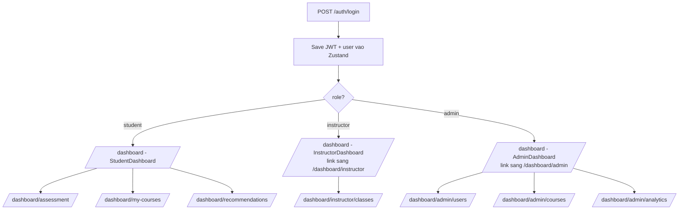

# Frontend — AI Learning Platform

Single-page app **React 18 + Vite** cho 3 role (`student / instructor / admin`). Một codebase, nhiều dashboard, gọi tới Backend FastAPI qua axios + JWT.

> Tài liệu này tập trung vào **Frontend**. Toàn cảnh hệ thống xem [`../README.md`](../README.md), API reference xem [`../docs/API.md`](../docs/API.md).

---

## 1. Tech stack

| Lớp | Thư viện | Phiên bản |
|------|---------|-----------|
| Framework | `react`, `react-dom` | 18.2.0 |
| Bundler / dev server | `vite`, `@vitejs/plugin-react` | 7.1.6 / 5.0.3 |
| Routing | `react-router-dom` | 6.26.1 |
| State | `zustand` (có middleware `persist`) | 4.5.4 |
| HTTP client | `axios` (có refresh interceptor) | 1.4.0 |
| Forms | `react-hook-form` | 7.62.0 |
| Animation | `framer-motion` | 10.12.5 |
| Charts | `recharts` | 2.12.7 |
| Toast / notification | `react-hot-toast` | 2.4.1 |
| Drag-drop upload | `react-dropzone` | 14.2.3 |
| i18n | `i18next`, `react-i18next`, browser detector, http backend | 23.7.8 / 13.5.0 |
| Lint / format | `eslint`, `prettier` | 8.57.0 / 3.0.0 |
| Test runner | `vitest` (chưa có test file) | 0.34.0 |

**JS/JSX**, không TypeScript. CSS thuần (token-based), không Tailwind.

---

## 2. Yêu cầu môi trường

- **Node**: 18+ (Vite 7 yêu cầu).
- **npm**: 9+ (hoặc pnpm/yarn nếu tự cấu hình).
- Backend chạy ở `http://localhost:8000` (xem [`../BE/README.md`](../BE/README.md)).

---

## 3. Setup & chạy

```powershell
cd FE
npm install
copy .env.example .env
npm run dev
```

Mặc định dev server bind `http://localhost:3000`. Nếu port 3000 bận, Vite sẽ fallback (ví dụ 3001) — **không cần** đổi `VITE_API_BASE_URL` vì biến đó trỏ tới **Backend** (`:8000`).

### Biến môi trường (`FE/.env`)

| Key | Mục đích | Mặc định |
|-----|----------|----------|
| `VITE_API_BASE_URL` | Base URL cho axios (đã include `/api/v1`) | `http://localhost:8000/api/v1` |
| `VITE_API_TIMEOUT` | Timeout request (ms) — code hiện dùng `30000` hard-coded | `30000` |
| `VITE_APP_NAME`, `VITE_APP_VERSION`, `VITE_APP_DESCRIPTION` | Metadata UI | `AI Learning Platform`, `1.0.0`, … |
| `VITE_AUTH_TOKEN_KEY` | Tên key localStorage cho access token | `access_token` |
| `VITE_AUTH_REFRESH_KEY` | Tên key localStorage cho refresh token | `refresh_token` |
| `VITE_ENABLE_DARK_MODE`, `VITE_ENABLE_I18N`, `VITE_ENABLE_PWA` | Feature flags | `true / true / false` |
| `VITE_DEV_MODE`, `VITE_ENABLE_MOCK_API` | Dev | `true / false` |
| `VITE_LOG_LEVEL` | Log level | `info` |

> Lưu ý: source code hiện hardcode key localStorage `access_token` / `refresh_token` (`FE/src/services/api.js`, `FE/src/stores/authStore.js`). Đổi giá trị `VITE_AUTH_TOKEN_KEY` chưa được wire vào code — coi như tham khảo.

---

## 4. Scripts (`npm run …`)

| Script | Lệnh thực tế | Mục đích |
|--------|--------------|----------|
| `dev` | `vite` | Dev server, hot reload, mặc định port 3000 |
| `start` | `vite --host 0.0.0.0 --port 3000` | Dev server expose ra LAN (ép port) |
| `build` | `vite build` | Build production vào `FE/dist/` |
| `preview` | `vite preview` | Serve thử bản build |
| `analyze` | `vite build --analyze` | Build kèm bundle analyzer |
| `lint` | `eslint . --ext .js,.jsx` | Lint toàn repo FE (**chưa có file `.eslintrc`** — sẽ báo lỗi config, xem mục Troubleshooting) |
| `lint:fix` | `eslint . --ext .js,.jsx --fix` | Lint + auto-fix |
| `format` | `prettier --write src/**/*.{js,jsx,json,css,md}` | Format code |
| `format:check` | `prettier --check …` | CI check format |
| `test` | `vitest` | Chạy unit test (chưa có file test) |
| `test:ui` | `vitest --ui` | UI mode |
| `test:coverage` | `vitest --coverage` | Coverage report |
| `clean` | `rm -rf dist node_modules/.vite` | Dọn cache (Bash) |

---

## 5. Cấu trúc thư mục `FE/src/`

```
src/
├── main.jsx                # ReactDOM.createRoot, mount <App />
├── App.jsx                 # ThemeProvider + Router + Toaster + i18n init
├── AppRouter.jsx           # Khai bao toan bo route + guards
├── pages/                  # Page components theo domain
├── components/             # Shared component (layout, ui, ...)
│   ├── layout/             # DashboardLayout, ProtectedRoute, AdminRoute, ...
│   └── ui/                 # Button, Card, Input, Modal, StateView, AILoadingState
├── services/               # axios instance + 1 file/domain (auth, course, ...)
├── stores/                 # Zustand store: authStore, courseStore, uiStore
├── hooks/                  # Custom hooks (useChatLogic)
├── contexts/               # ThemeContext (light/dark)
├── styles/                 # tokens.css, tokens-dark.css, index.css, motion.js
└── utils/                  # Helpers (formatters, ...)
```

| Folder | Mục đích |
|--------|---------|
| `pages/auth` | `LoginPage`, `RegisterPage`, `ForgotPasswordPage`, `ResetPasswordPage`, `VerifyEmailPage` |
| `pages/landing` | Landing page bento style (`LandingPage.jsx` + `LandingPage.css`) |
| `pages/dashboard` | `DashboardPage` + biến thể theo role (`StudentDashboard`, `InstructorDashboard`, `AdminDashboard`) trong `pages/dashboard/components/` |
| `pages/assessment` | Setup → Quiz → Review → Results cho assessment |
| `pages/courses` | Catalog + chi tiết khóa học công khai |
| `pages/learning` | `ModuleListPage`, `ModuleDetailPage`, `LessonPage` |
| `pages/quiz` | Quiz list / detail / attempt / results |
| `pages/personal-courses` | Quản lý khóa cá nhân (student) |
| `pages/enrollment` | `MyCoursesPage`, `StudentEnrollmentPage`, `InstructorDashboardPage` |
| `pages/classes` | List / Create / Detail lớp học (instructor) |
| `pages/chat` | AI Tutor chat |
| `pages/recommendations` | Lộ trình gợi ý từ AI |
| `pages/search` | Kết quả tìm kiếm global |
| `pages/progress` | Trang tiến độ học (hiện dùng `analyticsService`) |
| `pages/profile` | Hồ sơ cá nhân |
| `pages/admin` | `AdminPage` route lồng `/admin/users \| /courses \| /classes \| /analytics` |
| `pages/error` | `NotFoundPage`, `UnauthorizedPage` |

---

## 6. Routing & guards

Tất cả route khai báo trong `FE/src/AppRouter.jsx`. Guards nằm ở `FE/src/components/layout/ProtectedRoute.jsx`:

- `ProtectedRoute` — phải đăng nhập.
- `StudentRoute` — phải đăng nhập + role `student`.
- `InstructorRoute` — phải đăng nhập + role `instructor`.
- `AdminRoute` — phải đăng nhập + role `admin`.

Người chưa đăng nhập bị đẩy về `/auth/login`; sai role bị đẩy về `/unauthorized`.

### Bảng route → role

| Path | Component | Role bắt buộc |
|------|-----------|---------------|
| `/` | `LandingPage` | Public |
| `/auth/login`, `/auth/register`, `/auth/forgot-password`, `/auth/reset-password`, `/auth/verify-email` | Auth pages | Public |
| `/dashboard` | `DashboardPage` (render theo role) | Đăng nhập |
| `/dashboard/profile`, `/dashboard/progress` | Profile / Progress | Đăng nhập |
| `/dashboard/courses`, `/dashboard/courses/:id`, `/dashboard/courses/:id/modules/*`, `/dashboard/courses/:id/lessons/:lid` | Course / Learning | Đăng nhập |
| `/dashboard/quiz`, `/dashboard/quiz/:quizId/*` | Quiz | Đăng nhập |
| `/dashboard/chat` | `ChatPage` | Đăng nhập |
| `/dashboard/search` | `SearchResultsPage` | Đăng nhập |
| `/dashboard/my-courses`, `/dashboard/enrollment/:id` | Enrollment | **Student** |
| `/dashboard/assessment`, `/dashboard/assessment/:id/*` | Assessment | **Student** |
| `/dashboard/recommendations` | Recommendations | **Student** |
| `/dashboard/personal-courses`, `/dashboard/personal-courses/create`, `/dashboard/personal-courses/:id/edit` | Personal courses | **Student** ⚠️ instructor cũng bị chặn |
| `/dashboard/instructor`, `/dashboard/instructor/classes`, `/dashboard/instructor/classes/create`, `/dashboard/instructor/classes/:classId` | Instructor pages | **Instructor** |
| `/dashboard/admin/*` (users / courses / classes / analytics) | `AdminPage` (nested route) | **Admin** |
| `/unauthorized`, `/404`, `*` | Error pages / catch-all | Public |

### Điều hướng sau login theo role



---

## 7. State management — Zustand

3 store nằm trong `FE/src/stores/`:

| Store | Trách nhiệm | Persist |
|-------|-------------|---------|
| `useAuthStore` (`authStore.js`) | `user`, `isAuthenticated`, `login / register / logout / getCurrentUser / updateProfile / initializeAuth / reset`. Tự reset `courseStore` & `uiStore` khi logout để tránh leak giữa user. | localStorage key **`auth-storage`** (chỉ lưu `user` + `isAuthenticated`) |
| `useCourseStore` (`courseStore.js`) | Cache courses / detail / filter | Không |
| `useUiStore` (`uiStore.js`) | Sidebar open, theme toggle, modal flags | Không |

> **Token storage**: access token và refresh token được lưu **trực tiếp** trong `localStorage` (key `access_token`, `refresh_token`, `token_type`). Đây là quyết định đơn giản hóa cho dev — **không an toàn cho production**, dễ bị XSS. Khi đi prod nên chuyển sang HttpOnly cookie + CSRF token.

---

## 8. API client

File: `FE/src/services/api.js`.

- `baseURL = import.meta.env.VITE_API_BASE_URL || 'http://127.0.0.1:8000/api/v1'`.
- `timeout = 30s` mặc định; có 2 timeout dài hơn export sẵn:
  - `AI_TIMEOUT = 120_000` — endpoint gọi Gemini sinh nội dung.
  - `ASSESSMENT_SUBMIT_TIMEOUT = 180_000` — submit assessment (BE chấm bằng AI).
- **Request interceptor**: tự gắn `Authorization: Bearer <access_token>` lấy từ `localStorage`.
- **Response interceptor — refresh queue**:
  1. Khi nhận `401` và chưa retry, kiểm tra `isRefreshing`.
  2. Nếu đang refresh, push request vào `failedQueue` chờ token mới rồi retry.
  3. Nếu chưa refresh, gọi `POST /auth/refresh` (bằng axios gốc, tránh loop). Lưu `access_token` mới, flush queue.
  4. Nếu refresh fail → xóa localStorage, `window.dispatchEvent(new CustomEvent('auth:session-expired'))`, redirect `/auth/login`.
- Helper `handleApiResponse`, `handleApiError` (đặc biệt xử lý 422 Pydantic detail array).

### Service per domain

Mỗi domain BE có 1 file tương ứng:

```
services/authService.js          recommendationService.js
services/userService.js          analyticsService.js
services/courseService.js        adminService.js
services/enrollmentService.js    chatService.js
services/learningService.js      classService.js
services/quizService.js          searchService.js
services/progressService.js      personalCourseService.js
services/assessmentService.js    dashboardService.js
```

Endpoint chi tiết: [`../docs/API.md`](../docs/API.md).

---

## 9. Design system

- **Tokens**: `FE/src/styles/tokens.css` (light) + `FE/src/styles/tokens-dark.css` (dark). Biến CSS cho màu, spacing, radius, shadow, typography.
- **Theme toggle**: `FE/src/contexts/ThemeContext.jsx` quản lý light/dark, lưu preference vào localStorage.
- **Global CSS**: `FE/src/styles/index.css` import tokens và reset.
- **Motion variants chung**: `FE/src/styles/motion.js` (framer-motion variants tái dùng).
- **UI primitives** (`FE/src/components/ui/`):

| Component | Mục đích |
|-----------|---------|
| `Button` | Primary / secondary / ghost, loading state |
| `Card` | Container với padding + shadow, hỗ trợ hover |
| `Input` | Input + label + error |
| `Modal` | Dialog có focus trap |
| `StateView` | Empty / error / loading state placeholder |
| `AILoadingState` | Skeleton + animation dành cho call AI dài |

- **Landing page** (`pages/landing/LandingPage.jsx` + `.css`): bento layout full-bleed, hamburger nav, scroll-trigger drop animation per-tile.

---

## 10. Internationalization & toast

- i18n đã được wire trong `App.jsx` (i18next + browser language detector + http backend) — file dịch chưa có sẵn, có thể bật/tắt qua flag `VITE_ENABLE_I18N`.
- Toast: `react-hot-toast`, mount `<Toaster />` trong `App.jsx`. Dùng `toast.success / toast.error / toast.loading` ở các page.

---

## 11. Known gaps & TODO

- **Forgot / reset / verify password** — page tồn tại nhưng `authService` gọi endpoint BE chưa có (`forgotPassword`, `resetPassword`, `verifyEmail`). Action: bổ sung router BE hoặc gỡ link UI.
- **`ProgressPage` chưa wire với `progressService`** — đang dùng `analyticsService` (`/analytics/learning-stats`, `/analytics/progress-chart`). `progressService.js` (gọi `GET /progress/course/{id}`) không page nào import.
- **Instructor không vào được `personal-courses`** — guard `<StudentRoute>` đang bao toàn bộ. Nếu instructor cũng cần course editor, đổi `StudentRoute` → `ProtectedRoute`.
- **Không có file test** — `vitest` được cấu hình nhưng `src/**/*.test.*` chưa tồn tại.
- **Lint chưa chạy được** — chưa có `.eslintrc.{json,cjs}` hay block `eslintConfig` trong `package.json`. Cần thêm config Eslint cho React.
- **`VITE_AUTH_TOKEN_KEY` / `VITE_AUTH_REFRESH_KEY`** trong `.env.example` không được đọc — code hard-code key `access_token` / `refresh_token`.

---

## 12. Troubleshooting

| Triệu chứng | Nguyên nhân | Cách xử lý |
|-------------|-------------|------------|
| `npm run dev` báo `Port 3000 in use` | Có process khác giữ port | Vite tự fallback sang 3001/3002. Hoặc tự kill process: `Get-NetTCPConnection -LocalPort 3000` |
| Mọi request đều `Network Error` / `ERR_CONNECTION_REFUSED` | BE chưa chạy hoặc khác origin | Khởi BE `uvicorn app.main:app --reload`. Kiểm tra `VITE_API_BASE_URL` |
| `401 Unauthorized` lặp vô tận, sau đó về `/auth/login` | Refresh token cũng đã hết hạn / sai | Xóa localStorage `access_token` + `refresh_token`, đăng nhập lại |
| `CORS error` ở browser | Origin FE không nằm trong `ALLOWED_ORIGINS` của BE | Sửa `BE/.env` thêm `http://localhost:3001` (hoặc port fallback) vào `ALLOWED_ORIGINS` |
| `npm run lint` báo "No ESLint configuration found" | Repo chưa có config | Thêm `.eslintrc.cjs` chuẩn React/JSX (chưa có sẵn — coi là known gap) |
| Đổi role trên BE nhưng FE không nhận | Zustand persist còn giữ `user` cũ | Logout → login lại để gọi `GET /users/me` mới |

---

## 13. Build & deploy

```powershell
npm run build         # output FE/dist/
npm run preview       # serve thu ban build, port 4173
```

Static bundle có thể deploy lên bất kỳ static host (Vercel / Netlify / S3 / CloudFront / Nginx). Khi build production, set `VITE_API_BASE_URL` trỏ về domain backend thật trước khi `vite build`.
