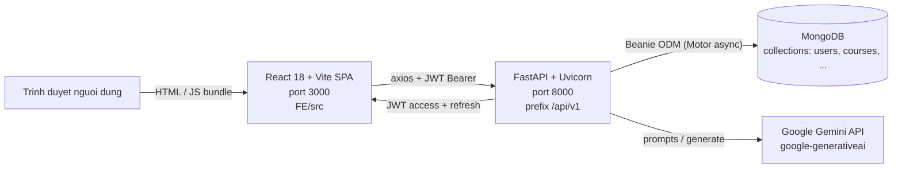
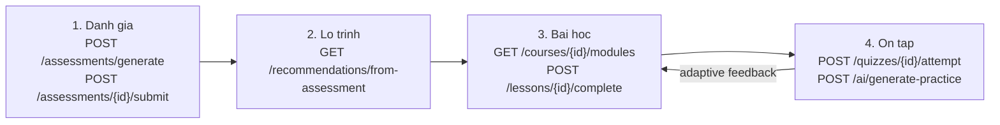
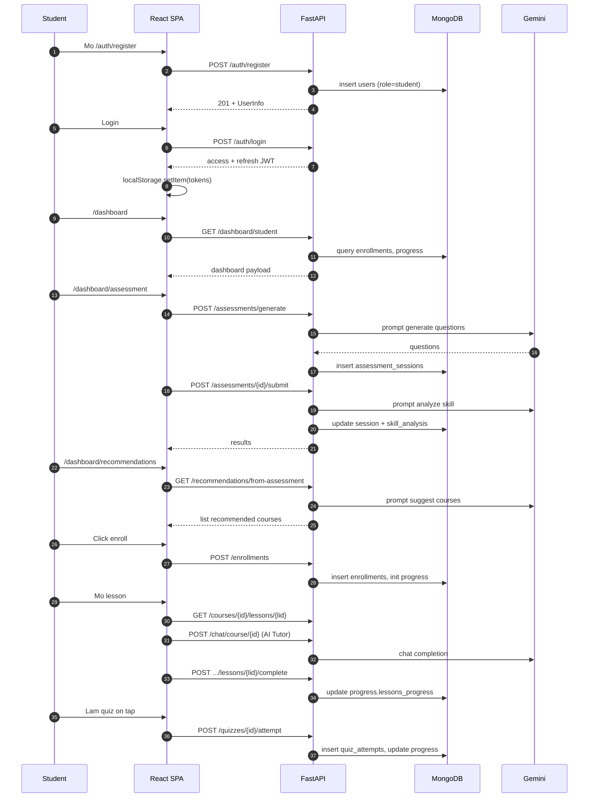
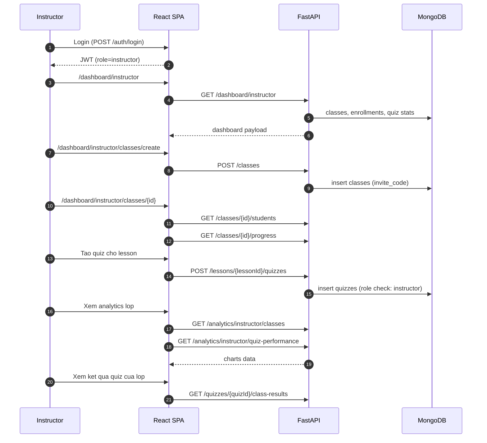
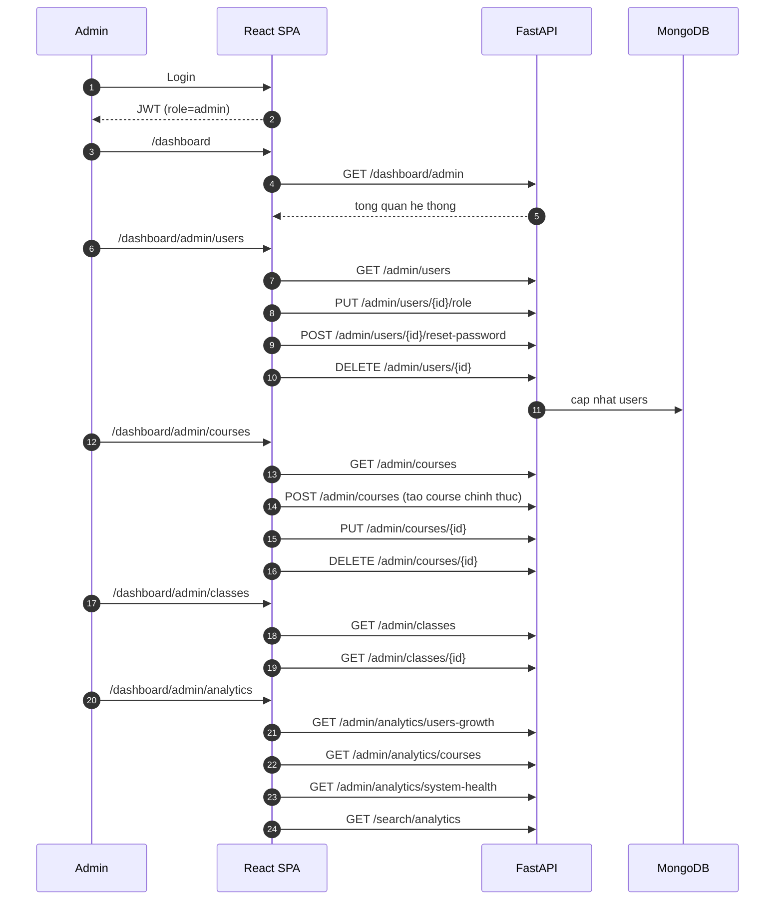

# AI Learning Platform

Nền tảng học tập **cá nhân hóa bằng AI** (assessment → lộ trình → bài học → ôn tập) gồm:

- **Frontend (FE)**: SPA React 18 + Vite, single landing + dashboard cho 3 role.
- **Backend (BE)**: FastAPI + MongoDB (Beanie ODM), tích hợp **Google Gemini** cho assessment / AI tutor / sinh quiz.
- **Tài liệu**: README cấp phân hệ (FE, BE), API reference (`docs/API.md`), QUICKSTART đã có sẵn cho BE.

> Đây là tài liệu **gốc** mô tả toàn cảnh hệ thống. Setup chi tiết xem [`FE/README.md`](FE/README.md) và [`BE/README.md`](BE/README.md). API reference đầy đủ xem [`docs/API.md`](docs/API.md).

---

## 1. Kiến trúc tổng quan



- **Auth**: JWT access token (15 phút mặc định) + refresh token 7 ngày, refresh tự động qua axios interceptor (`FE/src/services/api.js`).
- **CORS**: BE cho phép `http://localhost:3000` và `http://localhost:5173` mặc định (`BE/config/config.py`).

---

## 2. Tech stack ngắn gọn

| Lớp | Công nghệ chính | Dùng để làm gì |
|------|-----------------|----------------|
| **Frontend** | React 18.2 + Vite 7.1 + JSX, Zustand 4 (persist), axios 1.4, react-router-dom 6, framer-motion 10, recharts 2, react-hook-form 7, react-hot-toast | SPA, routing, state, gọi API, animation, biểu đồ tiến độ |
| **Backend** | FastAPI + Uvicorn, Pydantic v2, Beanie ODM (Motor + PyMongo), python-jose (JWT), passlib/bcrypt, google-generativeai | REST API, validation, JWT auth, hash password, gọi Gemini |
| **Database** | MongoDB 7.0 (document store) | Collections: `users`, `courses`, `modules`, `lessons`, `enrollments`, `assessment_sessions`, `quizzes`, `quiz_attempts`, `progress`, `conversations`, `classes`, `recommendations`, `refresh_tokens`, `password_reset_tokens` |
| **AI** | Google Gemini (qua `BE/services/ai_service.py`) | Sinh đề assessment, sinh quiz / practice, AI Tutor chat, đề xuất khóa |
| **Infra** | Docker Compose (`BE/docker-compose.yml`), file log `BE/logs/app.log` | Chạy BE + MongoDB ở môi trường dev/staging |

---

## 3. Ba vai trò (role)

Tên role lấy chính xác từ model `User` (`BE/models/models.py`) và RBAC (`BE/middleware/rbac.py`): **`student | instructor | admin`** (mặc định khi đăng ký là `student`).

| Role | Mô tả | Page chính | Nhóm endpoint chính |
|------|------|------------|---------------------|
| **`student`** | Người học. Đăng ký công khai, làm assessment, học theo lộ trình AI, chat AI tutor, làm quiz, theo dõi tiến độ. | `/dashboard`, `/dashboard/assessment`, `/dashboard/courses`, `/dashboard/my-courses`, `/dashboard/chat`, `/dashboard/quiz`, `/dashboard/recommendations`, `/dashboard/personal-courses` | `assessments`, `enrollments`, `learning`, `chat`, `quiz`, `recommendations`, `personal-courses`, `progress`, `analytics/learning-stats` |
| **`instructor`** | Giảng viên. Quản lý lớp (`classes`), theo dõi học viên, tạo / sửa quiz, xem analytics lớp. | `/dashboard/instructor`, `/dashboard/instructor/classes` | `dashboard/instructor`, `analytics/instructor/*`, `classes/*`, `quizzes` (CRUD), `lessons/{id}/quizzes` |
| **`admin`** | Quản trị viên. CRUD user (đổi role, reset password), CRUD khóa học toàn cục, giám sát lớp, analytics hệ thống. | `/dashboard/admin/{users,courses,classes,analytics}` | `admin/*`, `dashboard/admin`, `search/analytics` |

Phân quyền hiện được kiểm trong **controller** (so sánh chuỗi `current_user["role"]`), chưa gắn qua `Depends` của `BE/middleware/rbac.py`. Chi tiết: [`BE/README.md`](BE/README.md).

---

## 4. FLOW_STEPS — quy trình học tập cốt lõi

Bốn bước marketing trên landing (`FE/src/pages/landing/LandingPage.jsx`) **map 1‑1** với luồng code thực tế:



| Bước | Mục tiêu | Page FE | Endpoint chính | Collection thay đổi |
|------|----------|---------|----------------|---------------------|
| **1. Đánh giá** | Xác định năng lực hiện tại | `AssessmentSetupPage` → `AssessmentQuizPage` → `AssessmentResultsPage` | `POST /assessments/generate`, `POST /assessments/{id}/submit`, `GET /assessments/{id}/results` | `assessment_sessions` |
| **2. Lộ trình** | Sinh kế hoạch học cá nhân từ kết quả assessment | `RecommendationsPage` | `GET /recommendations/from-assessment?session_id=…`, `GET /recommendations` | `recommendations` |
| **3. Bài học** | Học theo module/lesson, đánh dấu hoàn thành | `CourseDetailPage` → `ModuleListPage` → `ModuleDetailPage` → `LessonPage` | `GET /courses/{id}/modules`, `GET /courses/{id}/lessons/{lessonId}`, `POST /courses/{id}/lessons/{lessonId}/complete` | `courses`, `modules`, `lessons`, `enrollments`, `progress` |
| **4. Ôn tập** | Củng cố đúng điểm yếu | `QuizPage` → `QuizAttemptPage` → `QuizResultsPage`; AI practice tự sinh | `POST /quizzes/{id}/attempt`, `POST /quizzes/{id}/retake`, `POST /ai/generate-practice`, `POST /courses/{id}/modules/{moduleId}/assessments/generate` | `quizzes`, `quiz_attempts`, `progress` |

---

## 5. End-to-end flows theo role

### 5.1 Student — luồng đầy đủ



### 5.2 Instructor — luồng đầy đủ



### 5.3 Admin — luồng đầy đủ



---

## 6. Cấu trúc workspace

```
AI-Learning-Platform/
├── README.md                       # tai lieu nay
├── BE/                             # backend FastAPI
│   ├── README.md                   # huong dan BE (stack + setup + RBAC)
│   ├── QUICKSTART.md               # setup nhanh BE (da co tu truoc)
│   ├── app/                        # entry point + db init
│   ├── controllers/                # HTTP handlers
│   ├── routers/                    # khai bao FastAPI Router
│   ├── services/                   # nghiep vu + AI
│   ├── models/                     # Beanie Document
│   ├── schemas/                    # Pydantic request/response
│   ├── middleware/                 # auth (JWT) + rbac helpers
│   ├── utils/                      # security, helpers
│   ├── config/                     # Settings, logging
│   ├── docs/reports/               # bao cao schema seed
│   ├── docker-compose.yml          # MongoDB + BE container
│   └── requirements.txt
├── FE/                             # frontend React + Vite
│   ├── README.md                   # huong dan FE (stack + setup + routing)
│   ├── package.json
│   ├── vite.config.js
│   ├── index.html
│   └── src/
│       ├── main.jsx, App.jsx, AppRouter.jsx
│       ├── pages/                  # landing, auth, dashboard, ...
│       ├── components/             # layout, ui, ...
│       ├── services/               # axios + API per domain
│       ├── stores/                 # Zustand
│       ├── hooks/, contexts/, styles/, utils/
└── docs/
    └── API.md                      # API reference day du
```

---

## 7. Quick start (3 phút)

> Yêu cầu: **Node 18+**, **Python 3.11+**, **MongoDB** đang chạy (local hoặc Atlas), **Google Gemini API key**.

```powershell
# 1) Backend (xem BE/README.md de biet chi tiet)
cd BE
python -m venv venv ; venv\Scripts\activate
pip install -r requirements.txt
copy .env.example .env   # sua SECRET_KEY, MONGODB_URL, GOOGLE_API_KEY
uvicorn app.main:app --reload      # http://localhost:8000

# 2) Frontend (mo terminal moi - xem FE/README.md de biet chi tiet)
cd FE
npm install
copy .env.example .env             # VITE_API_BASE_URL=http://localhost:8000/api/v1
npm run dev                        # http://localhost:3000
```

Sau đó:

1. Truy cập `http://localhost:3000` → đăng ký tài khoản (role mặc định **`student`**).
2. Để tạo `instructor` / `admin`: dùng Swagger `http://localhost:8000/docs` đăng nhập bằng tài khoản admin, gọi `PUT /admin/users/{id}/role` để đổi role.

---

## 8. Tài liệu liên quan

| Tài liệu | Mục đích |
|----------|----------|
| [`FE/README.md`](FE/README.md) | Setup, scripts, routing, state, design system của Frontend |
| [`BE/README.md`](BE/README.md) | Setup, biến môi trường, RBAC, AI integration của Backend |
| [`BE/QUICKSTART.md`](BE/QUICKSTART.md) | Setup nhanh BE (đã có sẵn) |
| [`BE/docs/reports/SEED_SCHEMA_MATRIX.md`](BE/docs/reports/SEED_SCHEMA_MATRIX.md) | Ma trận seed schema cho mọi collection |
| [`docs/API.md`](docs/API.md) | Reference đầy đủ **90 endpoints** + curl mẫu |

---

## 9. Trạng thái tính năng và known gaps

Mục này tổng hợp những điểm code thực tế **lệch** với tài liệu cũ hoặc **chưa hoàn thiện**, để dev mới khỏi mất thời gian đoán:

- [ ] **Forgot / reset / verify password** — page tồn tại (`FE/src/pages/auth/{ForgotPassword,ResetPassword,VerifyEmail}Page.jsx`) nhưng service throw vì BE chưa có endpoint (`FE/src/services/authService.js`). `auth_router.py` chỉ có `register / login / logout / refresh`.
- [x] **Seed script** — có sẵn [`BE/scripts/init_data.py`](BE/scripts/init_data.py): `cd BE && python -m scripts.init_data` (full reset DB + seed lớn). Sau khi chạy, script in demo accounts (ví dụ `admin1@ailearning.vn / Admin@123456`, `instructor1@ailearning.vn / Instructor@123`, `student1@gmail.com / Student@123`). Có thể dùng kèm smoke test [`BE/scripts/smoke_test.py`](BE/scripts/smoke_test.py).
- [ ] **Tests** — `pytest` có trong `BE/requirements.txt` và `vitest` có trong `FE/package.json`, nhưng **không có file test thực tế** trong cả 2 phân hệ.
- [ ] **`SECRET_KEY` vs `JWT_SECRET_KEY`** — `BE/QUICKSTART.md` viết `JWT_SECRET_KEY`, nhưng `BE/config/config.py` đọc biến tên **`SECRET_KEY`**. Dùng `SECRET_KEY` trong `.env`.
- [ ] **RBAC helpers chưa gắn router** — `BE/middleware/rbac.py` có `require_admin / require_instructor / require_student`, hierarchy đầy đủ, nhưng các router hiện kiểm `role` bằng cách so chuỗi trong controller (xem `BE/controllers/{admin,dashboard,quiz,search}_controller.py`).
- [ ] **Progress page chưa wire BE** — `BE/routers/progress_router.py` expose `GET /progress/course/{id}` và `FE/src/services/progressService.js` đã có hàm gọi, nhưng **không page nào import**. `ProgressPage` đang dùng `analyticsService` (`/analytics/learning-stats`, `/analytics/progress-chart`).
- [ ] **Instructor bị chặn personal-courses** — `FE/src/AppRouter.jsx` bọc `/dashboard/personal-courses*` trong `<StudentRoute>` ⇒ role `instructor` sẽ rơi vào `/unauthorized`. Nếu muốn instructor cũng dùng course editor, cần đổi guard.

---

## 10. License & liên hệ

> Placeholder — bổ sung khi xác định license và thông tin team.
