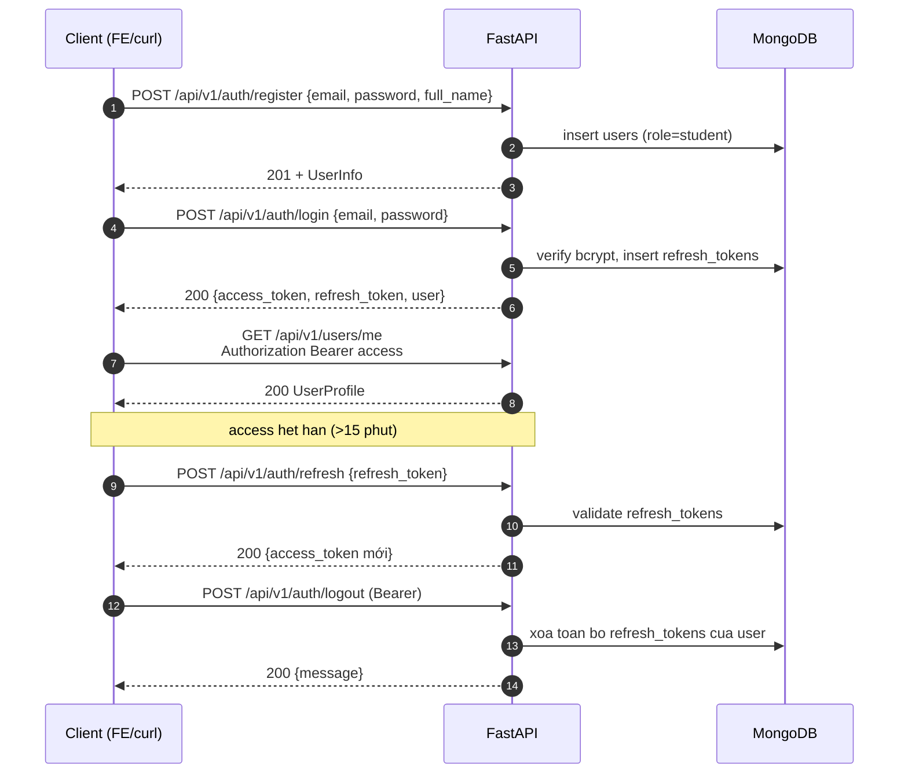

# API Reference — AI Learning Platform

Đầy đủ **90 endpoint** của Backend FastAPI: 1 `GET /health` ngoài prefix + 89 endpoint dưới `/api/v1`. Tài liệu này liệt kê theo router, kèm role bắt buộc và ví dụ `curl`.

> Triển khai mã nguồn: [`BE/routers/`](../BE/routers/). Setup BE: [`../BE/README.md`](../BE/README.md). Toàn cảnh hệ thống: [`../README.md`](../README.md).

---

## 1. Quy ước chung

- **Base URL (dev)**: `http://localhost:8000`. Tất cả endpoint nghiệp vụ nằm dưới prefix **`/api/v1`** (trừ `/health`).
- **Content-Type**: `application/json` cho mọi request/response trừ upload file.
- **Auth header**: `Authorization: Bearer <access_token>` cho endpoint yêu cầu đăng nhập.
- **Token**: JWT HS256 — access 15 phút, refresh 7 ngày (cấu hình qua `.env`).
- **Response thành công**: HTTP 200/201, body là JSON đúng schema khai báo trong Swagger (`/docs`).
- **Response lỗi**: JSON `{ "detail": ... }`. Với 422, `detail` là **array** Pydantic validation errors (FE đã handle ở `handleApiError`).
- **Phân trang chuẩn**: query `skip` + `limit` (đa số) hoặc `page` + `limit` (search + admin classes).
- **Role-naming**: `student | instructor | admin`. Hierarchy `admin > instructor > student` chỉ áp dụng khi router dùng `require_role` (hiện hầu hết check role bằng so chuỗi trong controller — xem `BE/README.md` mục 9.2).

### 1.1 Mã lỗi thường gặp

| Code | Ý nghĩa | Khi nào |
|------|---------|---------|
| 400 | Bad Request | Logic nghiệp vụ sai (email đã tồn tại, đã enroll, đã cancel…) |
| 401 | Unauthorized | Token thiếu / sai / hết hạn / không phải type "access" |
| 403 | Forbidden | Sai role, không phải owner |
| 404 | Not Found | Tài nguyên không tồn tại |
| 409 | Conflict | Xung đột state (ít dùng) |
| 422 | Unprocessable Entity | Pydantic validation fail — `detail` là array |
| 500 | Internal Server Error | Lỗi không catch (DB/AI) |

### 1.2 Cột "Role" trong các bảng

- **Public** — không cần token.
- **Đăng nhập** — bất kỳ user đã login.
- **Optional** — cho phép cả guest và user, response có thể khác nếu đã login (cờ `is_enrolled`, ...).
- **Student / Instructor / Admin** — chỉ role đó (kiểm trong controller). Admin **không** tự động truy cập được endpoint dán nhãn `Student` vì check bằng so chuỗi.

---

## 2. Auth flow



---

## 3. Bảng đầy đủ 90 endpoints

> Mỗi mục bên dưới tương ứng 1 router trong [`BE/routers/`](../BE/routers/). Tổng kiểm tra: **1 + 4 + 2 + 5 + 6 + 4 + 4 + 7 + 10 + 1 + 5 + 2 + 3 + 5 + 10 + 4 + 17 = 90**.

### 3.1 System — `/` (1 endpoint)

| Method | Path | Mục đích | Role |
|--------|------|---------|------|
| GET | `/health` | Health probe — `{"status": "ok"}` | Public |

### 3.2 Auth — `/api/v1/auth` (4 endpoints)

| Method | Path | Mục đích | Role |
|--------|------|---------|------|
| POST | `/api/v1/auth/register` | Đăng ký tài khoản (mặc định role `student`) | Public |
| POST | `/api/v1/auth/login` | Đăng nhập, trả access + refresh token | Public |
| POST | `/api/v1/auth/logout` | Đăng xuất, xóa toàn bộ refresh token của user | Đăng nhập |
| POST | `/api/v1/auth/refresh` | Cấp access token mới từ refresh token | Public (có refresh) |

### 3.3 Users — `/api/v1/users` (2 endpoints)

| Method | Path | Mục đích | Role |
|--------|------|---------|------|
| GET | `/api/v1/users/me` | Hồ sơ chính chủ | Đăng nhập |
| PATCH | `/api/v1/users/me` | Cập nhật profile (full_name, avatar_url, bio, contact_info, learning_preferences) | Đăng nhập |

### 3.4 Assessments — `/api/v1/assessments` (5 endpoints)

| Method | Path | Mục đích | Role |
|--------|------|---------|------|
| POST | `/api/v1/assessments/generate` | AI sinh bộ đề theo `beginner/intermediate/advanced` | Student |
| GET | `/api/v1/assessments/history` | Lịch sử các phiên đánh giá của user | Đăng nhập |
| POST | `/api/v1/assessments/{session_id}/submit` | Nộp bài → AI chấm + phân tích skill | Student (chủ session) |
| GET | `/api/v1/assessments/{session_id}/results` | Kết quả + skill analysis + knowledge gaps | Student (chủ session) |
| GET | `/api/v1/assessments/{session_id}/review` | Xem lại đề và câu trả lời (sau khi evaluated) | Student (chủ session) |

### 3.5 Personal Courses — `/api/v1/courses` (sub-paths) (6 endpoints)

> Cần được mount **trước** `courses_router` để tránh bị nuốt bởi `/courses/{course_id}`.

| Method | Path | Mục đích | Role |
|--------|------|---------|------|
| POST | `/api/v1/courses/from-prompt` | AI sinh khóa học từ prompt natural language | Student |
| POST | `/api/v1/courses/personal` | Tạo khóa cá nhân thủ công (`status=draft`) | Student |
| GET | `/api/v1/courses/my-personal` | Danh sách khóa cá nhân của user (filter status / search) | Student |
| GET | `/api/v1/courses/personal/{course_id}` | Chi tiết khóa cá nhân (kèm lesson content) cho owner | Student (chủ course) |
| PUT | `/api/v1/courses/personal/{course_id}` | Sửa khóa cá nhân (auto-save) | Student (chủ course) |
| DELETE | `/api/v1/courses/personal/{course_id}` | Xóa vĩnh viễn khóa cá nhân | Student (chủ course) |

### 3.6 Courses (public) — `/api/v1/courses` (4 endpoints)

| Method | Path | Mục đích | Role |
|--------|------|---------|------|
| GET | `/api/v1/courses/search` | Tìm kiếm course (keyword/category/level) | Optional |
| GET | `/api/v1/courses/public` | Danh sách course đã publish | Optional |
| GET | `/api/v1/courses/{course_id}` | Chi tiết course + modules/lessons + flag `is_enrolled` | Optional |
| GET | `/api/v1/courses/{course_id}/enrollment-status` | Cờ `is_enrolled`, progress%, access | Đăng nhập |

### 3.7 Enrollments — `/api/v1/enrollments` (4 endpoints)

| Method | Path | Mục đích | Role |
|--------|------|---------|------|
| POST | `/api/v1/enrollments` | Đăng ký course (tạo enrollment + init progress) | Student |
| GET | `/api/v1/enrollments/my-courses` | Danh sách enrollment của user (filter status) | Student |
| GET | `/api/v1/enrollments/{enrollment_id}` | Chi tiết enrollment + tiến độ + next_lesson | Student (chủ enrollment) |
| DELETE | `/api/v1/enrollments/{enrollment_id}` | Hủy enrollment (`status=cancelled`, giữ progress) | Student (chủ enrollment) |

### 3.8 Learning — `/api/v1/courses` (modules / lessons) (7 endpoints)

| Method | Path | Mục đích | Role |
|--------|------|---------|------|
| GET | `/api/v1/courses/{course_id}/modules` | Danh sách module + progress + cờ khóa | Đăng nhập (enrolled) |
| GET | `/api/v1/courses/{course_id}/modules/{module_id}` | Chi tiết module (lessons, outcomes, resources, progress%) | Đăng nhập (enrolled) |
| GET | `/api/v1/courses/{course_id}/modules/{module_id}/outcomes` | Learning outcomes của module | Đăng nhập (enrolled) |
| GET | `/api/v1/courses/{course_id}/modules/{module_id}/resources` | Resources nhóm theo loại (PDF, slide, code, video, link) | Đăng nhập (enrolled) |
| POST | `/api/v1/courses/{course_id}/modules/{module_id}/assessments/generate` | AI sinh quiz cho module theo outcomes + độ khó | Student |
| GET | `/api/v1/courses/{course_id}/lessons/{lesson_id}` | Nội dung lesson + tracking + quiz đính kèm | Đăng nhập (enrolled) |
| POST | `/api/v1/courses/{course_id}/lessons/{lesson_id}/complete` | Đánh dấu hoàn thành lesson, mở khóa lesson kế | Student (chủ enrollment) |

### 3.9 Quiz + AI practice — `/api/v1` (10 endpoints)

| Method | Path | Mục đích | Role |
|--------|------|---------|------|
| GET | `/api/v1/quizzes/{quiz_id}` | Chi tiết quiz (câu hỏi, time limit, best score) | Đăng nhập |
| POST | `/api/v1/quizzes/{quiz_id}/attempt` | Submit câu trả lời → chấm điểm | Student |
| GET | `/api/v1/quizzes/{quiz_id}/results` | Kết quả attempt cụ thể hoặc gần nhất | Student (chủ attempt) |
| POST | `/api/v1/quizzes/{quiz_id}/retake` | Tạo quiz mới (AI gen câu tương tự) cho quiz đã fail | Student (chủ attempt) |
| POST | `/api/v1/ai/generate-practice` | AI sinh bài tập practice theo chủ đề / độ khó | Đăng nhập |
| POST | `/api/v1/lessons/{lesson_id}/quizzes` | Tạo quiz mới cho lesson | Instructor |
| GET | `/api/v1/quizzes` | Danh sách quiz có filter (`course_id`, `class_id`, search, sort) | Instructor |
| PUT | `/api/v1/quizzes/{quiz_id}` | Cập nhật quiz | Instructor (owner) |
| DELETE | `/api/v1/quizzes/{quiz_id}` | Xóa quiz (chưa có người làm) | Instructor (owner) |
| GET | `/api/v1/quizzes/{quiz_id}/class-results` | Thống kê kết quả quiz của 1 lớp | Instructor (chủ class) |

### 3.10 Progress — `/api/v1/progress` (1 endpoint)

| Method | Path | Mục đích | Role |
|--------|------|---------|------|
| GET | `/api/v1/progress/course/{course_id}` | Tiến độ chi tiết per-course (lessons, time, streak, avg quiz) | Student (chủ progress) |

> Lưu ý: FE hiện không gọi endpoint này; `ProgressPage` đang dùng `/analytics/learning-stats` + `/analytics/progress-chart`.

### 3.11 Chat AI — `/api/v1/chat` (5 endpoints)

| Method | Path | Mục đích | Role |
|--------|------|---------|------|
| POST | `/api/v1/chat/course/{course_id}` | Gửi message → AI Tutor trả lời theo context khóa | Student (enrolled) |
| GET | `/api/v1/chat/history` | Danh sách conversation (filter `course_id`) | Đăng nhập |
| GET | `/api/v1/chat/conversations/{conversation_id}` | Chi tiết conversation + AI summary | Đăng nhập (chủ conv) |
| DELETE | `/api/v1/chat/conversations` | Xóa toàn bộ conversation của user | Đăng nhập |
| DELETE | `/api/v1/chat/history/{conversation_id}` | Xóa 1 conversation cụ thể | Đăng nhập (chủ conv) |

### 3.12 Recommendations — `/api/v1/recommendations` (2 endpoints)

| Method | Path | Mục đích | Role |
|--------|------|---------|------|
| GET | `/api/v1/recommendations/from-assessment?session_id=…` | AI sinh lộ trình dựa trên 1 assessment session | Student |
| GET | `/api/v1/recommendations` | AI đề xuất khóa học dựa trên lịch sử / preferences | Đăng nhập |

### 3.13 Dashboard — `/api/v1/dashboard` (3 endpoints)

| Method | Path | Mục đích | Role |
|--------|------|---------|------|
| GET | `/api/v1/dashboard/student` | Overview cho student (course đang học, quiz pending, avg score) | Student |
| GET | `/api/v1/dashboard/instructor` | Overview cho instructor (active classes, students, quizzes) | Instructor |
| GET | `/api/v1/dashboard/admin` | Overview cho admin (users, courses, enrollments) | Admin |

### 3.14 Analytics — `/api/v1/analytics` (5 endpoints)

| Method | Path | Mục đích | Role |
|--------|------|---------|------|
| GET | `/api/v1/analytics/learning-stats` | Stats học tập của student (lessons, quizzes, scores) | Student |
| GET | `/api/v1/analytics/progress-chart?time_range=…` | Biểu đồ tiến độ theo day/week/month | Student |
| GET | `/api/v1/analytics/instructor/classes` | Stats các class của instructor | Instructor |
| GET | `/api/v1/analytics/instructor/progress-chart` | Biểu đồ tiến độ lớp theo thời gian | Instructor |
| GET | `/api/v1/analytics/instructor/quiz-performance` | Quiz performance: attempts, pass rate, hardest question | Instructor |

### 3.15 Classes — `/api/v1/classes` (10 endpoints)

| Method | Path | Mục đích | Role |
|--------|------|---------|------|
| POST | `/api/v1/classes` | Tạo class (auto invite_code, status `preparing`) | Instructor |
| GET | `/api/v1/classes/my-classes` | Danh sách class của instructor (filter status) | Instructor |
| GET | `/api/v1/classes/{class_id}` | Chi tiết class + students + stats | Instructor (owner) |
| PUT | `/api/v1/classes/{class_id}` | Cập nhật class | Instructor (owner) |
| DELETE | `/api/v1/classes/{class_id}` | Xóa class (no students hoặc đã completed) | Instructor (owner) |
| POST | `/api/v1/classes/join` | Student join class bằng invite code | Student |
| GET | `/api/v1/classes/{class_id}/students` | Danh sách học viên trong class | Instructor (owner) |
| GET | `/api/v1/classes/{class_id}/students/{student_id}` | Chi tiết hồ sơ học viên (quiz scores, module progress) | Instructor (owner) |
| DELETE | `/api/v1/classes/{class_id}/students/{student_id}` | Xóa học viên khỏi class (soft delete, giữ progress) | Instructor (owner) |
| GET | `/api/v1/classes/{class_id}/progress` | Analytics tiến độ tổng class | Instructor (owner) |

### 3.16 Search — `/api/v1/search` (4 endpoints)

| Method | Path | Mục đích | Role |
|--------|------|---------|------|
| GET | `/api/v1/search?q=…` | Universal search (courses, users, classes, modules, lessons) | Optional |
| GET | `/api/v1/search/suggestions?q=…` | Autocomplete real-time | Optional |
| GET | `/api/v1/search/history` | Lịch sử tìm kiếm cá nhân | Đăng nhập |
| GET | `/api/v1/search/analytics` | Search analytics (popular queries, no-result, response time) | Admin |

### 3.17 Admin — `/api/v1/admin` (17 endpoints)

#### Users (7)

| Method | Path | Mục đích | Role |
|--------|------|---------|------|
| GET | `/api/v1/admin/users` | Danh sách user + filter/sort/search | Admin |
| GET | `/api/v1/admin/users/{user_id}` | Hồ sơ chi tiết user + stats | Admin |
| POST | `/api/v1/admin/users` | Tạo user mới (Student pending, Instructor/Admin active) | Admin |
| PUT | `/api/v1/admin/users/{user_id}` | Cập nhật bất kỳ field user | Admin |
| DELETE | `/api/v1/admin/users/{user_id}` | Xóa user (check dependencies) | Admin |
| PUT | `/api/v1/admin/users/{user_id}/role` | Đổi role | Admin |
| POST | `/api/v1/admin/users/{user_id}/reset-password` | Force reset password | Admin |

#### Courses (5)

| Method | Path | Mục đích | Role |
|--------|------|---------|------|
| GET | `/api/v1/admin/courses` | Tất cả course (public + personal) + filter | Admin |
| GET | `/api/v1/admin/courses/{course_id}` | Chi tiết course (metadata + structure + analytics) | Admin |
| POST | `/api/v1/admin/courses` | Tạo course chính thức (public) | Admin |
| PUT | `/api/v1/admin/courses/{course_id}` | Sửa bất kỳ course (kể cả personal của user) | Admin |
| DELETE | `/api/v1/admin/courses/{course_id}` | Xóa course (check impact) | Admin |

#### Classes monitoring (2)

| Method | Path | Mục đích | Role |
|--------|------|---------|------|
| GET | `/api/v1/admin/classes` | Danh sách class hệ thống + filter | Admin |
| GET | `/api/v1/admin/classes/{class_id}` | Chi tiết class + instructor + stats | Admin |

#### Analytics (3)

| Method | Path | Mục đích | Role |
|--------|------|---------|------|
| GET | `/api/v1/admin/analytics/users-growth?time_range=7d\|30d\|90d` | Tăng trưởng user theo thời gian | Admin |
| GET | `/api/v1/admin/analytics/courses?time_range=…` | Phân tích course (top, completion, trends) | Admin |
| GET | `/api/v1/admin/analytics/system-health` | Sức khỏe hệ thống (DB, perf, alerts) | Admin |

---

## 4. Curl examples

> Thay `BASE=http://localhost:8000` và `TOKEN=<access_token>` cho thuận tiện.

### 4.1 Đăng nhập + lấy token

```bash
curl -X POST "$BASE/api/v1/auth/login" \
  -H "Content-Type: application/json" \
  -d '{
    "email": "student@example.com",
    "password": "Str0ng@Pass!",
    "remember_me": true
  }'
```

Response (rút gọn):

```json
{
  "access_token": "eyJhbGciOi...",
  "refresh_token": "eyJhbGciOi...",
  "token_type": "bearer",
  "user": { "id": "...", "email": "...", "role": "student", ... }
}
```

### 4.2 Sinh đề assessment

```bash
curl -X POST "$BASE/api/v1/assessments/generate" \
  -H "Authorization: Bearer $TOKEN" \
  -H "Content-Type: application/json" \
  -d '{
    "level": "intermediate",
    "topic": "python-basics"
  }'
```

> Endpoint này gọi Gemini, có thể mất 20–90 giây — FE dùng timeout 120 s.

### 4.3 Nộp bài assessment

```bash
curl -X POST "$BASE/api/v1/assessments/{session_id}/submit" \
  -H "Authorization: Bearer $TOKEN" \
  -H "Content-Type: application/json" \
  -d '{
    "answers": [
      { "question_id": "q1", "selected_option": "a" },
      { "question_id": "q2", "selected_option": "c" }
    ]
  }'
```

### 4.4 Lấy lộ trình recommendation từ assessment

```bash
curl -X GET "$BASE/api/v1/recommendations/from-assessment?session_id=<sid>" \
  -H "Authorization: Bearer $TOKEN"
```

### 4.5 Instructor tạo class

```bash
curl -X POST "$BASE/api/v1/classes" \
  -H "Authorization: Bearer $TOKEN_INSTRUCTOR" \
  -H "Content-Type: application/json" \
  -d '{
    "course_id": "<course_id>",
    "name": "Lớp Python K10",
    "max_students": 40,
    "start_date": "2026-06-01"
  }'
```

### 4.6 Refresh access token

```bash
curl -X POST "$BASE/api/v1/auth/refresh" \
  -H "Content-Type: application/json" \
  -d '{ "refresh_token": "<refresh_token>" }'
```

---

## 5. Ghi chú quan trọng (đối chiếu code thực tế)

- **Endpoint forgot/reset password chưa tồn tại trong BE** — `BE/routers/auth_router.py` chỉ có register/login/logout/refresh. FE có page nhưng `authService` sẽ throw.
- **`/api/v1/progress/course/{id}` chưa được FE gọi** — `ProgressPage` đang dùng `/analytics/learning-stats` + `/analytics/progress-chart` thay vì progress router. `progressService.js` ở FE có hàm nhưng không page nào import.
- **`middleware/rbac.py` chưa được dùng làm `Depends` trong router** — phần lớn check role bằng so chuỗi trong controller (admin, dashboard, quiz, search). Khi tự test bằng curl, role lấy từ JWT claim — chỉ cần token đúng role, không cần permission flag.
- **`PUT /admin/users/{id}/role`** là cách duy nhất tạo admin/instructor đầu tiên (vì `register` cố định role `student`). Nếu chưa có admin nào, sửa Mongo trực tiếp.
- **AI endpoint timeouts**: `POST /assessments/{id}/submit`, `POST /assessments/generate`, `POST /ai/generate-practice`, `POST /chat/course/{id}`, `POST /courses/from-prompt`, `POST /courses/{cid}/modules/{mid}/assessments/generate` — đều có thể mất > 30 s. FE đặt 2 mức timeout 120 s và 180 s (`FE/src/services/api.js`).
- **`personal_courses_router` MUST mount trước `courses_router`** — vì cả hai prefix `/courses`. `routers.py` đã sắp xếp đúng; khi thêm route mới chú ý thứ tự.
- **Swagger UI** vẫn là tài liệu “sống”: mọi thay đổi router phản ánh ngay tại `http://localhost:8000/docs`. Tài liệu này được cập nhật thủ công theo snapshot code; nếu có sai lệch, lấy Swagger làm nguồn chân lý cuối cùng.

---

## 6. Liên kết

| Tài liệu | Mục đích |
|----------|---------|
| [`../README.md`](../README.md) | Toàn cảnh hệ thống + 3 role + FLOW_STEPS |
| [`../FE/README.md`](../FE/README.md) | FE setup, routing, services |
| [`../BE/README.md`](../BE/README.md) | BE setup, env, models, RBAC chi tiết |
| [`../BE/QUICKSTART.md`](../BE/QUICKSTART.md) | Setup nhanh BE (đã có sẵn) |
| [`../BE/docs/reports/SEED_SCHEMA_MATRIX.md`](../BE/docs/reports/SEED_SCHEMA_MATRIX.md) | Ma trận seed schema cho mọi collection |
| Swagger UI | `http://localhost:8000/docs` |
| ReDoc | `http://localhost:8000/redoc` |
