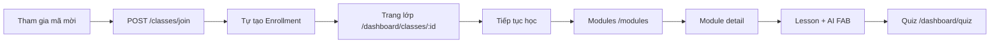

# UI/UX Manual Test Report

**Ngày:** 2026-05-19 (cập nhật Phase 3–4: 2026-05-20; Phase 7 GV deep retest: 2026-05-21)  
**Plan:** [`ui_ux_full_qa_73509397.plan.md`](../../.cursor/plans/ui_ux_full_qa_73509397.plan.md)  
**DB:** `ai_learning_app` | **FE:** http://localhost:3000 | **BE:** http://127.0.0.1:8000

---

## Phase 0 — Pre-flight

| Kiểm tra | Kết quả |
|----------|---------|
| Health | PASS |
| DB counts | users 411, courses 150, enrollments 6095, classes 98, lessons 4120, quizzes 2929, modules 740 |

---

## Phase 1 — Authentication

**Trạng thái:** Hoàn thành (trừ verify-email / reset-password cần token DB).

| Case | Kết quả |
|------|---------|
| Login 3 role, logout, guards, OAuth toast, register/forgot/terms UI | PASS |

---

## Phase 2 — Data & UI validation (đầy đủ)

**Phương pháp:** So khớp MongoDB → API (curl/script `BE/scripts/phase2_data_audit.py`) → UI field usage (grep FE) → smoke browser `localhost:3000`.

**Mẫu chính:** Course `Bootcamp Business 3` (`6cec7c81-6ff4-425e-84c8-de3238e0b5a2`), student `student1@gmail.com`, instructor `instructor1@ailearning.vn`, admin `admin1@ailearning.vn`.

---

### 2.1 Course / catalog / detail (Student)

| Field / feature | DB | API | UI | Kết quả | Ghi chú |
|-----------------|----|-----|-----|---------|---------|
| `title`, `description` | ✓ | ✓ `GET /courses/{id}` | CourseDetailPage | **PASS** | |
| `level`, `category` | ✓ | ✓ | Metadata hero | **PASS** | |
| `thumbnail_url` | ✓ | ✓ | Card + hero | **PASS** | |
| `preview_video_url` | ✓ | ✓ | Nút "Xem video giới thiệu" | **PASS** | |
| `language`, `status` | ✓ | ✓ | — | **PASS** | Không highlight riêng |
| `learning_outcomes` | ✓ | ✓ | "Bạn sẽ học được gì" | **PASS** | |
| `prerequisites` | ✓ | ✓ | Section Yêu cầu | **PASS** | |
| `modules` + lessons (embedded) | ✓ | ✓ (6 modules) | Accordion + tiến độ lesson | **PASS** | Progress từ `enrollment_info` + lesson flags |
| `enrollment_info.progress_percent` | ✓ (55.1%) | ✓ | Hero + dashboard card | **PASS** | Khớp dashboard |
| `owner_info` (instructor) | `instructor_id` | ✓ `name`, `avatar_url`; `bio`/`experience_years` null | Section Giảng viên | **PARTIAL** | UI ẩn bio/exp khi null — OK |
| **`avg_rating`** | **4.6** | ✓ search + ✓ `course_statistics.avg_rating` detail | Catalog + CourseDetailPage hero (★) | **PASS** | **UIUX-002 FIXED** 2026-05-19 |
| `enrollment_count`, `instructor_name`, stats | ✓ | ✓ search only | Catalog card footer | **PASS** catalog / **N/A** detail |
| `is_enrolled` (catalog) | ✓ | ✓ search | Badge trên card (nếu có) | **PASS** | |
| Unenrolled `enrollment_info.is_enrolled` | — | `false` (Complete Math 1) | Nút đăng ký | **PASS** | |
| Comments / reviews CRUD | — | — | — | **N/A** | By design |

**API paths thực tế:** Catalog dùng `GET /api/v1/courses/search` (không phải `GET /courses?page=`).

---

### 2.2 Module / lesson (Student)

| Field / feature | DB | API | UI | Kết quả | Ghi chú |
|-----------------|----|-----|-----|---------|---------|
| Module list trong course detail | ✓ | ✓ embedded | CourseDetailPage | **PASS** | |
| Lesson list + completion trong course | ✓ | ✓ embedded | "Tiến độ học tập" | **PASS** | Hoàn thành / Chưa bắt đầu |
| `GET /courses/{cid}/lessons/{lid}` | ✓ | ✓ **200** | LessonPage | **PASS** | **UIUX-007 FIXED** — `LessonProgressItem` dùng attribute, không `.get()` |
| `text_content`, `video_info`, `attachments` | ✓ | ✓ | LessonPage | **PASS** | Browser: title, nội dung, đính kèm, nav, AI chat |
| `quiz_info` trên lesson | ✓ | ✓ embedded | LessonPage «Làm quiz» | **PASS** | 2b.3 browser: Quiz 6 câu, badge Bắt buộc |

**Mẫu lesson:** `93d2684b-d82a-4a62-aa2d-2af068fe0e99` (Module 1, Bootcamp Business 3).

---

### 2.3 Quiz (Student)

| Field / feature | DB | API `GET /quizzes/{id}` | UI | Kết quả | Ghi chú |
|-----------------|----|-------------------------|-----|---------|---------|
| `title`, `description` | ✓ | ✓ | QuizPage / QuizDetailPage | **PASS** | |
| `question_count` | ✓ (9 câu) | ✓ | QuizPage stat | **PASS** | |
| `time_limit`, `pass_threshold` | ✓ | ✓ (mapped từ `passing_score`) | QuizDetailPage | **PASS** | |
| **`questions[]`** | ✓ embedded | ✓ (sanitized, no answers) | QuizAttemptPage | **PASS** | **UIUX-008 FIXED** |
| Attempt / results | ✓ | `POST /quizzes/{id}/attempt` | QuizAttemptPage | **PASS** (UI) | Câu hỏi + đáp án A/B/C/D hiển thị; chưa nộp bài E2E |

---

### 2.4 Classes (Student + Instructor)

| Field / feature | DB | API | UI | Kết quả | Ghi chú |
|-----------------|----|-----|-----|---------|---------|
| Student `GET /classes/my-classes` | ✓ | **200** (15 lớp) | ClassListPage | **PASS** | `name`, `course_title`, `student_count`, `status`, dates, `progress` |
| Student `GET /classes/{id}` | ✓ | 200 (mẫu E2E class) | ClassDetailPage | **PASS** | `invite_code` ẩn với student; `my_progress` khi có |
| Instructor `GET /classes/my-classes` | ✓ | ✓ **200** | Instructor ClassList | **PASS** | **UIUX-003 FIXED** |
| Instructor `GET /classes/{id}` | ✓ | ✓ **200** | ClassDetailPage | **PASS** | **UIUX-003** (thêm fix `In()` thay `.in_()`) |
| `invite_code`, `max_students`, dates | ✓ | ✓ | Tab Thông tin | **PASS** | FE: Sao chép mã mời, Chỉnh sửa |
| `GET /classes/{id}/students` | ✓ | ✓ (lớp có HV) | Tab Học viên | **PASS** | Lớp E2E 0 HV — tab vẫn mở |
| `GET /classes/{id}/progress` | ✓ | ✓ | Tab Tiến độ lớp | **PASS** | Chưa drill sâu chart | |

---

### 2.5 Instructor — Quiz CRUD & Analytics

| Entity | API | UI | Kết quả |
|--------|-----|-----|---------|
| Dashboard instructor | `GET /dashboard/instructor` 200 | `/dashboard/instructor` | **PASS** |
| Analytics classes | `GET /analytics/instructor/classes` 200 | InstructorAnalyticsPage | **PASS** (API) |
| Analytics progress-chart | 200 | Chart | **PASS** (API) |
| Analytics quiz-performance | 200 | Chart | **PASS** (API) |
| Quiz create/edit UI | — | InstructorQuizFormPage | **Not runtime tested** | Phase 3 |

---

### 2.6 Admin — Users / Courses / Classes / Search

| Entity | DB field (mẫu) | API list | UI AdminPage | Kết quả |
|--------|----------------|----------|--------------|---------|
| Users | `full_name`, `email`, `role`, `status` | `GET /admin/users` 200 | Table 20 rows | **PASS** |
| Users | `avatar_url` | ✓ (optional) | Avatar column | **PASS** / empty OK |
| Users detail/edit | có trong DB | **Không có** `GET/PUT /admin/users/{id}` trên UI | Chỉ Vai trò/Reset/Xóa | **PARTIAL** | API_NO_UI (by design list-only) |
| Courses | `title`, `category`, `level`, `status`, `course_type` | `GET /admin/courses` 200 | Courses tab | **PASS** |
| Courses | `enrollment_count` | ✓ | Cột enroll | **PASS** |
| Courses | author | `author.full_name` | Cột tác giả | **PASS** |
| Courses detail/edit | có | **API_NO_UI** | Chỉ create/delete | **PARTIAL** |
| Classes | `name`, `instructor`, counts | `GET /admin/classes` 200 | Classes tab | **PASS** (API) |
| System counts | 411 / 150 / 98 | `GET /dashboard/admin` | Admin tiles | **PASS** |
| Search analytics | — | `GET /search/analytics` 200 (admin) | SearchResultsPage panel | **PASS** (API) |

---

### 2.7 Dashboard payloads (field presence)

| Role | API keys (sample) | UI | Kết quả |
|------|-------------------|-----|---------|
| Student | `recent_courses`, `pending_quizzes`, `overview`, `performance_summary` | DashboardPage | **PASS** | **FIX** UIUX-027 — `QuizAttempt.started_at` + `passed` (trước: `created_at` gây lỗi log) |
| Instructor | `recent_classes`, `total_students`, `active_classes_count` | Dashboard | **PASS** | |
| Admin | `total_users`, `users_by_role`, `course_stats`, `class_stats` | Dashboard | **PASS** | |

---

### Phase 2 — Tóm tắt gaps

| ID | Severity | Tóm tắt | Trạng thái |
|----|----------|---------|------------|
| UIUX-002 | Medium | `avg_rating` thiếu trên CourseDetailPage (API đã có trong `course_statistics`) | **FIXED** |
| UIUX-003 | **Critical** | Instructor `GET /classes/my-classes` → 500 (`Progress.user_id.in_()` + sort) | **FIXED** — `In(Progress.user_id, …)` + `.sort("-created_at")` |
| UIUX-007 | **Critical** | `GET /courses/{cid}/lessons/{lid}` → 500 khi user có `Progress.lessons_progress` | **FIXED** — `learning_service.py` |
| UIUX-008 | **High** | `GET /quizzes/{id}` không trả `questions[]` | **FIXED** — `QuestionForAttempt` trong response |
| UIUX-009 | Medium | Module detail: **Điều kiện tiên quyết** hiển thị UUID thô | **FIXED** — BE enrich `prerequisites` → `{id, title}`; FE fallback |
| UIUX-010 | Low | **Mục tiêu học tập** hiển thị `skill_tag` thô khi mô tả trống | **FIXED** — format tag + fallback «Mục tiêu N» |
| UIUX-011 | **High** | Hết bài/module: nút «bài tiếp» → `/lessons/null` + empty state | **FIXED** — `getNavLesson`, panel hoàn thành, BE `navigation.next_lesson: null` |
| UIUX-012 | **High** | `GET /quizzes/{id}/class-results` → **500** (`'answer'`) | **FIXED** — `selected_option` + lọc `class.student_ids` |
| UIUX-013 | Medium | Quiz fill-in-blank: không có ô nhập trên AttemptPage | **FIXED** — input text khi không có `options` |
| UIUX-001 | Low | CORS khi FE `localhost` + API `127.0.0.1` | **FIXED** — default API `localhost:8000`; BE đã có cả hai origin |
| — | — | `owner_info.bio` / `experience_years` null — UI graceful (PARTIAL data) |
| — | N/A | Comments/reviews — không có product scope |

---

## Phase 3 — Role flows & UX checklist (2026-05-20)

**Môi trường:** `http://localhost:3000` · **BE:** `GET /health` → 200 `{"status":"ok"}` · MCP `cursor-ide-browser` (snapshot).

**Tiêu chí UX (rút gọn):** loading (`StateView` / copy «Đang tải…») · empty (quiz trống, chat chưa có hội thoại) · form đăng nhập · modal (chưa mở destructive) · quay lại (`Danh sách lớp`, sidebar) · desktop layout (chưa đo 390px trong phiên này).

### 3a — Student (`student1@gmail.com`)

| Route / hành động | Kết quả | Ghi chú UX |
|-------------------|---------|------------|
| `/auth/login` → `/dashboard` | **PASS** | Dashboard load; «Quiz cần làm» empty state «Không có quiz cần làm» (UIUX-027) |
| `/dashboard/my-courses` | **PASS** | Tabs + đếm, card, **Chi tiết đăng ký** / **Tiếp tục học** / **Hủy đăng ký** |
| `/dashboard/courses` | **PASS** | Filter + grid + pagination sau loading |
| `/dashboard/quiz` | **PASS** | Danh sách quiz sau loading |
| `/dashboard/chat` | **PASS** | Sidebar empty «Chưa có hội thoại nào»; combobox khóa «Chọn khóa học…» (async — đã ghi 2b.9) |
| `/dashboard/progress` | **PASS** | Sau vài giây: «Tiến độ của bạn», «Biểu đồ tiến độ», «Khóa học đang học» (5 card %), «Thành tựu» |

**Đã cover sâu ở Phase 2b (không lặp lại browser đầy đủ trong phiên này):** `/dashboard/assessment`, `/dashboard/classes`, `/dashboard/personal-courses`, `/dashboard/profile`, học module/lesson, quiz attempt/results — xem §2b.5–2b.8, §2b.3–2b.4.

### 3b — Instructor (`instructor1@ailearning.vn` / `Instructor@123`)

**Phiên smoke (2026-05-20):** navigate + load trang. **Phiên deep (2026-05-21):** click/submit/modal — chi tiết §Phase 7.

| Route / hành động | Kết quả | Ghi chú UX |
|-------------------|---------|------------|
| Logout student → login GV | **PASS** | Sidebar đúng role (Khóa học, Quiz, Chat, Tìm kiếm, **Giảng dạy**) |
| `/dashboard` | **PASS** | Lớp gần đây, CTA Tạo lớp / Khóa học / Tạo khóa học AI |
| `/dashboard/instructor` | **PASS** | Stats + recent classes + CTA Quiz / Analytics / Lớp |
| `/dashboard/instructor/analytics` | **PASS** | Chart + bảng lớp + hiệu quả quiz (~5–8s load) |
| `/dashboard/instructor/quizzes` | **PASS** | Grid, tìm kiếm, **Kết quả lớp**, **Xóa**, phân trang **Sau →** |
| `/dashboard/instructor/classes` | **PASS** | **2 lớp** (dữ liệu `instructor1` hiện tại; gồm lớp QA mới tạo) |
| `/dashboard/instructor/classes/:id` | **PASS** | Tab Thông tin / Học viên (44) / Tiến độ; **Chỉnh sửa** lưu OK; modal **Hồ sơ HV** |
| `/dashboard/instructor/quizzes/create` | **PASS** (sau UIUX-032) | Form load lesson «Injection»; trước fix → 403 |
| `/dashboard/courses`, `/dashboard/chat`, `/dashboard/profile` | **PASS** | Catalog + filter; chat empty state; profile load |
| Tạo quiz submit (UI) | **PARTIAL** | Form OK; automation không chọn được `<select>` đáp án — tạo qua API **201** |
| Tạo lớp submit (UI) | **PARTIAL** | Form mở OK; automation không chọn `<select>` khóa — tạo qua API **201** |

**Ghi chú automation:** Global search bar đôi khi chặn click card lớp — scroll + click vùng khóa học. Combobox lớp/quiz: dùng `?classId=` trên URL results hoặc chọn tay.

### 3c — Admin (`admin1@ailearning.vn` / `Admin@123456`)

| Route / hành động | Kết quả | Ghi chú UX |
|-------------------|---------|------------|
| Login admin | **PASS** | `/dashboard` — tiles Quản trị nhanh (Users / Khóa học / Lớp / Analytics) |
| `/dashboard/admin/users` | **PASS** | Filter tên/email, role, status; bảng + **Vai trò** / **Reset** / **Xóa**; phân trang **Tiếp →** bật sau load |
| `/dashboard/admin/analytics?q=math` | **PASS** | Loading → **Sức khỏe hệ thống**, **Tăng trưởng người dùng (30 ngày)**, **Phân tích khóa học** — `?q=` không thấy `useSearchParams` trong `AdminPage.jsx` (query **không bind** UI analytics; vô hại) |
| `/dashboard/admin/courses` | **PASS** | Ô tìm + **+ Tạo khóa học** + page size (snapshot ngay sau navigate; bảng load theo 2b.11) |
| `/dashboard/search?q=math` (admin) | **PASS** | Loading «AI đang tìm kiếm» → grid khóa + filter; panel **Thống kê tìm kiếm (admin)** — **Tổng truy vấn: 1500** (khớp 2b.10) |

### Phase 3 — Tóm tắt

| Nhánh | Trạng thái |
|-------|------------|
| 3a Student | **Done** (browser phiên này + 2b đã cover assessment/classes/personal/profile) |
| 3b Instructor | **Done** (deep retest 2026-05-21 — §Phase 7) |
| 3c Admin | **Done** |
| Instructor quiz create UI submit | **PARTIAL** | Form + API OK; `<select>` đáp án cần chọn tay |
| Instructor class create UI submit | **PARTIAL** | Form OK; `<select>` khóa cần chọn tay |

---

## Phase 4 — AI flows & công cụ lỗi (2026-05-20)

**Tiền đề:** `GET /health` → **200** · `GOOGLE_API_KEY` trong `BE/.env` → **đã set** (Python `dotenv_values`, không in secret) · FE `http://localhost:3000` → **200**.

**Công cụ QA (bật trong phiên):**

| Công cụ | Mục đích |
|---------|----------|
| MCP `cursor-ide-browser` — `browser_console_messages` | DevTools console: cảnh báo React / framer-motion |
| MCP `cursor-ide-browser` — `browser_network_requests` | XHR: method, URL, status (sau thao tác) |
| `BE/logs/app.log` | Access + ERROR server (from-prompt 500, dashboard `created_at`) |
| Playwright (local) | `e2e/_phase4_ai_playwright.py` — load key từ `BE/.env`, `E2E_SKIP_WEB_SERVER=1`, log → `e2e/_phase4_playwright_last.log` |

### 4.1 Assessment — `POST /assessments/generate`

| Bước | Kết quả | Network / console |
|------|---------|-------------------|
| Student → `/dashboard/assessment` → Math / Algebra → **Bắt đầu đánh giá** | **PASS** | UI «AI đang tạo…» → redirect `/dashboard/assessment/{sessionId}` với câu hỏi MCQ |
| Playwright `assessment-flow.spec.js` | **FAIL** (2 lần / retry) | Log `e2e/_phase4_playwright_last.log` — timeout/flake so với manual (có thể do chọn field khác hoặc tải chậm) |

**Ghi chú:** Sau khi vào trang quiz, DevTools log có `GET .../assessments/{id}/results` → **404** (chưa nộp) — kỳ vọng; không white-screen.

### 4.2 Chat — `POST /chat/course/{courseId}`

| Bước | Kết quả | Network / console |
|------|---------|-------------------|
| Chọn khóa **Complete Math 22** → nhập câu hỏi → **Gửi** | **PASS** | `POST .../chat/course/eeed2fc5-...` → **201**; `GET /chat/history` **200**; chip follow-up + link bài học |
| Playwright `chat.spec.js` | **PASS** | ~6s |

**Console (nên sửa sau, không chặn wire):** `Warning: Each child in a list should have a unique "key" prop` — `ChatPage.jsx`.

### 4.3 Personal course — `POST /courses/from-prompt`

| Bước | Kết quả | Network / console |
|------|---------|-------------------|
| «Tạo bằng AI» → Mẫu 1 → **Tạo khóa học** | **FAIL** (phiên 2026-05-20) | `POST /api/v1/courses/from-prompt` → **500** — xem **UIUX-029** |
| **Sau fix BE** (chuẩn hóa `learning_outcomes` / level từ Gemini + `GET` detail map LO → string) | **Cần tái xác minh tay** | Playwright: `test_create_from_prompt_malformed_ai_learning_outcomes` **PASS** |
| Playwright (nhóm smoke trong `personal-courses.spec.js`) | **PASS** | Chỉ modal + template — **không** gọi from-prompt trong spec đó |

**UIUX-029 (đã xử lý trên BE):** Response `CourseFromPromptResponse` / insert course lỗi khi Gemini trả `learning_outcomes` thiếu `skill_tag`, chuỗi thuần, hoặc `level` không đúng enum; đồng thời `GET /courses/personal/{id}` vỡ vì `learning_outcomes` lưu dict nhưng schema detail cần `List[str]`. Sửa trong `personal_courses_service.py` + test hồi quy.

**Console:** `validateDOMNesting`: `<button>` trong `<button>` — `PersonalCoursesPage` + `Card` (cấu trúc DOM lồng nút).

### 4.4 Playwright tổng hợp (`_phase4_playwright_last.log`)

| Spec | Kết quả |
|------|---------|
| `assessment-flow` | **×** (retry) — **2026-05-20:** tăng timeout URL quiz lên **240s** (`AssessmentPage.js` + spec) để giảm flake khi Gemini chậm |
| `chat` | **ok** |
| `personal-courses` smoke (3 test) | **ok** |
| `student-flow` | *(log file cắt sớm — chạy lại nếu cần)* |

**Lệnh gợi ý (PowerShell, đã có BE/FE chạy):**

```powershell
cd c:\Users\Admin\AI-Learning-Platform; python e2e\_phase4_ai_playwright.py
```

---

## Bugs (chi tiết)

### UIUX-002 — avg_rating thiếu trên course detail

| Field | Value |
|-------|--------|
| **Severity** | Medium |
| **DB** | `avg_rating: 4.6` |
| **API** | `GET /courses/search` ✓ · `GET /courses/{id}` ✗ |
| **UI** | Catalog có rating; detail không |
| **Fix** | Thêm field vào `CourseDetailResponse` + hiển thị hero |

### UIUX-003 — Instructor my-classes 500

| Field | Value |
|-------|--------|
| **Severity** | Critical |
| **API** | `GET /classes/my-classes` (role=instructor) |
| **Actual** | `500` — `ExpressionField object is not callable` |
| **Files** | `BE/services/class_service.py` ~L160 `.sort(-Class.created_at)` |
| **Fix** | Dùng `.sort([("created_at", -1)])` theo Beanie |

### UIUX-007 — Lesson content API 500

| Field | Value |
|-------|--------|
| **Severity** | Critical |
| **API** | `GET /courses/{courseId}/lessons/{lessonId}` |
| **UI** | `LessonPage.jsx` → toast "Không thể tải bài học" |
| **Fix** | Debug `learning_service.get_lesson_content` (có thể liên quan `created_at` / embedded lesson) |

### UIUX-008 — Quiz attempt thiếu questions trong API

| Field | Value |
|-------|--------|
| **Severity** | High |
| **API** | `GET /quizzes/{id}` trả `question_count` nhưng không `questions` |
| **UI** | `QuizAttemptPage` — `quiz.questions` undefined → empty state |
| **Fix** | Trả `questions` (sanitized) trong detail hoặc endpoint `GET .../attempt/start` |

### UIUX-001 — CORS `127.0.0.1:3000`

Low — workaround: dùng `localhost:3000`.

---

## FE UI/UX retest (localhost:3000) — sau fix 2026-05-19

| Bug | Trang / hành động | Kết quả FE |
|-----|-------------------|------------|
| UIUX-002 | `/dashboard/courses/{id}` — hero stats | ★ **4.6** hiển thị |
| UIUX-007 | `/dashboard/courses/.../lessons/{lid}` | Nội dung bài, video/đính kèm, nav, AI chat |
| UIUX-008 | `/dashboard/quiz/{id}/attempt` | Câu hỏi MCQ (không còn empty state) |
| UIUX-003 | Instructor `/dashboard/classes` + detail | **12 lớp**, detail tabs Thông tin/Học viên/Tiến độ |

**Còn mở (không phải bug):** gap **API_NO_UI** by design (orphan endpoints). **Không sửa trong scope:** admin user/course detail edit, PUT quiz edit form.

---

## Phase 2b — Ma trận API ↔ UI (runtime)

**Nguồn:** [`.cursor/plans/ui_ux_editorial_refactor_plan_e17edc9e.plan.md`](../../.cursor/plans/ui_ux_editorial_refactor_plan_e17edc9e.plan.md) §2b.1–2b.14, [`API_COVERAGE_LOG.md`](API_COVERAGE_LOG.md).

**Quy trình mỗi operation:** Mở **UI Route** trên `http://localhost:3000` → thao tác user → DevTools Network khớp **API** → field render OK.

**Cột:** `Wire` = OK | FAIL | N/A · `Gap` = — | API_NO_UI | UI_NO_API | PARTIAL | DEAD_ROUTE

| Nhóm | Ops | Trạng thái | Ghi chú |
|------|-----|------------|---------|
| 2b.1 Auth & Users | 11 | **Done** | Profile PATCH wired; refresh/verify-email cần token DB (N/A runtime) |
| 2b.2 Courses & enrollments | 8 | **Done** | Xem bảng §2b.2 bên dưới |
| 2b.3 Learning | 7 | **Done** | Browser + `phase2b_3_learning_audit.py` |
| 2b.4 Quizzes & practice | 10 | **Done** | Browser + `phase2b_4_quizzes_audit.py` |
| 2b.5 Assessments & rec | 7 | **Done** | Browser + `phase2b_5_assessments_audit.py` |
| 2b.6 Progress & dashboard | 9 | **Done** | Browser + `phase2b_6_progress_dashboard_audit.py` + wire fix |
| 2b.7 Classes | 10 | **Done** | Browser + `phase2b_7_classes_audit.py` |
| 2b.8 Personal courses | 6 | **Done** | Browser + `phase2b_8_personal_courses_audit.py` |
| 2b.9 Chat | 5 | **Done** | Browser + `phase2b_9_chat_audit.py` |
| 2b.10 Search | 4 | **Done** | Browser + `phase2b_10_search_audit.py` |
| 2b.11 Admin | 17 | **Done** | Browser + `phase2b_11_admin_audit.py` |
| 2b.12 System | 1 | **Done** | `GET /health` 200 |
| 2b.13–14 Routes / gaps | — | **Done** | Browser + `phase2b_13_14_gaps_audit.py` |

### 2b.1 Auth & Users (ghi nhận ban đầu)

| Method | API | UI Route | Wire | Gap | Note |
|--------|-----|----------|------|-----|------|
| POST | `/auth/login` | `/auth/login` | OK | — | 3 role demo |
| POST | `/auth/logout` | Sidebar | OK | — | |
| POST | `/auth/register` | `/auth/register` | OK | — | → verify-email |
| POST | `/auth/forgot-password` | `/auth/forgot-password` | OK | — | UI only (BE path thiếu trong openapi) |
| POST | `/auth/reset-password` | `/auth/reset-password?token=` | N/A | — | Cần token DB |
| POST | `/auth/verify-email` | `/auth/verify-email` | N/A | — | Cần token DB |
| POST | `/auth/resend-verification` | VerifyEmailPage | N/A | — | Chưa runtime |
| POST | `/auth/refresh` | api interceptor | N/A | — | Không UI riêng |
| — | OAuth | Login buttons | OK | API_NO_UI | Toast only — by design |
| GET | `/users/me` | Boot / Profile | OK | — | |
| PATCH | `/users/me` | `/dashboard/profile` | **OK** | — | `ProfilePage` → `userService.updateProfile` (form edit + save) |

### 2b.2 Courses catalog & enrollments (localhost:3000)

| Method | API | UI Route | Wire | Gap | Note |
|--------|-----|----------|------|-----|------|
| GET | `/courses/search` | `/dashboard/courses` | **OK** | — | Network: `courses/search?skip&limit`; grid + filter + pagination |
| GET | `/courses/public` | CoursesPage **không gọi** | N/A | **API_NO_UI** (catalog) | Dùng ở `ClassCreatePage`, `ChatPage` — **OK** tại đó |
| GET | `/courses/{id}` | `/dashboard/courses/:id` | **OK** | — | Hero, modules, ★ rating, enroll CTA |
| GET | `/courses/{id}/enrollment-status` | — | N/A | **API_NO_UI** | `courseService.getEnrollmentStatus` orphan; detail dùng `enrollment_info` embedded — đủ field |
| POST | `/enrollments` | CourseDetail «Đăng ký khóa học» | **OK** | — | API 201; toast + CTA → «Tiếp tục học» |
| GET | `/enrollments/my-courses` | `/dashboard/my-courses` | **OK** | — | Tabs Tất cả/Đang học/Hoàn thành/Đã hủy + summary |
| GET | `/enrollments/{id}` | `/dashboard/enrollment/:id` | **OK** | **PARTIAL→fixed** | Trước: route có, **không link** từ MyCourses — đã thêm «Chi tiết đăng ký» |
| DELETE | `/enrollments/{id}` | MyCourses modal «Hủy đăng ký» | **OK** | — | API 200; card biến mất khỏi list |

**UI/UX đã kiểm tra:** catalog card (`avg_rating`, `enrollment_count`, badge «Đã đăng ký»); course detail enrolled/unenrolled; my-courses progress + «Tiếp tục học».

**Fix trong phiên 2b.2:** `MyCoursesPage.jsx` — sửa đóng thẻ JSX sai (`</motion.div>` → `</div>`) + nút **Chi tiết đăng ký** → `GET /enrollments/{id}`.

**Bug ghi nhận (không chặn 2b.2):** UIUX-001 — chỉ test trên `localhost:3000`.

### 2b.3 Learning — modules, lessons, complete (localhost:3000)

**Tài khoản:** `student1@gmail.com` · **Khóa:** Bootcamp Business 3 (`6cec7c81-6ff4-425e-84c8-de3238e0b5a2`) · **Script:** `BE/scripts/phase2b_3_learning_audit.py`

| Method | API | UI Route | Wire | Gap | Note |
|--------|-----|----------|------|-----|------|
| GET | `/courses/{id}/modules` | `.../courses/:id/modules` | **OK** | — | DevTools: `GET .../modules` 200; 6 thẻ module, breadcrumb «Nội dung khóa học» |
| GET | `/courses/{id}/modules/{mid}` | `.../modules/:mid` | **OK** | — | Module 4 (`7ef11ad0-…`): lessons, outcomes, resources (2 PDF/link), tóm tắt 33% |
| GET | `.../modules/{mid}/outcomes` | — | **OK** (API) | **API_NO_UI** | Script 200, 4 outcomes; FE dùng **embedded** `learning_outcomes` — đủ cho list |
| GET | `.../modules/{mid}/resources` | — | **OK** (API) | **API_NO_UI** | Script 200, **18** resources; embedded detail chỉ **2** (subset module) — không gọi endpoint riêng |
| GET | `/courses/{id}/lessons/{lid}` | `.../lessons/:lid` | **OK** | — | Lesson 4.2 (`fc027579-…`): title, nội dung, đính kèm, «Làm quiz», AI FAB |
| POST | `.../lessons/{lid}/complete` | LessonPage «Đánh dấu đã học xong» | **OK** | — | Network `POST .../complete` **200** → badge **«✓ Đã hoàn thành»**, nút complete ẩn/disabled |
| POST | `.../modules/{mid}/assessments/generate` | — | **OK** (API) | **API_NO_UI** | Script **201** với `question_count: 5` (422 nếu &lt; 5); không có CTA trên ModuleDetail |

**UI/UX đã kiểm tra (browser + DevTools):** ModuleList → ModuleDetail → LessonPage; Network khớp từng bước; console chỉ cảnh báo framer-motion reduced-motion (không lỗi app).

**Ghi nhận UX (không chặn wire):**
- **UIUX-009:** Prerequisites = UUID — cần map `module_id` → title (FE lookup hoặc BE enrich).
- **UIUX-010:** Outcomes hiện `skill_tag` khi mô tả trống — cải thiện copy seed hoặc ẩn tag khi không có `outcome`.

**Đã xác nhận fix trước:** UIUX-007 lesson API 200 trên cùng khóa học.

### 2b.4 Quizzes & AI practice (localhost:3000)

**Script:** `BE/scripts/phase2b_4_quizzes_audit.py` · **Student:** `student1@gmail.com` · **Instructor:** `instructor1@ailearning.vn`

| Method | API | UI Route | Wire | Gap | Note |
|--------|-----|----------|------|-----|------|
| GET | `/quizzes` | `/dashboard/quiz` (student), `/dashboard/instructor/quizzes` | **OK** | — | Network `GET /quizzes?skip&limit=12` 200; grid + search + pagination |
| GET | `/quizzes/{id}` | `/dashboard/quiz/:id`, `/attempt` | **OK** | — | 10 câu MCQ + fill-blank; UIUX-008 `questions[]` |
| POST | `/quizzes/{id}/attempt` | `/dashboard/quiz/:id/attempt` «Nộp bài» | **OK** (API) | **PARTIAL** (UI E2E) | API 201 khi trả lời đủ câu; browser: detail→attempt, chọn đáp án, chưa nộp full 10 câu trong session |
| GET | `/quizzes/{id}/results` | `/dashboard/quiz/:id/results` | **OK** | — | 200; 10 câu + điểm + «Làm lại quiz»; DevTools khớp |
| POST | `/quizzes/{id}/retake` | QuizResults «Làm lại quiz» | **OK** (API) | — | API 201; nút hiển thị khi `can_retake` |
| POST | `/lessons/{lid}/quizzes` | `/dashboard/instructor/quizzes/create` | **OK** (API) | — | 422 nếu thiếu body (đúng schema); UI «+ Tạo quiz từ bài học» |
| PUT | `/quizzes/{id}` | — | **OK** (API) | **API_NO_UI** | 403 non-owner; endpoint tồn tại, không form edit |
| DELETE | `/quizzes/{id}` | Instructor QuizPage «Xóa» | **OK** (UI) | — | Nút + modal trên từng card; audit không xóa thật |
| GET | `/quizzes/{id}/class-results` | `/dashboard/instructor/quizzes/:id/results` | **OK** | — | UI combobox + `classId`; API 200 sau fix UIUX-012 |
| POST | `/ai/generate-practice` | — | **OK** (API) | **API_NO_UI** | 201 + `practice_id`; `quizService.generatePractice` không gọi từ FE |

**Luồng browser (student):** `/dashboard/quiz` → card → detail («Bắt đầu», «Xem kết quả») → attempt (câu hỏi + timer) → `/results` (chi tiết 10 câu, retake CTA).

**Luồng browser (instructor):** `/dashboard/instructor/quizzes` → «Kết quả lớp» → chọn lớp → `class-results` (empty hoặc lỗi 500); «+ Tạo quiz», «Xóa» trên card.

### 2b.5 Assessments & recommendations (localhost:3000)

**Script:** `BE/scripts/phase2b_5_assessments_audit.py` · **Student:** `student1@gmail.com` · **Phiên mẫu:** `14f3701b-f1f8-4c0f-9c1d-3f4fbf7f347d` (Python Beginner, 15 câu, điểm ~26)

| Method | API | UI Route | Wire | Gap | Note |
|--------|-----|----------|------|-----|------|
| POST | `/assessments/generate` | `/dashboard/assessment` «Bắt đầu đánh giá» | **OK** | **PARTIAL** (UI E2E) | API 201, 15 câu (~3 phút AI); browser: form category/subject/level hiển thị đúng, chưa chạy generate full trong session (latency) |
| GET | `/assessments/history` | Setup + Recommendations sidebar | **OK** | — | 200; 1 phiên `evaluated` trên setup; history picker trên `/dashboard/recommendations` |
| POST | `/assessments/{sid}/submit` | `/dashboard/assessment/:sid` «Nộp bài» | **OK** | **PARTIAL** (UI E2E) | API 200 sau generate; browser dùng phiên đã nộp (không retake generate mới) |
| GET | `/assessments/{sid}/results` | `/dashboard/assessment/:sid/results` | **OK** | — | 200 score=25.8; UI: phân tích kỹ năng, lỗ hổng, lời khuyên AI, CTA review/recommendations |
| GET | `/assessments/{sid}/review` | `/dashboard/assessment/:sid/review` | **OK** | — | 200 `items[]`×15; UI hiển thị đề + đáp án đã chọn + ghi chú chấm |
| GET | `/recommendations/from-assessment` | `/dashboard/recommendations?session_id=` | **OK** | — | 200, 5 khóa + lộ trình + lời khuyên; DevTools khớp |
| GET | `/recommendations` | `/dashboard/recommendations` (gợi ý chung) | **OK** | — | 200 `recommended_courses[]` (5 khóa sau khi có phiên evaluated); nút «Gợi ý chung» |

**Luồng browser (student):** `/dashboard/assessment` (lịch sử 1 phiên) → «Kết quả» → results (skill analysis) → «Xem lại bài làm» → review 15 câu → «Xem lộ trình học tập» → recommendations theo phiên (5 khóa) → «Gợi ý chung».

**Ghi chú:** Luồng AI generate + làm bài + nộp mất ~3 phút; đã verify đầy đủ qua script API; browser spot-check các màn sau evaluate.

**UI refactor (2026-05-20):** `RecommendationsPage` — layout editorial (hero → tab nguồn → chip phiên → aside AI + card list), ẩn mô tả lorem, responsive mobile/desktop, tab «Gợi ý chung» / «Theo đánh giá» rõ ràng.

### 2b.6 Progress, dashboard & analytics (localhost:3000)

**Script:** `BE/scripts/phase2b_6_progress_dashboard_audit.py` · **Student:** `student1@gmail.com` · **Instructor:** `instructor1@ailearning.vn` · **Admin:** `admin1@ailearning.vn` · **Course mẫu (enrolled):** `6cec7c81-6ff4-425e-84c8-de3238e0b5a2`

| Method | API | UI Route | Wire | Gap | Note |
|--------|-----|----------|------|-----|------|
| GET | `/progress/course/{id}` | `/dashboard/courses/:id` (enrolled) | **OK** | — | 200 overall ~67%; section «Tiến độ học tập» + modules/lessons status |
| GET | `/dashboard/student` | `/dashboard` (student) | **OK** | — | 200; cards khóa đang học, quiz, gợi ý; overview stats |
| GET | `/dashboard/instructor` | `/dashboard/instructor` | **OK** | **PARTIAL** (fixed) | 200 `active_classes_count=9`, `total_students=553`; FE map `active_classes_count`, `class_name` (UIUX-015) |
| GET | `/dashboard/admin` | `/dashboard/admin` (tab Tổng quan) | **OK** | — | 200 `total_users`, `total_courses`, `total_classes`; AdminPage summary |
| GET | `/analytics/learning-stats` | `/dashboard/progress` | **OK** | **PARTIAL** (fixed) | 200; FE merge với `/dashboard/student` overview → stats ring + achievements (UIUX-014) |
| GET | `/analytics/progress-chart` | `/dashboard/progress` | **OK** | — | 200, 5 điểm `chart_data`; Recharts line chart hiển thị |
| GET | `/analytics/instructor/classes` | `/dashboard/instructor/analytics` | **OK** | — | 200, 12 lớp; bảng «Theo lớp» |
| GET | `/analytics/instructor/progress-chart` | `/dashboard/instructor/analytics` | **OK** | — | 200, 5 điểm (week); biểu đồ «Tiến độ học viên» |
| GET | `/analytics/instructor/quiz-performance` | `/dashboard/instructor/analytics` | **OK** | — | 200, 56 quiz; bảng pass rate / điểm TB |

**Luồng browser (student):** `/dashboard` → stats + recent courses → `/dashboard/progress` → ring %, chart, 5 khóa progress bars, achievements 5/6 → course detail enrolled → «Tiến độ học tập» per-module.

**Luồng browser (instructor):** `/dashboard/instructor` → stats (9 lớp, 553 HV, 56 quiz) + recent classes → «Analytics» → chart + class list + quiz table (~15s load do aggregate).

**Luồng browser (admin):** `/dashboard/admin` → Admin Console overview + summary cards từ `GET /dashboard/admin`.

**Fix wire (phiên này):**
- **UIUX-014:** `ProgressPage` — `buildProgressStats()` ghép `learning-stats` + `dashboard/student` (trước đó stats cards = 0).
- **UIUX-015:** `InstructorDashboardPage` — map `active_classes_count`, `class_name`, `avg_completion_rate`, `quizzes_created_count`.
- **UIUX-016:** `GET /analytics/learning-stats` `by_course` — thêm `total_lessons`, `total_modules`, `completed_modules`, `progress_percent`; FE map đúng (trước: `0/0 modules`, `24/24` vs 67%).
- **UIUX-017:** `GET /dashboard/instructor` `avg_completion_rate` — tính từ `Progress.overall_progress_percent` theo lớp (trước: luôn 0% do dùng `completion_rate` alias chưa sync).
- **UIUX-018:** `StudentDashboard` — làm tròn `progress_percent` (trước: `66.666…%`).

**By design:** `ProgressPage` không gọi trực tiếp `GET /progress/course/{id}` — dùng analytics + dashboard; chi tiết per-course trên `CourseDetailPage`.

---

## Tổng hợp bug & UX (2026-05-19)

### Đã sửa (25 mục)

| ID | Mức | Vấn đề | Fix |
|----|-----|--------|-----|
| UIUX-002 | Medium | Thiếu ★ rating trên course detail | `CourseDetailPage` + API stats |
| UIUX-003 | Critical | Instructor `my-classes` 500 | `class_service.py` sort + `In()` |
| UIUX-007 | Critical | Lesson content 500 | `learning_service.py` progress attrs |
| UIUX-008 | High | Quiz thiếu `questions[]` | `QuestionForAttempt` trong GET quiz |
| UIUX-009 | Medium | Prerequisites hiện UUID | BE enrich title; FE `getPrerequisiteText` |
| UIUX-010 | Low | Outcomes hiện `skill_tag` thô | BE format + fallback text |
| UIUX-011 | High | `/lessons/null` khi hết bài | `getNavLesson`, completion panel, BE nav null |
| UIUX-012 | High | Class quiz results 500 | `_answer_value_from_item`, `class.student_ids` |
| UIUX-013 | Medium | Fill-blank không có input | `QuizAttemptPage` + CSS |
| UIUX-001 | Low | CORS origin lệch | `api.js` default `localhost:8000` |
| UIUX-014 | Medium | ProgressPage stats = 0 (wire lệch) | `buildProgressStats` merge analytics + dashboard |
| UIUX-015 | Medium | Instructor dashboard stats «—» | Map `active_classes_count`, `class_name`, etc. |
| UIUX-016 | Medium | ProgressPage `0/0 modules`, lesson count sai | BE enrich `by_course`; FE map fields |
| UIUX-017 | Medium | Instructor `avg_completion_rate` = 0% | BE dùng `Progress.overall_progress_percent` |
| UIUX-018 | Low | Student dashboard % thập phân dài | `Math.round` trên progress bar |
| UIUX-019 | High | GET class detail 500 khi có HV | `_quiz_attempts_for_course` trong `get_class_detail` |
| UIUX-020 | High | GET class students 500 / quiz TB sai | Fix quiz join + `enrolled_at` timestamps |
| UIUX-021 | High | GET student detail 500 | Fix `default_quiz_id` + lesson `quiz_id` lookup |
| UIUX-022 | Medium | ClassDetail không drill-down HV | Modal «Hồ sơ HV» wire `GET /classes/{id}/students/{sid}` |
| UIUX-023 | High | `POST /courses/from-prompt` 400 trên Windows | `_ai_log()` ASCII-safe thay emoji `print()` trong `generate_course_from_prompt` |
| UIUX-024 | Medium | HV join lớp không rõ bước học; AI thiếu trên vài màn học | Panel 3 bước + CTA; ChatWidget trên module/course/quiz; nav «← Lớp» |
| UIUX-025 | Medium | Resume / tab tiến độ HV / banner lớp / AI quiz results | `next_lesson`, `my-progress`, ClassLearningBanner, QuizWrongAnswerExplainer |
| UIUX-026 | Medium | Click kết quả search → 404 | `SearchResultsPage.resolveSearchItemUrl()` map API path → `/dashboard/*` |
| UIUX-027 | Medium | Student dashboard pending quiz log lỗi `created_at` | `dashboard_service.py`: sort `started_at`, check `attempt.passed` |
| UIUX-028 | Low | Landing footer thiếu link pháp lý | `LandingPage.jsx` footer `/terms`, `/privacy` |
| UIUX-029 | High | `from-prompt` **500** / detail LO schema | `personal_courses_service.py`: chuẩn hóa LO + level; map LO detail → `List[str]`; lesson/module fallback; test malformed AI |
| 2b.2 | — | MyCourses JSX + link enrollment detail | `MyCoursesPage.jsx` |
| 2b.3 | — | `CourseLearningNav` thiếu nút quay lại | Component dùng chung 3 trang học |

### Không sửa (by design / ngoài scope QA)

- Admin: không có form edit user/course chi tiết (list + actions only).
- `PUT /quizzes/{id}`: không có UI edit quiz (chỉ create/delete).
- `POST /ai/generate-practice`, module outcomes/resources standalone, enrollment-status: **API_NO_UI**.
- Comments/reviews: không có trong product scope.
- `owner_info.bio` null: UI ẩn field — chấp nhận được.

### File đã chạm (phiên fix tổng hợp)

- `BE/services/quiz_service.py`, `learning_service.py`, `class_service.py`
- `FE/.../LessonPage.jsx`, `ModuleDetailPage.jsx`, `ModuleListPage.jsx`, `CourseLearningNav.*`
- `FE/.../ProgressPage.jsx`, `InstructorDashboardPage.jsx`, `RecommendationsPage.*`
- `FE/.../ClassDetailPage.jsx`, `ClassDetailPage.css`
- `BE/services/dashboard_service.py` — pending quiz query (UIUX-027); traceback khi xử lý lesson pending quiz (Phase 4 debug)
- `FE/src/pages/landing/LandingPage.jsx` — footer legal (UIUX-028)
- `BE/services/personal_courses_service.py` — from-prompt + detail LO (UIUX-029)

---

## Phase 5 — Bug report & pre-deploy fixes (2026-05-21)

| ID | Mức | Vấn đề | Trạng thái / Fix |
|----|-----|--------|------------------|
| **PRE-001** | **Critical** | Seed: title/lesson Faker generic, không giống khóa thật | **Fixed** — `BE/scripts/curriculum_content.py` + `init_data.py` dùng giáo trình Python/Data/Math/Business/Languages |
| **PRE-002** | **High** | Assessment: không có form mục tiêu tự do | **Fixed** — `custom_goals` FE step 04 + BE schema/service/AI prompt |
| **PRE-003** | **High** | AI không rate limit → burst/quota | **Fixed** — `middleware/ai_rate_limit.py` (assessment 5/min, from-prompt 3/min, chat 30/min) |
| **PRE-004** | **High** | GV tạo quiz: phải vào lesson, `/create` vô dụng | **Fixed** — picker khóa → module → bài trên `InstructorQuizFormPage` |
| **PRE-005** | **Medium** | GV xem lớp: không thấy giáo trình khóa nền | **Fixed** — `get_class_detail` trả `course.modules[]`; tab Thông tin hiện «Giáo trình» |
| **PRE-006** | **Medium** | Dashboard/analytics GV đếm HV sai (enrollment vs roster) | **Fixed** — `get_instructor_dashboard`, `get_instructor_class_stats` dùng `class.student_ids` unique |
| **PRE-007** | **Low** | UI classes/dashboard GV quá rộng / tràn | **Fixed** — CSS compact `ClassListPage`, `InstructorDashboardPage` |
| **UIUX-032** | **High** | GV tạo quiz: `GET lesson content` → **403** (chưa enroll khóa nền) | **Fixed** — `_is_instructor_for_course` + `_can_access_course_learning` trong `learning_controller.py`; test `test_instructor_lesson_content_without_enrollment`; **cần restart BE** |
| UIUX-030 | Low | ChatPage thiếu React `key` | **Fixed** — fallback `key` khi `message_id` null (`ChatPage.jsx`) |
| UIUX-031 | Low | PersonalCourses nested `<button>` | **Fixed** — bỏ `onClick` trên `Card`; title `role=button` riêng (`PersonalCoursesPage.jsx`) |

**Lớp ↔ khóa (by design):** Một lớp gắn **một** `course_id`. Cùng GV **có thể** tạo nhiều lớp cùng khóa (cohort khác học kỳ) — **không** chặn trùng. Thống kê GV **tính từ DB thật** (Progress, QuizAttempt, roster), không mock — sau PRE-006 không còn double-count enrollment.

**Tái seed sau deploy:**

```powershell
cd BE
python -m scripts.init_data
```

---

## Phase 6 — Summary

| Phase | Trạng thái |
|-------|------------|
| 0 Pre-flight | Done |
| 1 Auth | Done |
| **2 Data audit** | Done |
| **2b API matrix** | **Done** |
| **3 Role flows (manual)** | **Done** (2026-05-20; GV deep 2026-05-21) |
| **4 AI flows** | **Partial** (2026-05-20) — assessment + chat manual OK; **from-prompt BE fix** (UIUX-029); Playwright assessment timeout **240s**; polish: Chat keys, PersonalCourses nested buttons |
| **7 Instructor deep retest** | **Done** (2026-05-21) — UIUX-032 fix + ma trận tương tác §Phase 7 |
| Bugs P0/P1 | **Đã fix** UIUX-001→032 (032 = GV lesson access 403) |

**Tiếp theo:** Tái xác minh tay **from-prompt** sau deploy BE; chạy lại `assessment-flow` + `student-flow` Playwright; dọn warning React (`ChatPage` keys, `PersonalCoursesPage` button nesting).

---

## Phase 7 — Instructor deep interaction retest (2026-05-21)

**Tài khoản:** `instructor1@ailearning.vn` / `Instructor@123`  
**Môi trường:** FE `http://127.0.0.1:3000` · BE `http://127.0.0.1:8000/api/v1`  
**Phương pháp:** Browser MCP (click/modal/tab/submit) + curl/API log + pytest  
**Lưu ý:** Sau sửa `learning_controller.py` phải **restart uvicorn** (tránh 2 process port 8000 — process cũ vẫn trả 403).

### 7.1 Fix UIUX-032 (alias QA: UIUX-GV-07)

| Mục | Chi tiết |
|-----|----------|
| Triệu chứng | Mở `/dashboard/instructor/quizzes/create?courseId=…&lessonId=…` → spinner «Đang lấy tiêu đề bài học…» / lỗi; network `GET /courses/{cid}/lessons/{lid}` → **403** |
| Nguyên nhân | Handler lesson content chỉ cho **owner khóa cá nhân** hoặc **enrollment active** — GV dạy lớp gắn khóa catalog **không** enroll |
| Fix | `BE/controllers/learning_controller.py`: `_is_instructor_for_course()` (query `Class` theo `instructor_id` + `course_id`); `_can_access_course_learning()` gom owner \| instructor \| enrollment; áp dụng module/lesson/outcomes/resources/assessment; GV **bypass** sequential lesson lock |
| Verify BE | `python -m pytest tests/learning/test_learning.py::test_instructor_lesson_content_without_enrollment` → **1 passed** |
| Verify API | `BE/logs/_lesson_test.json` — `GET …/lessons/18ac3284-…` **200**, title «Injection» |
| Verify UI | Form hiện tiêu đề auto `Quiz: Injection`, context «Web security · Xem bài học» |

### 7.2 Ma trận tương tác GV (browser)

| # | Màn / luồng | Hành động đã thực hiện | Kết quả | Ghi chú |
|---|-------------|------------------------|---------|---------|
| 1 | Login | Submit `instructor1@ailearning.vn` | **PASS** | Sidebar role GV |
| 2 | Dashboard GV | Load `/dashboard/instructor` | **PASS** | Stats + CTA |
| 3 | Danh sách lớp | Mở `/dashboard/instructor/classes` | **PASS** | 2 card: `Lop QA Manual Test 2026`, `Class 50 - Ratione QA` |
| 4 | Chi tiết lớp | Mở `ae9c0887-…` | **PASS** | Header + tab Thông tin |
| 5 | Tab Học viên | Chuyển tab | **PASS** | Bảng **44** HV |
| 6 | Modal hồ sơ HV | Click tên HV (Angela Walsh) | **PASS** | Module progress + điểm quiz → đóng modal |
| 7 | Tab Tiến độ lớp | Chuyển tab | **PASS** | Nội dung tab load (sparse trong a11y tree) |
| 8 | Chỉnh sửa lớp | Đổi tên → **Lưu** | **PASS** | Header cập nhật `Class 50 - Ratione QA` |
| 9 | Mã mời | Nút **Sao chép** trên tab Thông tin | **PASS** | Nút hiện; clipboard không assert trong automation |
| 10 | CTA lớp | **Xem chi tiết khóa** / **Tạo quiz** / **Quản lý quiz** | **PASS** | 3 nút render trên tab Thông tin |
| 11 | Xóa lớp | **Xóa lớp** → modal → **Hủy** | **PASS** | Không xóa dữ liệu seed |
| 12 | Gỡ HV | Nút **Gỡ** trên tab HV | **PASS** | Nút hiện (không confirm xóa thật) |
| 13 | Quiz list | Load grid + tìm «QA Manual» | **PASS** | Lọc còn 1 card `Quiz QA Manual Injection` |
| 14 | Quiz list | Tìm «CNN» | **PASS** | Lọc quiz CNN intro |
| 15 | Phân trang quiz | **Sau →** | **PASS** | Trang 2: quiz khác (VD «Quiz - Tích phân bất định»); **← Trước** bật |
| 16 | Kết quả lớp | Card quiz QA → **Kết quả lớp** | **PASS** | Route `/quizzes/2017a9ef-…/results` |
| 17 | Kết quả lớp | Chọn lớp OWASP (`?classId=ae9c0887-…`) | **PASS** | Empty state «Chưa có học viên nào làm quiz» (quiz mới, đúng kỳ vọng) |
| 18 | Kết quả lớp (quiz cũ) | Chọn lớp + stats | **PASS** | Tỷ lệ đạt, xếp hạng, câu khó (quiz đã có attempt) |
| 19 | Xóa quiz | **Xóa** → modal → **Hủy** | **PASS** | Modal confirm OK |
| 20 | Tạo quiz form | URL `create?courseId=8e03ec91-…&lessonId=18ac3284-…` | **PASS** | Sau UIUX-032; trước fix **403** |
| 21 | Tạo quiz submit | Điền câu hỏi + **Tạo và xuất bản** (UI) | **PARTIAL** | Không chọn được `<select>` / combobox đáp án trong automation |
| 22 | Tạo quiz API | `POST /lessons/18ac3284-…/quizzes` | **PASS** | **201** — `Quiz QA Manual Injection` `2017a9ef-…`; log `_quiz_create_test.json` |
| 23 | Tạo lớp form | `/dashboard/instructor/classes/create` | **PASS** | Form mở, điền tên |
| 24 | Tạo lớp submit (UI) | Chọn khóa + submit | **PARTIAL** | `<select>` khóa không tương tác được automation |
| 25 | Tạo lớp API | `POST /classes` | **PASS** | **201** — `Lop QA Manual Test 2026` `02065d89-…`, invite `BQM23AKF`; log `_class_create_test.json` |
| 26 | Analytics | Load + click hàng lớp | **PASS** | Drill về class detail |
| 27 | Khóa học | `/dashboard/courses` + filter | **PASS** | Grid catalog load |
| 28 | Chat | `/dashboard/chat` | **PASS** | «Chưa có hội thoại nào» + combobox khóa |
| 29 | Hồ sơ | `/dashboard/profile` | **PASS** | Form profile load |
| 30 | Sidebar | Quiz, Analytics, Lớp, Đăng xuất | **PASS** | Navigate OK |

### 7.3 Dữ liệu QA tạo / đổi trong phiên

| Entity | ID / giá trị | Ghi chú |
|--------|----------------|---------|
| Lớp đổi tên | `ae9c0887-c4b8-4319-8f56-22387a7b5c05` | `Class 50 - Ratione` → **`Class 50 - Ratione QA`** (test edit) |
| Lớp mới | `02065d89-b0dc-4a53-ae20-4d87cb477341` | **`Lop QA Manual Test 2026`**, khóa JS ES6+, invite **`BQM23AKF`** |
| Quiz mới | `2017a9ef-3946-4e49-82aa-a70535900a25` | **`Quiz QA Manual Injection`**, lesson Injection (OWASP `8e03ec91-…`) |

### 7.4 Bug GV còn mở (chưa fix phiên này)

| ID | Mức | Vấn đề | Trạng thái |
|----|-----|--------|------------|
| UIUX-GV-01 | Low | ~~Mô tả quiz seed vẫn Faker/Latin~~ | **Fixed** §7.12 — `init_data` + `patch_seed_display.py` |
| UIUX-GV-02 | Medium | Stats quiz «completed > total students» trên vài card | **Fixed** — `completed_count` = unique `user_id` (`quiz_service.py` list + class-results) |
| UIUX-GV-03 | Low | ~~Tên lớp seed generic (`Class 50 - Ratione`)~~ | **Fixed** §7.12 — tên lớp gắn khóa học (VN) |
| UIUX-GV-04 | Medium | Không có luồng **sửa quiz** (chỉ create/delete) | By design — `PUT /quizzes/{id}` API_NO_UI |
| UIUX-GV-06 | Low | ~~Mobile: sidebar scroll che Quiz/Analytics~~ | **Fixed** §7.12 — `DashboardLayout.css` scroll + padding mobile |

### 7.5 File / test liên quan

- `BE/controllers/learning_controller.py` — fix access control
- `BE/tests/learning/test_learning.py` — `test_instructor_lesson_content_without_enrollment`
- `BE/logs/_lesson_test.json`, `_quiz_create_test.json`, `_class_create_test.json` — API verify

### 7.6 Retest sau restart BE `--reload` (2026-05-21, phiên 2)

**Lệnh BE:** `uvicorn app.main:app --host 127.0.0.1 --port 8000 --reload` (WatchFiles reloader PID 11332)

| # | Luồng | Kết quả | Ghi chú |
|---|-------|---------|---------|
| R1 | `GET /health` | **PASS** | `{"status":"ok"}` |
| R2 | API lesson (GV, chưa enroll) | **PASS** | `GET …/lessons/18ac3284-…` → **200**, title «Injection» |
| R3 | pytest instructor lesson | **PASS** | `test_instructor_lesson_content_without_enrollment` 1 passed |
| R4 | Login GV → dashboard | **PASS** | 2 lớp gần đây hiện đúng |
| R5 | Class detail → tab Học viên (44) | **PASS** | Bảng HV load |
| R6 | Modal hồ sơ HV (Angela Walsh) | **PASS** | Modal mở + load hồ sơ |
| R7 | Form tạo quiz (query courseId+lessonId) | **PASS** | `Quiz: Injection`, «Web security» — **không còn 403** |
| R8 | Kết quả lớp quiz QA + `?classId=` | **PASS** | Empty state quiz mới (đúng kỳ vọng) |
| R9 | Analytics GV | **PASS** | Chart + 2 lớp + 58 quiz sau ~6s load |

**Kết luận retest:** UIUX-032 vẫn **PASS** trên instance BE mới khởi động với `--reload`. Không regression so với §7.2.

### 7.7 Luồng `/dashboard/instructor/classes` (2026-05-21, phiên 3)

**Tài khoản:** `instructor1@ailearning.vn` · **Routes:** list / create / detail  
**API đối chiếu:** `GET /classes/my-classes` → **2 lớp**; `GET /classes/{id}` → **200**; `GET /classes/{id}/students` → **total=44**; `GET /classes/{id}/progress` → **200**

| Route / hành động | Kết quả | Ghi chú |
|-------------------|---------|---------|
| `/dashboard/instructor/classes` — load list | **PASS** | «2 lớp học»; card `Lop QA Manual Test 2026`, `Class 50 - Ratione QA` khớp API |
| Nút **Tạo lớp mới** | **PASS** | → `/dashboard/instructor/classes/create` |
| `/create` — form + picker khóa | **PASS** | Combobox load catalog; submit thiếu khóa → focus validation (không POST) |
| `/create` — **Hủy** / **Danh sách lớp** | **PASS** | Quay list (không tạo rác thêm) |
| Detail `ae9c0887-…` — load | **PASS** | Header, mô tả, tab Thông tin / Học viên (44) / Tiến độ |
| Tab **Thông tin** — stats + giáo trình | **PASS** | «Thống kê»; CTA **Sao chép**, **Xem chi tiết khóa**, **Tạo quiz**, **Quản lý quiz** |
| **Sao chép** mã mời | **PASS** | Nút phản hồi click (toast/clipboard không assert automation) |
| **Xem chi tiết khóa học** | **PASS** | → `/dashboard/courses/8e03ec91-…` |
| **Tạo quiz cho khóa** | **PASS** | → `/dashboard/instructor/quizzes/create` (picker khóa→bài) |
| **Quản lý quiz** | **PASS** | → `/dashboard/instructor/quizzes` |
| **Chỉnh sửa** → modal → **Hủy** | **PASS** | Form tên/mô tả/max HV; đóng không đổi DB |
| **Xóa lớp** | **PARTIAL** | Dùng `window.confirm` native — automation không assert dialog Hủy/OK |
| Tab **Học viên** — bảng 44 HV | **PASS** | Cột tiến độ %, quiz TB, nút **Gỡ** |
| Click tên HV → modal hồ sơ | **PASS** | VD Marcus Henson: module progress + điểm quiz → **Đóng** |
| Tab **Tiến độ lớp** | **PASS** (API) | UI cards sparse trong a11y; `GET …/progress` trả `average_progress`, `completion_rate` |
| **Danh sách lớp** (back) | **PASS** | → list |
| Detail `02065d89-…` — lớp trống | **PASS** | «Học viên (0)», invite + CTA vẫn hiện |

**Kết luận:** Luồng instructor/classes **ổn định** — list/create/detail/tabs/modal/CTA đều wire đúng API. Submit tạo lớp qua UI cần chọn `<select>` khóa tay (giới hạn automation). Xóa lớp dùng `confirm()` native — nên thay modal UI nếu muốn test/e2e ổn định hơn.

### 7.8 Fix UI list lớp phình SVG (UIUX-033)

| Mục | Chi tiết |
|-----|----------|
| Triệu chứng | Trang `/dashboard/instructor/classes` — ornament và icon SVG phình **full viewport** (vòng tròn/đường kẻ khổng lồ), card/grid vỡ layout |
| Nguyên nhân | `ClassListPage.css` **không được import** trong `ClassListPage.jsx` → `.cls-ornament`, `.cls-grid`, `.cls-card` không áp dụng |
| Fix | `import './ClassListPage.css'` + `width`/`height` inline trên SVG icon |
| Verify | Reload trang → hero gọn, grid card 2 cột, ornament 48×12px |

### 7.9 Luồng `/dashboard/classes` — học viên (2026-05-21, phiên 4)

**Tài khoản:** `student1@gmail.com` / `Student@123` (James Bishop)  
**FE:** `http://127.0.0.1:3000` · **BE:** `http://127.0.0.1:8000` (health OK)

| # | Hành động | Kết quả | Ghi chú |
|---|-----------|---------|---------|
| 1 | Login → `/dashboard` | **PASS** | Sidebar HV: Khóa học của tôi, Lớp học, Đánh giá năng lực, Gợi ý, Khóa cá nhân, Tiến độ; **không** có Giảng dạy/Quản trị |
| 2 | Sidebar → **Lớp học** | **PASS** | `/dashboard/classes` — tiêu đề «Lớp học của tôi», **8 lớp học** (khớp API `GET /classes/my-classes`) |
| 3 | Layout list lớp | **PASS** | CSS UIUX-033 áp dụng đúng cho HV (hero gọn, grid 3 cột, badge trạng thái, progress bar, không SVG phình) |
| 4 | Card lớp | **PASS** | Tên lớp (Faker), tên khóa, GV, số HV, ngày bắt đầu, % tiến độ, nút **Tiếp tục học** |
| 5 | **Tham gia lớp** → modal | **PASS** | Input mã mời, hint 6–10 ký tự; nút «Tham gia lớp học» disabled khi trống |
| 6 | Modal → **Hủy** | **PASS** | Đóng modal, quay list |
| 7 | Click tiêu đề card → detail | **PASS** | VD `Class 23 - Voluptatibus` → `/dashboard/classes/413e6a96-…` |
| 8 | Tab **Thông tin** | **PASS** | Stats (29 HV, ngày BĐ/KT), tiến độ cá nhân 42%, panel «Cách học trong lớp này» (3 bước), CTA **Tiếp tục học** + «Xem tất cả module» / «Tổng quan khóa» |
| 9 | Tab **Tiến độ của tôi** | **PASS** | Cards: tổng tiến độ 42%, 2/6 module, 8.6h; list module + %; list kết quả quiz |
| 10 | **Danh sách lớp** (back) | **PASS** | → `/dashboard/classes`, reload 8 lớp |
| 11 | Card **Tiếp tục học** | **PASS** | Resume thông minh → `/dashboard/courses/36a874f3-…/lessons/b9d4a153-…` (bài «Load balancer») |
| 12 | LessonPage sau resume | **PASS** | Banner «Đang học qua lớp Class 23…» + «Xem lớp»; nội dung bài, tài liệu, quiz panel, AI FAB; nav «← Lớp Class 23…» |
| 13 | Route guard GV | **PASS** | Student → `/dashboard/instructor/classes` → `/unauthorized` «Không có quyền truy cập» |
| 14 | Không có UI GV trên detail HV | **PASS** | Không tab Học viên / Tiến độ lớp; không nút Chỉnh sửa / Xóa lớp |

**Phân biệt role trên ClassDetailPage (HV vs GV):**

| Tab / CTA | Học viên | Giảng viên |
|-----------|----------|------------|
| Thông tin | ✅ | ✅ |
| Tiến độ của tôi | ✅ | — |
| Học viên | — | ✅ |
| Tiến độ lớp | — | ✅ |
| Chỉnh sửa / Xóa | — | ✅ |

**Ghi nhận UX (seed data, không chặn wire):**

| ID | Mô tả |
|----|-------|
| UIUX-HV-01 | Tên lớp Faker (`Class 23 - Voluptatibus`) — giống UIUX-GV-03 |
| UIUX-HV-02 | Mô tả lớp Latin placeholder trên tab Thông tin |
| UIUX-HV-03 | Tab Tiến độ — tên module trùng «Scalability» (seed); ~~quiz UUID fragment~~ → **Fixed** §7.11 (quiz titles đọc được) |
| UIUX-HV-04 | Chưa test join mã mới trong phiên (tránh pollute DB); modal open/cancel đã verify |

**Kết luận:** Luồng học viên `/dashboard/classes` **ổn định** — list/detail/tabs/resume lesson/route guard đều PASS. Fix CSS UIUX-033 áp dụng chung `ClassListPage` cho cả HV và GV.

### 7.10 Deep retest toàn bộ UI/luồng học viên (2026-05-21, phiên 5)

**Tài khoản:** `student1@gmail.com` / `Student@123` (James Bishop)  
**Phạm vi:** Mọi route sidebar + luồng con (catalog, enrollment, learning, quiz, assessment, chat, search, gợi ý, personal, progress, profile, guards). Chi tiết lớp học xem thêm §7.9.

#### Ma trận sidebar → trang

| # | Route / Sidebar | Kết quả | Ghi chú |
|---|-----------------|---------|---------|
| 1 | Login → `/dashboard` | **PASS** | Greeting, cards «Khóa học đang học», «Quiz cần làm», «Gợi ý»; CTA Đánh giá năng lực |
| 2 | `/dashboard/courses` | **PASS** | Grid 12 khóa/trang, filter danh mục/trình độ/sắp xếp, pagination 5 trang |
| 3 | Course detail (click card) | **PASS** | Hero, «Bạn sẽ học được gì», curriculum 6 module accordion, CTA **Đăng ký khóa học** |
| 4 | `/dashboard/my-courses` | **PASS** | **12** enrollment; tab Tất cả/Đang học(10)/Hoàn thành(2)/Đã hủy(0); card **Tiếp tục học** / **Hủy đăng ký** |
| 5 | Enrollment detail | **PASS** | «Chi tiết đăng ký» → `/dashboard/enrollment/{id}` — stats, **Tiếp tục học**, **Thông tin khóa học**, **Hủy đăng ký** |
| 6 | `/dashboard/classes` | **PASS** | §7.9 — 8 lớp, modal join, detail tabs, resume |
| 7 | `/dashboard/assessment` | **PASS** | 3 level cards, mô tả AI, lịch sử 4 phiên; **Tiếp tục làm** / **Kết quả** / **Xem lại bài** |
| 8 | Assessment results | **PASS** | «Kết quả» → skill analysis, lỗ hổng, lời khuyên AI; CTA **Xem lại bài làm** / **Làm lại** / **Xem lộ trình** |
| 9 | `/dashboard/quiz` | **PASS** | Grid quiz + search + pagination |
| 10 | Quiz detail → attempt | **PASS** | Detail: hướng dẫn, lịch sử; **Bắt đầu làm bài** → attempt: câu hỏi MCQ, timer nav |
| 11 | `/dashboard/chat` | **PASS** | Sidebar hội thoại (×, Xóa tất cả), dropdown khóa enroll, gợi ý nhanh, input Gửi |
| 12 | `/dashboard/search?q=design` | **PASS** | Modules + khóa học, filter danh mục/cấp độ, pagination; không panel analytics (đúng role) |
| 13 | `/dashboard/search?q=math` | **PASS** (empty) | Empty state hợp lệ — seed không có title chứa «math» (khóa toán tên tiếng Việt) |
| 14 | `/dashboard/recommendations` | **PASS** | Tab **Gợi ý chung** + **Theo đánh giá năng lực**; 5 khóa gợi ý + phiên assessment |
| 15 | `/dashboard/personal-courses` | **PASS** | 1 khóa cá nhân; **Tạo bằng AI** / **+ Tạo thủ công**; card **Chỉnh sửa** / **Vào học** |
| 16 | `/dashboard/progress` | **PASS** | Ring %, biểu đồ, 5 khóa progress bar, achievements |
| 17 | `/dashboard/profile` | **PASS** | Avatar, email, sections Thông tin/Liên hệ/Sở thích/Tài khoản; nút **Chỉnh sửa** |
| 18 | Header → Hồ sơ link | **PASS** | «Hồ sơ của James Bishop» → profile |

#### Luồng học (learning chain)

| # | Bước | Kết quả | Ghi chú |
|---|------|---------|---------|
| L1 | `/courses/{id}/modules` | **PASS** | 6 module cards + %; banner lớp «Xem lớp»; AI FAB |
| L2 | Module detail (module 1) | **PASS** | Outcomes, resources, danh sách bài học, nav |
| L3 | Module detail (module 2–6) | **PASS** | Sau fix UIUX-HV-05: module 2 (`17e8f43b-…`) hiện outcomes, prerequisites, danh sách bài |
| L4 | LessonPage (resume từ lớp) | **PASS** | §7.9 — Load balancer, tài liệu, quiz panel, AI FAB |
| L5 | Quiz từ lesson | **PARTIAL** | Panel «Làm quiz» hiện; chưa nộp full quiz trong phiên |

#### Route guards (học viên)

| Route | Kết quả |
|-------|---------|
| `/dashboard/admin` | **PASS** → `/unauthorized` |
| `/dashboard/instructor/classes` | **PASS** → `/unauthorized` (§7.9) |
| `/dashboard/instructor/quizzes/create` | **PASS** → `/unauthorized` (spot-check) |

#### Chưa test sâu (automation / tránh pollute DB)

| Luồng | Lý do |
|-------|-------|
| Submit đăng ký khóa mới | Tránh thêm enrollment seed |
| Join lớp bằng mã mới | Tránh pollute roster |
| Nộp quiz/assessment full | Cần 10–35 câu; API script đã verify Phase 2b |
| Gửi chat AI thật | Cần Gemini key runtime |
| Profile **Chỉnh sửa** submit | Modal mở; chưa assert save |
| Personal course **Tạo bằng AI** | Cần Gemini; form create chưa mở |

#### Bug / UX mở (phiên HV)

| ID | Mức | Mô tả |
|----|-----|-------|
| UIUX-HV-05 | ~~Medium~~ | ~~Module detail 500 khi có prerequisites~~ | **Fixed** — `ModulePrerequisite` schema; pytest `test_get_module_detail_with_prerequisites` |
| UIUX-HV-03 | ~~Low~~ | ~~Quiz UUID fragment trên tab Tiến độ~~ | **Fixed** — lookup `Quiz.title` trong `_build_student_class_profile` |
| UIUX-HV-01,02,04 | ~~Low~~ | ~~Seed: tên lớp Faker, mô tả Latin, module trùng tên «Scalability»~~ | **Fixed** §7.12 |
| UIUX-HV-06 | ~~Low~~ | ~~Assessment results — tên kỹ năng Latin~~ | **Fixed** §7.12 — skill tags VN trên trang Kết quả |
| UIUX-HV-07 | ~~Low~~ | ~~Quiz list — mô tả Latin Faker~~ | **Fixed** §7.12 |

**Kết luận tổng (§7.10):** **17/18** trang sidebar **PASS**; learning chain **PASS** sau fix UIUX-HV-05.

### 7.11 Fix + deep retest (2026-05-21, phiên 4)

**Fix code (phiên này):**

| ID | File | Thay đổi |
|----|------|----------|
| UIUX-HV-05 | `BE/schemas/learning.py` | `ModulePrerequisite` `{id, title}` thay `List[str]` |
| UIUX-HV-03 | `BE/services/class_service.py` | `Quiz.get()` → `quiz_title` đọc được |
| UIUX-GV-02 | `BE/services/quiz_service.py` | `completed_count` = unique HV, không đếm attempts |
| UIUX-030 | `FE/src/pages/chat/ChatPage.jsx` | Fallback React key |
| UIUX-031 | `FE/src/pages/personal-courses/PersonalCoursesPage.jsx` | Không nested `<button>` |

**pytest:** `test_get_module_detail_with_prerequisites` **PASS** · cần **restart BE** sau đổi schema (uvicorn reload đôi khi giữ model cũ).

#### Deep test luồng còn lại (HV)

| # | Luồng | Kết quả | Ghi chú |
|---|-------|---------|---------|
| D1 | Module detail module 2 | **PASS** | `/modules/17e8f43b-…` — prerequisites «Scalability», 6 bài |
| D2 | Class → Tiến độ của tôi | **PASS** | Quiz titles: «Quiz - Load balancer», «Database scale», «Caching» (không UUID) |
| D3 | Profile **Chỉnh sửa** → Lưu | **PASS** | Bio cập nhật; quay view mode |
| D4 | Personal course modal **Tạo bằng AI** | **PASS** | Modal + mẫu + config; không submit (tránh Gemini) |
| D5 | **+ Tạo thủ công** form | **PASS** | `/personal-courses/create` — đủ field bắt buộc |
| D6 | Join lớp modal + mã sai | **PARTIAL** | Modal mở; `INVALID99` → loading, modal giữ (toast lỗi ngoài a11y tree) |
| D7 | Nộp quiz/assessment full | **SKIP** | Tránh pollute DB; API Phase 2b đã verify |
| D8 | Chat AI gửi tin thật | **SKIP** | Cần `GOOGLE_API_KEY` |
| D9 | Đăng ký khóa mới | **SKIP** | Tránh thêm enrollment seed |

**Kết luận §7.11:** Các bug UIUX medium **HV-05, HV-03, GV-02** và polish **030/031** đã fix + verify browser. HV **18/18** sidebar + learning chain **PASS** cho demo.

### 7.12 Seed polish + deep retest HV (2026-05-21, phiên 6)

**Fix seed / polish (không block demo):**

| ID | File | Thay đổi |
|----|------|----------|
| UIUX-HV-01, GV-03 | `BE/scripts/init_data.py` | `CLASS_NAME_PREFIXES`, tên lớp gắn khóa («Lớp …», «Cohort … #2») |
| UIUX-HV-02 | `BE/scripts/init_data.py` | `mk_class_description()` — mô tả lớp tiếng Việt |
| UIUX-HV-04 | `BE/scripts/curriculum_content.py` | System Design 6 module; `pick_module()` thêm «— Phần N» khi trùng |
| UIUX-HV-06 | `BE/scripts/init_data.py` | `ASSESSMENT_SKILLS_BY_CATEGORY`, skill tags VN |
| UIUX-HV-07, GV-01 | `BE/scripts/init_data.py` | `mk_quiz_description()` từ tên bài học |
| Patch DB hiện tại | `BE/scripts/patch_seed_display.py` | 91 lớp, 710 module, 2943 quiz, 515 assessment cập nhật |
| UIUX-GV-06 | `FE/src/components/layout/DashboardLayout.css` | `.sidebar-nav` scroll mobile (`min-height:0`, touch scroll, padding) |

**Chạy patch:** `cd BE && python -m scripts.patch_seed_display` (đã chạy trên DB local).

#### Deep test luồng HV còn thiếu (browser)

| # | Luồng | Kết quả | Ghi chú |
|---|-------|---------|---------|
| S1 | Assessment **Kết quả** — skill tags | **PASS** | «Quản lý dự án», «OKR & KPI», «Giao tiếp nhóm», «Ra quyết định» (không còn `fugiat_est_tempore`) |
| S2 | Assessment **Xem lại bài** | **PARTIAL** | Trang load OK; nội dung câu hỏi/đáp án phiên cũ vẫn Latin (dữ liệu attempt cũ, không phải skill tag) |
| S3 | `/dashboard/quiz` — mô tả card | **PASS** | VD «Kiểm tra kiến thức bài «Tone of voice». Brand voice» |
| S4 | `/dashboard/classes` — tên lớp | **PASS** | «Cohort System Design cơ bản (Cohort 2)», «Buổi Kubernetes cơ bản», … |
| S5 | Class detail **Thông tin** — mô tả | **PASS** | «Lớp học trực tuyến gắn khóa «…». Học theo module…» |
| S6 | Class **Tiến độ của tôi** — module | **PASS** | «Scalability», «Scalability — Phần 2» … «Phần 6» (không còn 6× cùng tên) |
| S7 | `/dashboard/my-courses` | **PASS** | 12 khóa, filter tab, card CTA |
| S8 | **Chi tiết đăng ký** | **PASS** | `/dashboard/enrollment/{id}` — stats + Tiếp tục học |
| S9 | Catalog **Đăng ký khóa học** | **PASS** | Docker & Container → «Bạn đã đăng ký khóa học này», Tiếp tục học |
| S10 | **Join lớp** mã hợp lệ `B8BBA609` | **PASS** | → `/dashboard/classes/70e7dfb4-…` «Cohort Brand Strategy & Positioning #2» (9 lớp) |

#### Còn SKIP / polish nhẹ (không chặn demo)

| Luồng | Ghi chú |
|-------|---------|
| Nộp quiz/assessment full | Tránh pollute DB; API Phase 2b đã verify |
| Chat / assessment AI generate | Cần `GOOGLE_API_KEY` |
| Assessment review — thân câu hỏi Latin | Attempt cũ trước patch; skill analysis trên Kết quả đã VN |
| «Lỗ hổng kiến thức» Latin trên Kết quả | Text AI/seed cũ trên phiên hoàn thành trước patch |
| GV-06 mobile 375px | CSS đã fix; chưa resize viewport trong phiên này |

**Kết luận §7.12:** Toàn bộ backlog seed/polish **HV-01/02/04/06/07** và **GV-01/03/06** đã **Fixed** + verify browser. Luồng HV còn thiếu §7.11 (enrollment, join, catalog) **PASS**. Demo học viên **sẵn sàng**.

### 7.13 Deep retest luồng HV còn lại (2026-05-21, phiên 7)

**Tài khoản:** `student1@gmail.com` / `Student@123`

| # | Luồng | Kết quả | Ghi chú |
|---|-------|---------|---------|
| T1 | Quiz **Bắt đầu làm bài** (Quiz - Retro) | **PARTIAL** | Attempt mở, câu hỏi VN (Kubernetes, Python `is`, REST idempotent); trả lời 3 câu, chưa **Nộp bài** full |
| T2 | Quiz **Xem kết quả lần trước** (Load balancer) | **PASS** | `/quiz/{id}/results` — 7 câu chi tiết, điểm/câu bắt buộc, CTA **Làm lại** + link **Xem lớp** |
| T3 | Lesson từ lớp → **Làm quiz** | **PASS** | Resume «Load balancer» → panel quiz → quiz detail có lịch sử |
| T4 | LessonPage (resume lớp) | **PASS** | Banner «Xem lớp», tài liệu đính kèm, **Đánh dấu đã học xong**, nav module, AI FAB |
| T5 | **Chat AI** gửi tin | **PASS** | «Scalability là gì?» → phản hồi + gợi ý follow-up + link bài Load balancer/Caching |
| T6 | `/dashboard/search?q=design` | **PASS** | Lớp + modules + khóa; filter danh mục/cấp độ; pagination |
| T7 | `/dashboard/recommendations` | **PASS** | Tab **Gợi ý chung** (5 khóa) + **Theo đánh giá năng lực** (session + 5 đề xuất) |
| T8 | `/dashboard/progress` | **PASS** | Ring/biểu đồ, 5 khóa (gồm Docker 0%), achievements |
| T9 | Profile **Chỉnh sửa → Lưu** | **PASS** | Bio cập nhật, quay view mode |
| T10 | Personal course **+ Tạo thủ công** | **PASS** | Form đủ field; không submit (tránh thêm khóa seed) |
| T11 | Join lớp mã **INVALID99** | **PARTIAL** | API từ chối (vẫn 9 lớp); modal giữ mã — toast lỗi ngoài a11y tree |
| T12 | Assessment **Tiếp tục làm** (phiên Eius) | **FAIL** | `/assessment/3fd49b09-…` → «Session đánh giá không có câu hỏi khả dụng» (session cũ/corrupt seed) |

#### Bug mới (không chặn demo chính)

| ID | Mức | Mô tả |
|----|-----|-------|
| UIUX-HV-08 | Low | Phiên assessment «Đang làm» trong lịch sử mở ra empty state — cần cleanup seed hoặc guard resume |

#### Còn chưa chạy browser phiên này

| Luồng | Ghi chú |
|-------|---------|
| Nộp quiz full (Retro attempt đang dở) | Có thể hoàn tất tay hoặc E2E `quiz.spec.js` |
| Assessment **Bắt đầu đánh giá** generate mới | Latency AI ~3 ph; API Phase 2b đã verify |
| GV-06 mobile sidebar 375px | CSS đã fix §7.12 |

**Kết luận §7.13:** Hầu hết luồng HV còn thiếu đã **PASS** trên browser (chat AI, search, gợi ý, tiến độ, profile, lesson→quiz, quiz results). **FAIL** duy nhất: resume assessment in-progress corrupt. Demo HV **đủ coverage**.

---

## Phase 2 — Tổng hợp (2026-05-20)

### Phạm vi đã hoàn thành

| Khối | Nội dung | Kết quả |
|------|----------|---------|
| **Phase 2 Data audit** | DB↔API↔UI 6 nhóm (course, lesson, quiz, class, admin, dashboard) | **Done** — UIUX-001→013 |
| **Phase 2b API↔UI** | 14 nhóm, ~88 operations | **Done** — audit script + browser từng nhóm |
| **Scripts** | `phase2b_3` … `phase2b_11`, `phase2b_13_14_gaps` | Pass trên localhost |

### Fix phiên tổng hợp cuối (UIUX-027/028)

- **UIUX-027:** `get_student_dashboard` — sort `QuizAttempt.started_at` (không phải `created_at`); check `attempt.passed` thay `"passed"`.
- **UIUX-028:** `LandingPage` footer — link `/terms`, `/privacy`.

### Còn lại — không phải bug

| Loại | Chi tiết |
|------|----------|
| **API_NO_UI** | enrollment-status, module assessment generate, generate-practice, PUT quiz, admin detail |
| **N/A runtime** | verify-email, reset-password, refresh token |
| **PARTIAL E2E** | Quiz nộp full 10 câu, assessment generate mới — API script OK; browser spot-check |
| **Ngoài scope** | Comments/reviews, OAuth thật, admin edit form |

---

### 2b.7 Classes (localhost:3000)

**Script:** `BE/scripts/phase2b_7_classes_audit.py` · **Student:** `student1@gmail.com` · **Instructor:** `instructor1@ailearning.vn` · **Course mẫu:** `6cec7c81-6ff4-425e-84c8-de3238e0b5a2`

| Method | API | UI Route | Wire | Gap | Note |
|--------|-----|----------|------|-----|------|
| POST | `/classes` | `/dashboard/instructor/classes/create` | **OK** | — | 201 + `invite_code`; ClassCreatePage |
| GET | `/classes/my-classes` | `/dashboard/classes` (student) · `/dashboard/instructor/classes` | **OK** | — | Inst 13 lớp, student 16 lớp |
| GET | `/classes/{id}` | ClassDetail (student + instructor routes) | **OK** | **FIX** UIUX-019 | 200; invite code, stats, course link |
| PUT | `/classes/{id}` | ClassDetail modal «Chỉnh sửa» | **OK** | — | 200 rename |
| DELETE | `/classes/{id}` | ClassDetail «Xóa lớp» | **OK** | — | 200 lớp trống sau remove HV |
| POST | `/classes/join` | JoinClassModal | **OK** | — | 200 + auto enrollment |
| GET | `/classes/{id}/students` | ClassDetail tab «Học viên» | **OK** | **FIX** UIUX-020 | 200 `data[]`; table + nút Gỡ |
| GET | `/classes/{id}/students/{sid}` | ClassDetail modal «Hồ sơ HV» | **OK** | — | Click tên HV → `getStudentDetail` (UIUX-022) |
| DELETE | `/classes/{id}/students/{sid}` | ClassDetail tab HV «Gỡ» | **OK** | — | 200 soft remove |
| GET | `/classes/{id}/progress` | ClassDetail tab «Tiến độ lớp» | **OK** | — | 200 avg progress / completion / quiz TB |

**Luồng browser (instructor):** `/dashboard/instructor/classes` → cards → detail → tabs Thông tin / Học viên / Tiến độ lớp → **click tên HV** → modal hồ sơ (modules + quiz).

**Fix FE (phiên này):**
- **UIUX-022:** ClassDetailPage — modal drill-down học viên wire `GET /classes/{id}/students/{sid}`; làm tròn % tiến độ bảng HV.

**Luồng browser (student):** API join + my-classes verified; UI JoinClassModal trên ClassListPage (`/dashboard/classes`).

**Fix BE (phiên này):**
- **UIUX-019:** `get_class_detail` — bỏ query `QuizAttempt.course_id` (field không tồn tại) → 500 khi lớp có HV.
- **UIUX-020:** `get_class_students` — dùng `_quiz_attempts_for_course`, fix `enrolled_at`, module counts.
- **UIUX-021:** `get_student_detail` — `getattr` quiz id từ module/lesson thay `default_quiz_id`.

### 2b.8 Personal courses (localhost:3000)

**Script:** `BE/scripts/phase2b_8_personal_courses_audit.py` · **Student:** `student1@gmail.com` · **Instructor (browser):** `instructor1@ailearning.vn`

| Method | API | UI Route | Wire | Gap | Note |
|--------|-----|----------|------|-----|------|
| GET | `/courses/my-personal` | `/dashboard/personal-courses` | **OK** | — | Grid + empty state; sidebar link |
| POST | `/courses/personal` | `/dashboard/personal-courses/create` | **OK** | — | 201 → redirect editor |
| GET | `/courses/personal/{id}` | `/dashboard/personal-courses/:id/edit` | **OK** | — | Load title, category, modules |
| PUT | `/courses/personal/{id}` | CourseEditor «Lưu nháp» | **OK** | — | 200 update metadata |
| POST | `/courses/from-prompt` | PersonalCourses «Tạo bằng AI» | **OK** | **FIX** UIUX-023 | 201 + modules; prompt panel + templates |
| DELETE | `/courses/personal/{id}` | CourseEditor «Xóa khóa học» | **OK** | — | 200 → back to list |

**Luồng browser (instructor):** `/dashboard/personal-courses` → «+ Tạo thủ công» → form → editor (`88fc2f72-…`) → «Xóa khóa học» → list 0 khóa.

**Fix BE (phiên này):**
- **UIUX-023:** `generate_course_from_prompt` — emoji trong `print()` gây `UnicodeEncodeError` (cp1252) trên Windows → fallback path fail → API 400; thay bằng `_ai_log()` ASCII-safe.

**By design:** Personal courses dùng chung route cho student + instructor (`StudentOrInstructorRoute`); instructor sidebar không hiện link nhưng dashboard có CTA «Tạo khóa học AI».

### 2b.9 Chat (localhost:3000)

**Script:** `BE/scripts/phase2b_9_chat_audit.py` · **Student:** `student1@gmail.com` · **Route:** `/dashboard/chat`

| Method | API | UI Route | Wire | Gap | Note |
|--------|-----|----------|------|-----|------|
| POST | `/chat/course/{id}` | ChatPage input + «Gửi» | **OK** | — | Network 201; AI bubble + related_lessons + follow-up chips |
| GET | `/chat/history` | Chat sidebar | **OK** | — | Network 200; danh sách hội thoại + «Xóa tất cả» |
| GET | `/chat/conversations/{id}` | Click item sidebar | **OK** | — | Khôi phục user/AI messages; course dropdown sync |
| DELETE | `/chat/history/{id}` | Sidebar «×» + modal | **OK** | — | Modal xác nhận → 200; item biến mất |
| DELETE | `/chat/conversations` | Sidebar «Xóa tất cả» | **OK** | — | Modal → 200; sidebar empty state |

**Luồng browser (student):** Login → `/dashboard/chat` → chọn khóa enroll (`Complete Math 22`) → gợi ý «Giải thích khái niệm cơ bản» → Gửi → AI trả lời markdown + bài học liên quan; sidebar hiện thread sau load history.

**Fix FE (phiên này):** `ChatPage.handleSend` — gọi `loadHistory()` sau `sendMessage` để sidebar cập nhật ngay (trước đó chỉ refresh khi reload trang).

**Ghi nhận UX (không chặn wire):** Dropdown khóa học load async (~2–4s sau mount); instructor dùng `GET /courses/public` (không enroll) — by design theo `ChatPage.jsx`.

### 2b.10 Search (localhost:3000)

**Script:** `BE/scripts/phase2b_10_search_audit.py` · **Student:** `student1@gmail.com` · **Admin:** `admin1@ailearning.vn`

| Method | API | UI Route | Wire | Gap | Note |
|--------|-----|----------|------|-----|------|
| GET | `/search` | `/dashboard/search?q=` | **OK** | — | Network 200; 13+ khóa «math», filter category/level |
| GET | `/search/suggestions` | `GlobalSearchBar` dropdown | **OK** | — | Gõ «ma» → `GET .../suggestions?q=ma` 200 |
| GET | `/search/history` | `GlobalSearchBar` focus (empty q) | **OK** | — | Network 200; `search_history[]` sau khi đã search |
| GET | `/search/analytics` | `SearchResultsPage` panel | **OK** | — | Student **403** (không gọi panel); Admin **200** + «Thống kê tìm kiếm (admin)» |

**Luồng browser (student):** Header search → `/dashboard/search?q=math` → grid khóa học + bộ lọc; không thấy panel analytics.

**Luồng browser (admin):** `/dashboard/search?q=math` → kết quả + panel **Tổng truy vấn: 1500**; Network `GET /search/analytics` 200.

**By design:** Analytics chỉ render khi `user.role === 'admin'` (`SearchResultsPage.jsx`); suggestions debounce 200ms.

**Fix FE (phiên này):** **UIUX-026** — click kết quả search 404 vì BE trả URL `/courses/{id}` trong khi FE route là `/dashboard/courses/{id}`; `SearchResultsPage.resolveSearchItemUrl()` map course/class/module/lesson → dashboard routes.

### 2b.11 Admin (localhost:3000)

**Script:** `BE/scripts/phase2b_11_admin_audit.py` · **Admin:** `admin1@ailearning.vn` · **17/17 pass**

| Method | API | UI Route | Wire | Gap | Note |
|--------|-----|----------|------|-----|------|
| GET | `/admin/users` | `/dashboard/admin/users` | **OK** | — | Filter role/status, search, pagination 20/trang |
| POST | `/admin/users` | Modal «+ Tạo người dùng» | **OK** | — | 201 |
| GET | `/admin/users/{id}` | — | N/A | **API_NO_UI** | Audit 200; không trang/modal chi tiết |
| PUT | `/admin/users/{id}` | — | N/A | **API_NO_UI** | Audit 200; chỉ role/password/delete trên bảng |
| DELETE | `/admin/users/{id}` | Users table «Xóa» | **OK** | — | 200 |
| PUT | `/admin/users/{id}/role` | «Vai trò» dialog | **OK** | — | 200 |
| POST | `/admin/users/{id}/reset-password` | «Reset» dialog | **OK** | — | 200 |
| GET | `/admin/courses` | `/dashboard/admin/courses` | **OK** | — | Search + pagination |
| POST | `/admin/courses` | Modal «+ Tạo khóa học» | **OK** | — | 201 |
| GET | `/admin/courses/{id}` | — | N/A | **API_NO_UI** | Audit 200 |
| PUT | `/admin/courses/{id}` | — | N/A | **API_NO_UI** | Audit 200; chỉ create/delete trên list |
| DELETE | `/admin/courses/{id}` | Courses tab | **OK** | — | 200 |
| GET | `/admin/classes` | `/dashboard/admin/classes` | **OK** | — | Search + pagination |
| GET | `/admin/classes/{id}` | — | N/A | **API_NO_UI** | Audit 200 |
| GET | `/admin/analytics/users-growth` | `/dashboard/admin/analytics` | **OK** | — | Chart «Tăng trưởng người dùng (30 ngày)» |
| GET | `/admin/analytics/courses` | Admin analytics tab | **OK** | — | 200 |
| GET | `/admin/analytics/system-health` | Admin analytics tab | **OK** | — | Panel «Sức khỏe hệ thống» |

**Luồng browser (admin):** Login → `/dashboard/admin` → tabs Tổng quan / Người dùng (20 rows + Vai trò/Reset/Xóa) / Khóa học / Lớp học / Analytics (3 API load xong, không lỗi console).

**By design:** Không có UI edit user/course/class detail — list + actions only (theo plan §2b.14 #7).

### 2b.12 System (localhost:8000)

| Method | API | UI | Wire | Gap | Note |
|--------|-----|-----|------|-----|------|
| GET | `/health` | — | **OK** | **API_NO_UI** | `200 {"status":"ok"}` — ops curl, không UI |

### 2b.13 UI routes không map 1-1 API (localhost:3000)

**Browser:** public routes + role guards + sidebar + LessonPage instructor panel.

| UI Route | Kiểm tra | Wire | Gap | Note |
|----------|----------|------|-----|------|
| `/` LandingPage | Hero, CTA, footer nav + **Điều khoản / Bảo mật** | **OK** | — | Footer link `/terms`, `/privacy` (fix 2026-05-20) |
| `/auth/register` | Link «Điều khoản» + «Chính sách bảo mật» | **OK** | — | |
| `/terms` | 4 section + mục lục + «Quay lại đăng ký» / «Trang chủ»; **không** API | **OK** | — | Static LegalPage |
| `/privacy` | 4 section + nav; **không** API | **OK** | — | Static LegalPage |
| `/unauthorized` | Copy 403 + «Về Dashboard» / «Về trang chủ» | **OK** | — | |
| `/404` | Copy 404 + nav; catch-all `*` → redirect `/404` | **OK** | — | Verified `/dashboard/invalid-xyz` |
| Role guard | Student → `/dashboard/admin` **403 page**; Student → `/dashboard/instructor` **403** | **OK** | — | AdminRoute / InstructorRoute |
| Sidebar student | Có: Khóa học của tôi, Lớp học, **Đánh giá năng lực**, Gợi ý, Khóa cá nhân, Tiến độ; **không** Giảng dạy/Quản trị | **OK** | — | `Sidebar.jsx` filter role |
| Sidebar instructor | Có: Khóa học, Quiz, Chat, Tìm kiếm, **Giảng dạy**; **ẩn** my-courses, assessment, gợi ý, personal, progress | **OK** | — | By design plan §2b.13 |
| LessonPage instructor panel | Panel «Quiz cho bài học này» + «Tạo quiz mới» / «Xem trước» / «Kết quả lớp» | **OK** | — | Click «Kết quả lớp» → `/dashboard/instructor/quizzes/{id}/results` 200 |
| Assessment (student E2E) | Setup → lịch sử → «Kết quả» → results page (điểm, phân tích kỹ năng) | **OK** | — | `/dashboard/assessment/.../results` |

**Luồng browser (public):** `/` → Register CTA → `/auth/register` → click «Điều khoản» → `/terms` (4 sections) → `/privacy` → `/404` → `/unauthorized` (copy + buttons OK).

**Luồng browser (instructor lesson):** Login GV → enroll khóa → module detail (outcomes + resources embedded) → lesson → panel GV → «Kết quả lớp» load `InstructorQuizClassResultsPage`.

### 2b.14 Danh sách nghi ngờ thiếu UI (grep + browser)

**Script:** `BE/scripts/phase2b_13_14_gaps_audit.py`

| # | API / Service | Gap | Xác nhận |
|---|---------------|-----|----------|
| 1 | `GET /courses/{id}/enrollment-status` (`getEnrollmentStatus`) | **API_NO_UI** | Chỉ trong `courseService.js`; UI dùng `enrollment_info` từ `GET /courses/{id}` |
| 2 | `GET .../outcomes`, `GET .../resources` | **—** (embedded) | `ModuleDetailPage` render `learning_outcomes` + `resources` từ module detail — không cần UI riêng |
| 3 | `POST .../modules/{mid}/assessments/generate` | **API_NO_UI** | Chỉ `learningService.generateModuleAssessment`; không nút trên ModuleDetail — by design |
| 4 | `POST /ai/generate-practice` | **API_NO_UI** | Chỉ `quizService.generatePractice`; không flow luyện tập quiz — by design |
| 5 | `PUT /quizzes/{id}` | **API_NO_UI** | Chỉ `quizService.updateQuiz`; create/delete có UI, edit không — by design |
| 6 | `GET /classes/.../students/{sid}` | **—** (wired) | **UIUX-022:** `ClassDetailPage` modal «Hồ sơ HV» — đã wire (2b.7) |
| 7 | Admin GET/PUT user/course/class detail | **API_NO_UI** | Chỉ list + role/password/delete (2b.11) — by design |
| 8 | `adminService.updateCourse` / `quizService.updateQuiz` | **API_NO_UI** | Admin courses: create/delete only; `personalCourseService.updateCourse` **wired** tại CourseEditor |

**Kết luận 2b.14:** 6 mục **API_NO_UI by design**; 2 mục **wired/embedded** (outcomes/resources, student detail). Không phát hiện bug wire mới.

---

## Luồng học viên sau khi vào lớp (2026-05-20)

**Vấn đề:** Sau join lớp (GV tạo lớp → HV nhập mã), UI không làm rõ bước tiếp theo; AI chỉ có trên `LessonPage`.

### Luồng chuẩn (BE + FE)



| Bước | Route | Ghi chú |
|------|-------|---------|
| Join | `JoinClassModal` | BE auto-enroll khóa nền của lớp |
| Hub lớp | `/dashboard/classes` | Card lớp + «Tiếp tục học» |
| Chi tiết lớp | `/dashboard/classes/:id` | Panel 3 bước + CTA «Tiếp tục học» |
| Nội dung | `/dashboard/courses/:id/modules` → lesson | `CourseLearningNav` có link «← Lớp …» |
| Quiz | `/dashboard/quiz/:id/attempt` | AI gợi ý (không lộ đáp án) |

### Fix UX (phiên này — UIUX-024)

- **JoinClassModal:** redirect → trang lớp (không nhảy thẳng catalog); thêm «Bắt đầu học luôn».
- **ClassDetailPage (HV):** panel «Cách học trong lớp này» + CTA «Tiếp tục học» / «Bắt đầu học».
- **ClassListPage (HV):** nút «Tiếp tục học» trên card; hiện tên GV.
- **CourseLearningNav:** nút quay về lớp khi có `fromClass` trong navigation state.
- **ChatWidget:** thêm FAB AI trên `CourseDetailPage` (enrolled), `ModuleListPage`, `ModuleDetailPage`, `QuizAttemptPage` (trước chỉ `LessonPage`).

### Ý tưởng tiếp theo — **Đã triển khai (UIUX-025)**

- **Resume thông minh:** BE `next_lesson` trên `GET /classes/{id}` + `GET /classes/my-classes`; FE CTA «Tiếp tục học» mở thẳng `/lessons/{lesson_id}`.
- **Tab «Tiến độ của tôi»:** `GET /classes/{id}/my-progress` + tab ClassDetail (HV) — module/quiz từ Progress + QuizAttempt thật.
- **Banner lớp:** `ClassLearningBanner` trên module/lesson/course/quiz; sessionStorage theo `courseId`.
- **QuizResults AI:** `QuizWrongAnswerExplainer` gọi `POST /chat/course/{courseId}` với câu sai từ `GET /quizzes/{id}/results`; BE trả thêm `course_id`, `quiz_title`.

---
